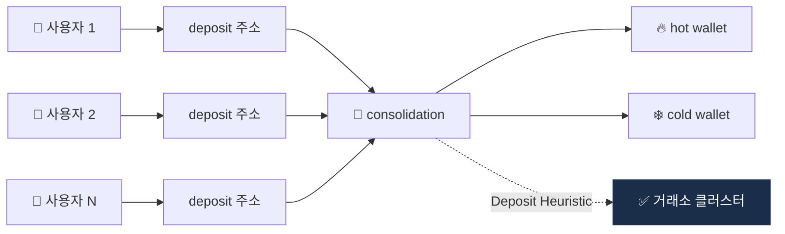

# Day 31 — Change Detection + Deposit Heuristic

> 거스름돈 식별 + 거래소 입금 패턴. ⏱️ ~70분.

## 📖 오늘 뭘 배우나

CIOH 다음으로 중요한 두 휴리스틱. **Change Detection**은 거스름돈 주소를 같은 클러스터로 묶고, **Deposit Heuristic**은 거래소의 consolidation 패턴으로 거래소 전체 주소 체계를 드러냅니다. 이 두 휴리스틱이 결합되면 Chainalysis 같은 회사의 attribution DB가 어떻게 거래소 계정까지 연결하는지 감이 잡힙니다.


<!-- MAP-START -->
## 🗺 오늘의 지도


<!-- MAP-END -->

## 🎯 핵심 질문
1. 비트코인 거스름돈 주소는 어떻게 식별?
2. Deposit Heuristic이 거래소 attribution의 핵심인 이유?
3. 두 휴리스틱의 정확도 한계?

## 📖 읽기 (~50분)
- 메인: [`../notes/4-technology/blockchain-analytics.md`](../notes/4-technology/blockchain-analytics.md) — 2절 (B, C)

## 🛠️ 미니 챌린지 (~15분)
- 거래소 deposit 흐름 예시 그리기:
  - 사용자 100명 → 각자 deposit 주소 → consolidation 주소 → cold/hot wallet
- 분석가 관점에서 어떻게 거래소 클러스터를 식별하는지 단계 정리

## ✅ 체크포인트
- [ ] Change Detection 휴리스틱 안다
- [ ] Deposit Heuristic 안다
- [ ] Consolidation 주소 = 거래소 코어 안다
- [ ] 휴리스틱 한계 (false positive) 인지

## 💭 오늘의 한 줄

## 💼 실무 현장 (Industry Reality)

### 한국 VASP에서는

Upbit·Bithumb·Coinone은 **자체 휴리스틱을 거의 돌리지 않습니다**. 이유는 단순 — Chainalysis와 Elliptic이 이미 **수억 개 주소의 change/deposit 클러스터를 자동 갱신**하고 있고, 자체 구현 시 정확도를 벤더와 비슷하게 맞추려면 온체인 인덱서·피처 파이프라인·QA 리소스를 연간 수십억원 단위로 써야 하기 때문. 대신 한국 거래소는 **자체 deposit 주소 체계**(사용자별 1:1 매핑)를 KYT 벤더에 **역으로 제공**해 "우리 주소는 이미 우리 거래소임"을 벤더 DB에 등록하게 합니다. 이걸 안 하면 글로벌 벤더가 한국 deposit 주소를 unknown으로 남겨둬서 카운터파티 분석 때 blind spot이 됩니다.

### 글로벌에서는

Chainalysis는 2023~2025 사이 **Deposit heuristic을 머신러닝 기반으로 전환** — 단순 consolidation 패턴뿐 아니라 **지갑 연령·거래 빈도·가스비 패턴**까지 입력으로 받는 분류기를 운영한다고 공개. TRM Labs는 **cross-chain consolidation**(Tron USDT → ETH consolidation 등)까지 같은 엔티티로 묶는 게 차별점. Coinbase는 2024년 **"Lynx" GNN**을 발표 — 그래프 신경망으로 지갑 클러스터를 직접 예측하는 사내 시스템.

### 실제 클러스터링 SQL (한국 VASP 자체 검증용)

```sql
-- 같은 tx에서 여러 입력이 들어왔는지 (CIOH) + change 후보 탐지
WITH tx_inputs AS (
  SELECT tx_hash, ARRAY_AGG(DISTINCT address) AS input_addrs
  FROM btc_vin GROUP BY tx_hash
),
tx_outputs AS (
  SELECT tx_hash, address, value,
         ROW_NUMBER() OVER (PARTITION BY tx_hash ORDER BY value DESC) AS rk
  FROM btc_vout
)
SELECT i.input_addrs, o.address AS change_candidate
FROM tx_inputs i
JOIN tx_outputs o ON i.tx_hash = o.tx_hash
WHERE o.rk = 2  -- 두 번째로 큰 output = change 가능성
  AND NOT EXISTS (SELECT 1 FROM known_exchange_addrs k WHERE k.address = o.address);
```

### 자주 나오는 오해

- **"클러스터링은 블록체인 회사만 한다"** — 실제로는 한국 VASP도 **자체 deposit 주소 ↔ 사용자 매핑 테이블**을 보유하며, 이게 가장 정확한 내부 클러스터. 벤더가 자체 휴리스틱으로 뽑은 것보다 당연히 정확.
- **"CIOH는 비트코인에만 적용"** — 맞지만, EVM 체인은 **"same funding source + 동일 nonce 패턴"** 같은 변형 휴리스틱이 사용됨. 체인별 다른 기법이라는 점을 모르면 면접에서 걸림.

