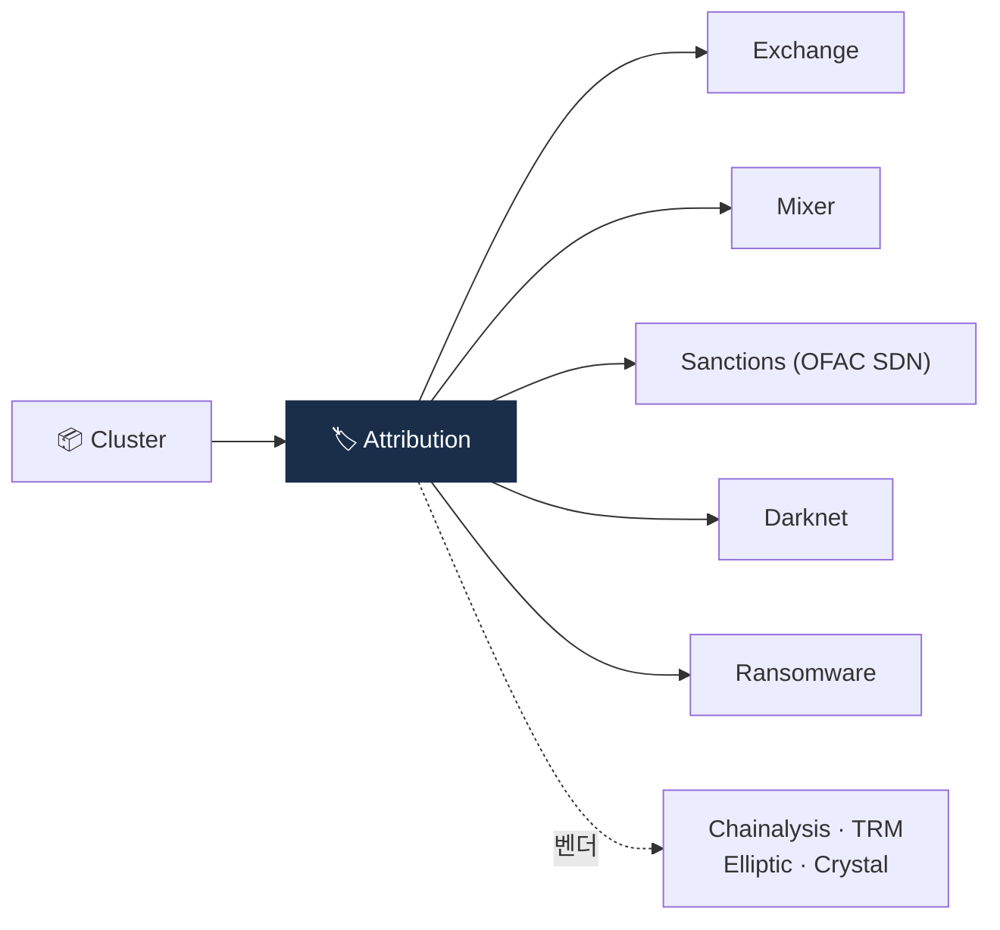

# Day 32 — Address Attribution + 라벨 DB

> 클러스터 → 알려진 엔티티 매핑. ⏱️ ~75분.

## 📖 오늘 뭘 배우나

Clustering이 "구조"라면 Attribution은 "정체성". 클러스터가 Binance인지 Tornado인지 OFAC SDN인지 **라벨링**하는 작업이며, 이 라벨 DB가 KYT 벤더의 **진짜 경쟁력**(moat)입니다. 4대 벤더(Chainalysis·Elliptic·TRM·Crystal)의 라벨 DB 차별점을 오늘 비교하면서 벤더 선정의 판단 기준을 세웁니다.

<!-- MAP-START -->
## 🗺 오늘의 지도

<!-- MAP-END -->

## 🎯 핵심 질문
1. Attribution = Clustering + 무엇?
2. 라벨 DB의 데이터 소스 5가지?
3. 4대 KYT 벤더의 라벨 DB 차별점?

## 📖 읽기 (~50분)
- 메인: [`../notes/4-technology/blockchain-analytics.md`](../notes/4-technology/blockchain-analytics.md) — 3절
- 보조: [`../notes/7-vendors/analytics-vendors.md`](../notes/7-vendors/analytics-vendors.md) — 1~3절

## 🌐 외부 자료 (~15분)
- [Chainalysis — Data Accuracy Flywheel](https://www.chainalysis.com/blog/chainalysis-data-accuracy/)

## 🛠️ 미니 챌린지 (~10분)
- 라벨 카테고리 (Exchange / DEX / Mixer / Sanctions / Stolen / Ransomware / Darknet / Scam / ...) 다시 외우기
- 한국 거래소 라벨링이 글로벌 벤더에서 정확한지 검증할 방법 1가지

## ✅ 체크포인트
- [ ] Clustering vs Attribution 구분
- [ ] 라벨 DB 5가지 데이터 소스 안다
- [ ] Chainalysis (시장 표준), TRM (cross-chain), Elliptic (compliance), Crystal (러시아) 차별점 안다
- [ ] 한국 거래소 attribution은 자체 보완 필요 인지

## 💭 오늘의 한 줄
