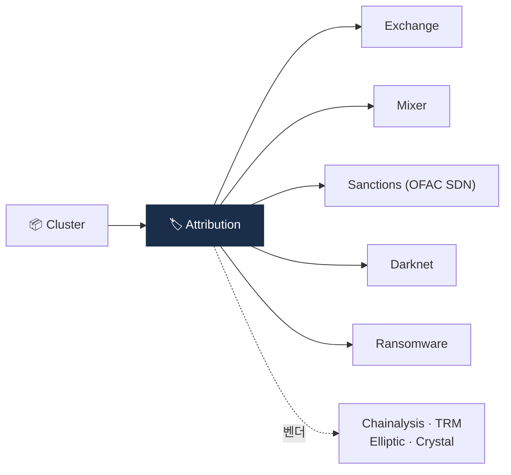

# Day 32 — Address Attribution + 라벨 DB

> 클러스터 → 알려진 엔티티 매핑. ⏱️ ~75분.

## 📖 오늘 뭘 배우나

Clustering이 "구조"라면 Attribution은 "정체성". 클러스터가 Binance인지 Tornado인지 OFAC SDN인지 **라벨링**하는 작업이며, 이 라벨 DB가 KYT 벤더의 **진짜 경쟁력**(moat)입니다. 4대 벤더(Chainalysis·Elliptic·TRM·Crystal)의 라벨 DB 차별점을 오늘 비교하면서 벤더 선정의 판단 기준을 세웁니다.


<!-- MAP-START -->
## 🗺 오늘의 지도


<!-- MAP-END -->

## 🎯 핵심 질문
1. Attribution = Clustering + 무엇?
2. 라벨 DB의 데이터 소스 5가지?
3. 4대 KYT 벤더의 라벨 DB 차별점?

## 📖 읽기 (~50분)
- 메인: [`../notes/4-technology/blockchain-analytics.md`](../notes/4-technology/blockchain-analytics.md) — 3절
- 보조: [`../notes/7-vendors/analytics-vendors.md`](../notes/7-vendors/analytics-vendors.md) — 1~3절

## 🌐 외부 자료 (~15분)
- [Chainalysis — Data Accuracy Flywheel](https://www.chainalysis.com/blog/chainalysis-data-accuracy/)

## 🛠️ 미니 챌린지 (~10분)
- 라벨 카테고리 (Exchange / DEX / Mixer / Sanctions / Stolen / Ransomware / Darknet / Scam / ...) 다시 외우기
- 한국 거래소 라벨링이 글로벌 벤더에서 정확한지 검증할 방법 1가지

## ✅ 체크포인트
- [ ] Clustering vs Attribution 구분
- [ ] 라벨 DB 5가지 데이터 소스 안다
- [ ] Chainalysis (시장 표준), TRM (cross-chain), Elliptic (compliance), Crystal (러시아) 차별점 안다
- [ ] 한국 거래소 attribution은 자체 보완 필요 인지

## 💭 오늘의 한 줄

## 💼 실무 현장 (Industry Reality)

### 한국 VASP에서는

KYT 벤더 선정은 **Chainalysis + 보조벤더 1개**가 사실상 표준. Upbit·Coinone은 **Chainalysis KYT + 자체 블랙리스트**, Bithumb은 **Chainalysis + CODE(Travel Rule)**, 과거 Korbit은 **Elliptic 병행** 기간이 있었음. 한국 특수 라벨(예: 국내 P2P 사기 지갑·검찰 수사 중 지갑)은 벤더 DB에 늦게 반영되므로 **자체 라벨 DB 3~5만 건** 수준을 내부 운영. DAXA 회원사는 **공동 제재 주소 리스트(수천 건)**를 실시간 공유 — 한 거래소에서 STR 대상이 된 주소는 다른 4사에도 즉시 차단.

### 글로벌에서는

**Chainalysis Reactor** 라이선스가 대기업 기준 연간 **$150K~$500K** (Enterprise tier). 자회사 툴 스택:
- **Chainalysis** — 시장 표준, 거래소·수사기관 80%+ 점유. 라벨 품질과 Reactor UI가 강점
- **Elliptic** — EU·UK 금융기관 선호. MiCA 대응 기능이 빠름
- **TRM Labs** — Cross-chain·DeFi 커버리지 1위. 신흥 벤더지만 미 재무부 채택으로 급부상
- **Crystal** — 러시아·CIS 자금세탁 데이터 특화(Merkle Science도 APAC 강점)

대형 거래소는 **2~3개 벤더를 병행**하면서 불일치 케이스를 자체 팀이 재조정(reconcile)합니다. 벤더별 라벨이 다른 경우가 **전체 alert의 5~15%** 수준.

### 라벨 DB 구조 예시 (자체 보완용)

```json
{
  "address": "0xA1E4380A0B7E74E3B9B84a8B5b3D4f1D6e2c5a8f",
  "cluster_id": "cl_korbit_deposit_00482",
  "labels": [
    {"source": "chainalysis", "category": "exchange", "entity": "Korbit", "confidence": 0.98},
    {"source": "internal", "category": "deposit", "customer_id": "uid_882311", "confidence": 1.0},
    {"source": "daxa_sharedlist", "category": "fraud_reported", "reported_at": "2026-02-14"}
  ],
  "last_refresh": "2026-04-21T03:00:00Z"
}
```

### AML Analyst 라벨 운영 루틴

- **매일** — OFAC SDN·UN·EU 제재 리스트 diff 확인 → 신규 지갑 주소 내부 블랙리스트 sync
- **주 1회** — Chainalysis·Elliptic·TRM 3벤더 불일치 케이스 리뷰 (sample 10~20건)
- **월 1회** — 자체 라벨 DB 품질 회의, FP가 높았던 라벨 원인 분석
- **분기** — 벤더 커버리지 평가 (특정 체인·체인명별 라벨 수)

### 자주 나오는 오해

- **"KYT만 사면 된다"** — 벤더 라벨은 한국 특수 범죄(국내 P2P 사기, 보이스피싱 환전상)를 놓침. 자체 DB 없이는 한국 시장 리스크를 못 본다.
- **"Chainalysis가 무조건 1위"** — 글로벌 점유율은 맞지만, **cross-chain·DeFi 최신 프로토콜**은 TRM이 먼저 커버하는 경우가 많음. 2024-2025 Bybit 해킹 추적도 TRM·Elliptic이 초동 속도에서 앞섰음.

