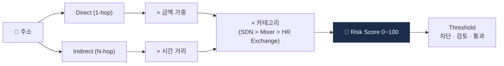

# Day 33 — Exposure Score (Direct vs N-hop)

> 위험 노출도 계산법. ⏱️ ~70분.

## 📖 오늘 뭘 배우나

Attribution이 끝나면 **"이 주소가 얼마나 위험한가"** 를 숫자로 표현해야 합니다. Direct(1-hop) vs Indirect(N-hop) 노출, 금액·시간·카테고리 가중치를 조합해 Risk Score를 만드는 로직을 오늘 이해합니다. 이 점수가 threshold를 넘으면 자동 차단이 발동하는 KYT의 핵심 의사결정 로직.


<!-- MAP-START -->
## 🗺 오늘의 지도


<!-- MAP-END -->

## 🎯 핵심 질문
1. Direct vs Indirect (N-hop) exposure 차이?
2. 가중치 적용 3요소?
3. Exposure Score → 의사결정 흐름?

## 📖 읽기 (~50분)
- 메인: [`../notes/4-technology/blockchain-analytics.md`](../notes/4-technology/blockchain-analytics.md) — 4절
- 보조: [`../notes/4-technology/kyc-kyt.md`](../notes/4-technology/kyc-kyt.md) — 4절 (Exposure)

## 🛠️ 미니 챌린지 (~15분)
- 가상 주소 1개 시나리오:
  - Direct exposure to Tornado Cash: 50점
  - 2-hop to OFAC SDN: 30점
  - Direct to Binance (low): 0점
- 다른 시나리오 1개 자기 만들기 + 점수 계산

## ✅ 체크포인트
- [ ] Direct vs N-hop 차이 안다
- [ ] 가중치 3요소 (금액/시간거리/위험카테고리) 안다
- [ ] threshold 기반 자동 차단 메커니즘 이해
- [ ] False positive 처리 (disposition) 흐름 안다

## 💭 오늘의 한 줄

## 💼 실무 현장 (Industry Reality)

### 한국 VASP에서는

Exposure score는 **벤더가 주는 숫자를 그대로 쓰지 않습니다**. Chainalysis KYT는 카테고리별 exposure (%) + Severe/High/Medium/Low 4단계 risk rating을 내려주는데, 한국 VASP는 이걸 **자체 점수 0~100**으로 재매핑해서 내부 **threshold 3단계**(자동차단·검토큐·통과)에 맞춥니다. 통상:
- **Severe or mixer direct ≥ 5%** → 자동 차단(frozen)
- **High or mixer indirect ≥ 10%** → AML 검토 큐(24h SLA)
- **Medium** → 샘플 리뷰(주 1회)
- **Low** → 통과

Threshold는 **월간 룰 위원회**에서 재조정. FP(False Positive)가 특정 룰에서 90% 넘어가면 그 룰은 임계치를 완화하거나 축소.

### 글로벌에서는

Coinbase·Kraken은 **exposure score + 고객 KYC 등급 + 거래 금액을 결합한 합성 점수**를 사용. 예: "mixer exposure 3%"도 **KYC Tier 1(여권+주소증빙)** 이면 통과, **Tier 0(이메일만)** 이면 차단. Chainalysis가 2024년부터 **"Behavior Analytics"** 모듈을 추가해 지갑의 역사적 거래 패턴까지 점수화 — 단순 카테고리 매칭을 넘어섬. TRM은 **"Risk Score 0~100"**을 직접 API로 제공해 이걸 그대로 threshold에 물리는 고객도 많음.

### 실제 룰 pseudocode

```
FUNCTION compute_risk_score(address, tx):
    exposure = chainalysis.get_exposure(address)
    score = 0
    # 1. Direct exposure — 가중 5x
    score += exposure.direct.mixer * 5.0
    score += exposure.direct.sanctions * 10.0   # SDN은 최고 가중
    score += exposure.direct.darknet * 4.0
    # 2. Indirect (2-hop) — 가중 감쇠
    score += exposure.indirect.mixer * 1.5
    score += exposure.indirect.sanctions * 3.0
    # 3. 금액 booster — 금액 클수록 민감하게
    if tx.krw_amount > 100_000_000:
        score *= 1.3
    # 4. 시간 감쇠 — 1년 이상 된 노출은 절반
    score *= decay_factor(exposure.oldest_tx_age_days)
    return min(score, 100)

DECISION:
    IF score >= 70: FREEZE
    ELIF score >= 40: QUEUE_FOR_REVIEW(sla="24h")
    ELIF score >= 15: SAMPLE_REVIEW(weekly)
    ELSE: PASS
```

### 자주 나오는 오해

- **"N-hop을 깊게 볼수록 정확하다"** — 아님. 3-hop 넘어가면 FP가 폭증(대부분 지갑이 어딘가 2~3 hop에서 mixer와 연결됨). 실무 기준 **direct + 2-hop**이 표준. Chainalysis 기본값도 그렇게 세팅.
- **"Threshold는 한 번 정하면 끝"** — 틀림. FP rate는 보통 **70~90%**, 월별로 룰 재튜닝이 필수. FP 줄이려다 FN(미탐) 올리면 감독당국 검사에서 치명적.

