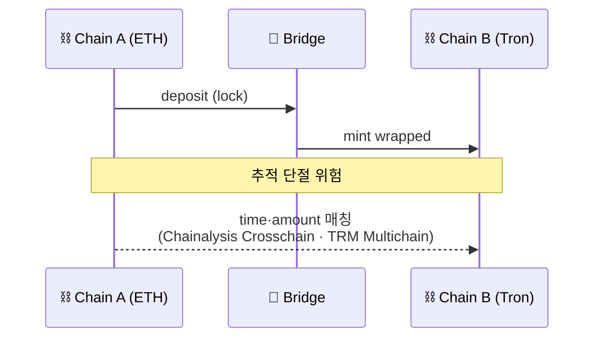

# Day 34 — Cross-chain Tracing + Bridge

> 2025-2026 자금세탁 트렌드 1위. ⏱️ ~75분.

## 📖 오늘 뭘 배우나

단일 체인 분석만으로는 2025~2026 자금세탁의 대부분을 놓칩니다. **Cross-chain tracing**은 bridge 입출금을 양쪽 체인에서 동시에 추적하고 시간·금액으로 매칭하는 작업이며, TRM이 이 영역에서 앞선 이유가 여기 있습니다. Lazarus가 이 영역을 가장 활발히 활용하는 현실도 오늘 확인.


<!-- MAP-START -->
## 🗺 오늘의 지도


<!-- MAP-END -->

## 🎯 핵심 질문
1. Cross-chain laundering이 왜 어려운가?
2. Bridge tracing 방법 4가지?
3. LayerZero/Wormhole 같은 generic messaging이 까다로운 이유?

## 📖 읽기 (~50분)
- 메인: [`../notes/4-technology/blockchain-analytics.md`](../notes/4-technology/blockchain-analytics.md) — 5절
- 보조: [`../notes/3-crypto-aml/onchain-typology.md`](../notes/3-crypto-aml/onchain-typology.md) — 1절 C (Bridge)
- 보조: [`../notes/3-crypto-aml/defi-nft-risks.md`](../notes/3-crypto-aml/defi-nft-risks.md) — 4절 (Bridge)

## 🌐 외부 자료 (~15분)
- [TRM Labs — Multichain Tracing](https://www.trmlabs.com/) (사이트 내 검색)

## 🛠️ 미니 챌린지 (~10분)
- "BTC → ETH → USDT(Tron) 자금 이동" 시나리오의 분석 도전과제 3가지 적기
- 주요 브리지 5개 이름 (Wormhole, LayerZero, Synapse, Stargate, Across) 외우기

## ✅ 체크포인트
- [ ] Cross-chain laundering의 본질적 어려움 안다
- [ ] Bridge indexing + Time/Amount matching 방법 안다
- [ ] 주요 브리지 해킹 사례 (Ronin/Wormhole/Nomad/Multichain) 인지
- [ ] TRM이 cross-chain 1위인 이유 안다

## 💭 오늘의 한 줄

## 💼 실무 현장 (Industry Reality)

### 한국 VASP에서는

한국 거래소에서 cross-chain은 **정책적으로 "입금 최소화"** 방향. 대부분 거래소가 **bridge wrapped 자산(예: wBTC on Tron, wETH on BSC)의 입금을 아예 지원하지 않거나**, 하더라도 **출금 whitelist**에서 제한. 탐지는 100% 벤더 의존 — **Chainalysis Crosschain** 또는 **TRM Multichain** API로 입금 주소의 cross-chain 히스토리를 조회. 자체 구현은 사실상 불가능(해당 브리지만 100개 이상, 각 프로토콜별 이벤트 로그 포맷이 다름).

### 글로벌에서는

**TRM Labs가 cross-chain 영역 1위**로 평가되는 이유: 2021년 창업 때부터 **"multichain-native" 아키텍처**로 설계해 bridge 이벤트를 자체 인덱싱. Chainalysis는 2023~2024에 **Crosschain Insights** 제품을 인수·통합하면서 따라잡는 중. 미 재무부 OFAC이 Lazarus 추적용으로 **TRM Labs를 2023년부터 공식 조달**한 것도 이 분야 업계 시그널. Elliptic은 **Holistic Screening** 브랜드로 2024년 런칭.

주요 bridge 해킹 규모(글로벌 참고):
- Ronin Bridge (2022-03) — 약 $625M, Lazarus
- Wormhole (2022-02) — 약 $325M
- Nomad (2022-08) — 약 $190M
- Multichain (2023-07) — 약 $126M, 창업자 구금
- Poly Network (2021-08) — 약 $611M, 대부분 회수

### Bridge tx 매칭 pseudocode

```python
# 양쪽 체인에서 bridge contract 이벤트를 시간+금액으로 매칭
def match_bridge_tx(src_chain, dst_chain, src_tx):
    # 1. 소스 체인에서 Lock/Burn 이벤트 확인
    lock = get_bridge_event(src_chain, src_tx, event="Lock")
    # 2. 목적지 체인에서 시간 윈도우 내 Mint/Release 탐색
    candidates = query_bridge_events(
        chain=dst_chain,
        event="Mint",
        amount_range=(lock.amount * 0.995, lock.amount * 1.005),  # 수수료 ±
        time_window=(lock.ts, lock.ts + 600),  # 10분 이내
    )
    # 3. 수신자 주소 매칭 (bridge payload의 recipient 필드)
    for c in candidates:
        if c.recipient == lock.recipient:
            return c
    return None  # unmatched — 수동 조사
```

### 자주 나오는 오해

- **"Bridge는 추적 불가능"** — 대부분 bridge는 오히려 **이벤트 로그가 공개**되어 있어 추적 가능. 진짜 어려운 건 **LayerZero·Wormhole 같은 generic messaging** — 임의 payload라 금액 의미가 탈락함.
- **"wrapped 토큰도 같은 주소로 간다"** — EVM-EVM이면 그럴 수 있지만, BTC→ETH wBTC처럼 체인 간 주소 체계가 다르면 수신자 주소가 완전히 바뀜. Time+amount 매칭이 유일한 링크.
- **"벤더만 쓰면 충분"** — 2024년 Poly Network 해킹 때 벤더 DB에 반영되기 전 24시간이 최대 layering window였음. 한국 거래소는 **DAXA 공유 채널**로 초동 대응 속도를 벌충.

