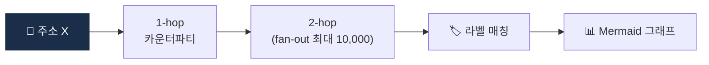

# Day 35 — 🛠️ 미니 프로젝트 2: Etherscan API 2-hop tracer + 5주 리뷰

> 직접 온체인 데이터 만져보기. ⏱️ ~150분.

## 📖 오늘 뭘 배우나

Week 5의 결산. Etherscan API로 **한 주소에서 2-hop 추적**을 직접 구현해보며, 지난 6일간 배운 Clustering·Attribution·Exposure가 실제 공개 데이터에서 어떻게 나타나는지 체감. 이 프로젝트의 결과물은 Capstone의 Risk Engine에 통합될 '온체인 분석 모듈'의 출발점입니다.


<!-- MAP-START -->
## 🗺 오늘의 지도


<!-- MAP-END -->

## 🎯 회고 질문
1. 클러스터링·Attribution·Exposure 중 가장 어려운 영역?
2. 자체 vs 벤더 KYT — 회사 입장에서 답?
3. Cross-chain의 미래 시나리오?

## 🛠️ 미니 프로젝트 2 (~120분)

### 목표
**Etherscan(또는 Blockscout) API로 한 주소에서 2-hop trace + 결과 시각화**

### 사양
- 입력: Ethereum 주소 1개
- 출력:
  - 1-hop: 이 주소가 상호작용한 모든 카운터파티 (이름/잔액/메모)
  - 2-hop: 1-hop 주소들이 또 누구와 거래했는가
  - 그래프 또는 테이블로

### 구현 가이드
프로젝트: `aml/projects/02-onchain-tracer/`

```python
# main.py 의사코드
import requests

ETHERSCAN_API = "https://api.etherscan.io/api"
API_KEY = "..."  # https://etherscan.io/apis 에서 무료 발급

def get_normal_txs(address: str, limit: int = 100) -> list[dict]:
    """주소의 normal transactions 가져오기"""
    ...

def trace_one_hop(address: str) -> set[str]:
    """1-hop 카운터파티 주소 집합"""
    ...

def trace_two_hop(address: str) -> dict[str, set[str]]:
    """{1-hop 주소: {2-hop 주소들}}"""
    ...

def render_graph(graph: dict) -> str:
    """ASCII 또는 Mermaid 다이어그램 출력"""
    ...

if __name__ == "__main__":
    # 테스트 주소: 잘 알려진 거래소 hot wallet 등 (공개 정보)
    target = "0x..."
    g = trace_two_hop(target)
    print(render_graph(g))
```

### 산출물
- `projects/02-onchain-tracer/main.py`
- `projects/02-onchain-tracer/README.md` (사용법 + .env 설정)
- `projects/02-onchain-tracer/sample_outputs/` (1~2개 trace 결과)

→ 자세한 가이드: [`../projects/02-onchain-tracer/README.md`](../projects/02-onchain-tracer/README.md)

### 보너스
- 1-hop 카운터파티 중 알려진 라벨이 있는 주소 매칭 (Etherscan label DB 활용)

## ✅ 체크포인트
- [ ] Tracer 작동
- [ ] 최소 1개 sample output 저장
- [ ] [`progress.md`](progress.md) Week 5 + W5 미니 프로젝트 체크
- [ ] git commit + push

## 💭 5주차 회고

가장 어려웠던 분석:
가장 흥미로웠던 발견:
실무에서 KYT 자체 구축은 가능?:

## 💼 실무 현장 (Industry Reality)

### 한국 VASP에서는

**Etherscan API 2-hop tracer를 자체 구축한 거래소는 거의 없습니다**. 이유는 둘 — (1) 이미 Chainalysis Reactor·TRM Explorer가 같은 기능을 GUI로 제공, (2) Etherscan public API는 **5 req/sec · 100K req/day** 한도라서 대규모 실시간 운영 불가. 대신 한국 VASP는 Etherscan API를 **"ad-hoc 수사용"**(특정 사건 수시 조사)으로만 활용. 예: 자금세탁 의심 지갑 1개를 들여다볼 때 분석가가 Postman·Jupyter로 돌림.

Upbit·Bithumb 내부엔 **자체 온체인 인덱서**를 가진 팀이 있지만, 이건 **Reorg·DEX event decoding·ERC20 transfer 재구성** 같은 내부 서비스용. 분석가용 tracer는 벤더 GUI로 대체.

### 글로벌에서는

**Coinbase "Lynx" (2024 발표)** — 자체 GNN(Graph Neural Network)으로 지갑 클러스터를 직접 예측하는 시스템. Etherscan API 같은 외부 의존 없이 자체 Ethereum 노드(Geth) + 자체 인덱서로 운영. **Binance "CryptoChainlys"**, **Kraken "Scout"** 등 자체 명칭의 온체인 분석 플랫폼이 각각 존재. 공통점은 **Reth/Erigon 노드 → Kafka → ClickHouse/BigQuery → Neo4j → 내부 웹 UI** 스택.

### 주니어 분석가가 이 프로젝트를 하는 이유 (현업 관점)

1. **면접 평가 요소** — "온체인 데이터 직접 만져봤나?"가 한국·글로벌 공통 스크리닝 질문. Etherscan API 호출·JSON 파싱·그래프 조립을 직접 해본 경험은 **이력서 1줄로 큰 차이**.
2. **벤더 블랙박스 이해** — Chainalysis가 주는 숫자의 의미를 역산하려면 raw 온체인 데이터를 만져본 사람만이 가능.
3. **내부 QA 역량** — 벤더 결과가 의심스러울 때 Etherscan으로 **재현·검증**할 수 있는 주니어는 팀에 귀함.

### 자주 나오는 오해

- **"API tracer는 장난감"** — 맞지만 **수사기관·법 집행은 여전히 Etherscan·Blockscout 기반의 수동 추적을 병행**. 모든 라벨이 벤더에 있지 않고, 법원 증거로는 **원천 데이터**가 더 신뢰됨.
- **"Rate limit만 있으면 금방 풀린다"** — Etherscan Pro tier는 **월 $400~$800**, Alchemy·QuickNode로 archive node 이용 시 **월 $1K~$5K**. 기업 운영 단가는 생각보다 비쌈.
