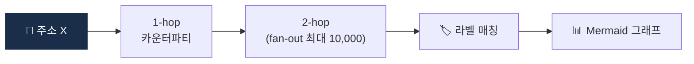

# Day 35 — 🛠️ 미니 프로젝트 2: Etherscan API 2-hop tracer + 5주 리뷰

> 직접 온체인 데이터 만져보기. ⏱️ ~150분.

## 📖 오늘 뭘 배우나

Week 5의 결산. Etherscan API로 **한 주소에서 2-hop 추적**을 직접 구현해보며, 지난 6일간 배운 Clustering·Attribution·Exposure가 실제 공개 데이터에서 어떻게 나타나는지 체감. 이 프로젝트의 결과물은 Capstone의 Risk Engine에 통합될 '온체인 분석 모듈'의 출발점입니다.


<!-- MAP-START -->
## 🗺 오늘의 지도


<!-- MAP-END -->

## 🎯 회고 질문
1. 클러스터링·Attribution·Exposure 중 가장 어려운 영역?
2. 자체 vs 벤더 KYT — 회사 입장에서 답?
3. Cross-chain의 미래 시나리오?

## 🛠️ 미니 프로젝트 2 (~120분)

### 목표
**Etherscan(또는 Blockscout) API로 한 주소에서 2-hop trace + 결과 시각화**

### 사양
- 입력: Ethereum 주소 1개
- 출력:
  - 1-hop: 이 주소가 상호작용한 모든 카운터파티 (이름/잔액/메모)
  - 2-hop: 1-hop 주소들이 또 누구와 거래했는가
  - 그래프 또는 테이블로

### 구현 가이드
프로젝트: `aml/projects/02-onchain-tracer/`

```python
# main.py 의사코드
import requests

ETHERSCAN_API = "https://api.etherscan.io/api"
API_KEY = "..."  # https://etherscan.io/apis 에서 무료 발급

def get_normal_txs(address: str, limit: int = 100) -> list[dict]:
    """주소의 normal transactions 가져오기"""
    ...

def trace_one_hop(address: str) -> set[str]:
    """1-hop 카운터파티 주소 집합"""
    ...

def trace_two_hop(address: str) -> dict[str, set[str]]:
    """{1-hop 주소: {2-hop 주소들}}"""
    ...

def render_graph(graph: dict) -> str:
    """ASCII 또는 Mermaid 다이어그램 출력"""
    ...

if __name__ == "__main__":
    # 테스트 주소: 잘 알려진 거래소 hot wallet 등 (공개 정보)
    target = "0x..."
    g = trace_two_hop(target)
    print(render_graph(g))
```

### 산출물
- `projects/02-onchain-tracer/main.py`
- `projects/02-onchain-tracer/README.md` (사용법 + .env 설정)
- `projects/02-onchain-tracer/sample_outputs/` (1~2개 trace 결과)

→ 자세한 가이드: [`../projects/02-onchain-tracer/README.md`](../projects/02-onchain-tracer/README.md)

### 보너스
- 1-hop 카운터파티 중 알려진 라벨이 있는 주소 매칭 (Etherscan label DB 활용)

## ✅ 체크포인트
- [ ] Tracer 작동
- [ ] 최소 1개 sample output 저장
- [ ] [`progress.md`](progress.md) Week 5 + W5 미니 프로젝트 체크
- [ ] git commit + push

## 💭 5주차 회고

가장 어려웠던 분석:
가장 흥미로웠던 발견:
실무에서 KYT 자체 구축은 가능?:
