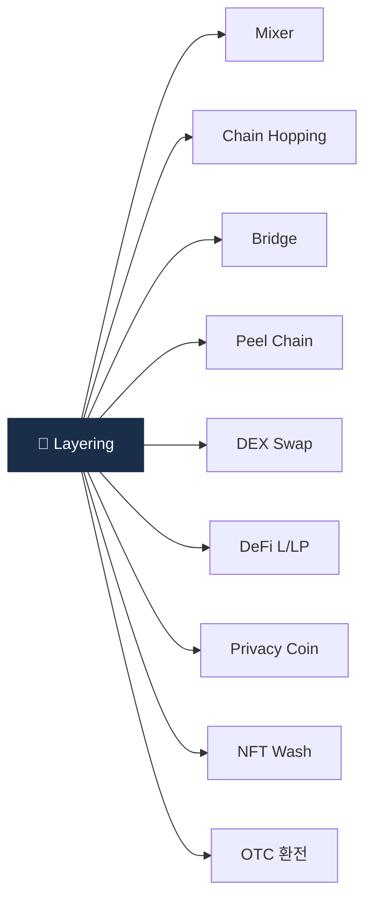

# Day 36 — 자금세탁 7 typology 종합

> 가상자산 자금세탁의 7가지 핵심 패턴. ⏱️ ~80분.

## 📖 오늘 뭘 배우나

Week 6은 자금세탁 유형 주간. 오늘은 그 전체 지도인 **7개 typology**(Mixer·Chain hop·Bridge·Peel·DEX·Privacy coin·OTC)를 한 장에 정리합니다. 각 유형의 정의·탐지 신호·한국 적용도를 비교하면서, 이후 6일간 각 유형을 deep하게 들어가는 준비를 합니다.

<!-- MAP-START -->
## 🗺 오늘의 지도

<!-- MAP-END -->

## 🎯 핵심 질문
1. 7유형 (Mixer/Chain hop/Bridge/Peel/DEX/Privacy coin/OTC) 각 한 줄 정의?
2. 어떤 유형이 가장 빠른가? 가장 큰 규모?
3. 한국 시장에서 가장 빈도 높은 유형?

## 📖 읽기 (~55분)
- 메인: [`../notes/3-crypto-aml/onchain-typology.md`](../notes/3-crypto-aml/onchain-typology.md)

## 🌐 외부 자료 (~15분)
- [Chainalysis 2026 Crypto Crime Report](https://www.chainalysis.com/reports/crypto-crime-2026/) — 목차 + Money Laundering 챕터

## 🛠️ 미니 챌린지 (~10분)
- 7유형을 표로 정리 (정의 / 사용도 / 한국 적용)
- 각 유형의 탐지 신호 1개씩

## ✅ 체크포인트
- [ ] 7 typology 모두 한 줄 정의 가능
- [ ] 2025 트렌드 1위 = cross-chain 안다
- [ ] 스테이블코인 84% 비중 안다
- [ ] CMLN $16.1B 안다

## 💭 오늘의 한 줄

## 💼 실무 현장 (Industry Reality)

### 한국 VASP에서는

7 typology 중 한국 거래소가 실제로 가장 **자주 마주치는 건 Peel chain + OTC + Chain hopping(USDT Tron)**. Mixer(Tornado Cash) 직접 노출은 오히려 많지 않음 — 한국 거래소는 Tornado Cash 직연결 입금을 **자동 차단**(mixer direct ≥ 약 1%)하기 때문에 이미 필터링됨. 실제 STR로 이어지는 패턴은:

| 빈도 | 유형 | 전형 사례 |
|---|---|---|
| 최다 | Peel chain + OTC | 보이스피싱 편취금 소액 분할 → 거래소 입금 → 소액 반복 출금 → OTC 환전 |
| 많음 | Chain hopping (USDT Tron) | 스캠/P2P 사기 → Tron USDT로 즉시 환전 → CMLN 경유 |
| 중간 | Bridge + DeFi | 해킹 자금 → cross-chain bridge → DEX swap |
| 낮음 | Mixer direct | 대부분 자동 차단으로 걸러짐 |

### 글로벌에서는

**Chainalysis 2026 Crypto Crime Report**(매년 2월 발간)가 typology 비중의 **사실상 업계 표준 참조 자료**. 2025 데이터:
- 불법 거래 규모: 약 $51B (전체 거래의 약 0.14%)
- Stablecoin 비중: 약 63% (전년 54% → 증가)
- Cross-chain: 약 $21B
- CMLN 관련: 약 $16.1B
- Sanctions-related: 약 $16B

글로벌 컴플라이언스 컨퍼런스(ACAMS·Chainalysis Links·Elliptic ACE) 기조연설은 매년 이 수치를 업데이트하면서 typology 우선순위를 제시. 한국 DAXA도 이를 참고해 공통 차단 기준을 개정.

### 자주 나오는 오해

- **"Mixer가 1위 위협"** — 미디어 인상과 달리 2025년 실제 금액 기준으로는 **cross-chain + CMLN이 mixer보다 3~5배 큼**. Tornado 제재 이후 대규모 mixer 의존도는 감소.
- **"7개로 다 포함된다"** — 업계에서는 **pig butchering (romance scam)·AI 생성 가짜 신원 KYC·NFT launder**를 별도 카테고리로 분리하는 흐름. FATF 2025 가이던스도 8~10개 typology로 확장 추세.
- **"한국 거래소는 해외 typology와 무관"** — 2024 Bybit 해킹(Lazarus) 자금 일부가 **국내 P2P·OTC로 유입된 정황**이 DAXA 공유에서 포착됨. 한국도 Lazarus·CMLN 타겟.

