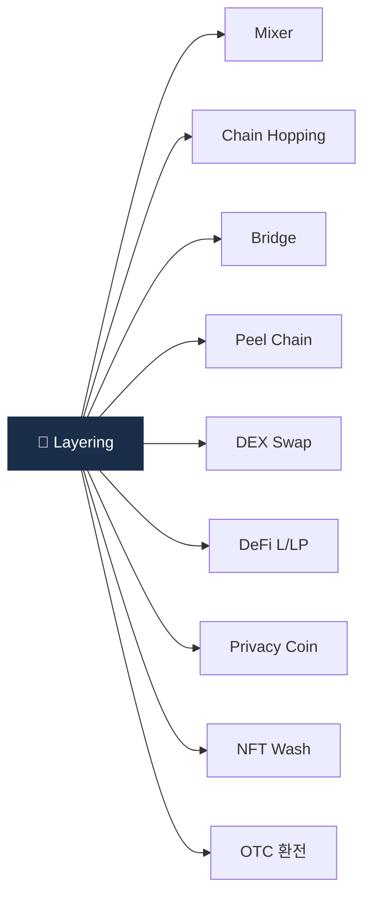

# Day 36 — 자금세탁 7 typology 종합

> 가상자산 자금세탁의 7가지 핵심 패턴. ⏱️ ~80분.

## 📖 오늘 뭘 배우나

Week 6은 자금세탁 유형 주간. 오늘은 그 전체 지도인 **7개 typology**(Mixer·Chain hop·Bridge·Peel·DEX·Privacy coin·OTC)를 한 장에 정리합니다. 각 유형의 정의·탐지 신호·한국 적용도를 비교하면서, 이후 6일간 각 유형을 deep하게 들어가는 준비를 합니다.

<!-- MAP-START -->
## 🗺 오늘의 지도

<!-- MAP-END -->

## 🎯 핵심 질문
1. 7유형 (Mixer/Chain hop/Bridge/Peel/DEX/Privacy coin/OTC) 각 한 줄 정의?
2. 어떤 유형이 가장 빠른가? 가장 큰 규모?
3. 한국 시장에서 가장 빈도 높은 유형?

## 📖 읽기 (~55분)
- 메인: [`../notes/3-crypto-aml/onchain-typology.md`](../notes/3-crypto-aml/onchain-typology.md)

## 🌐 외부 자료 (~15분)
- [Chainalysis 2026 Crypto Crime Report](https://www.chainalysis.com/reports/crypto-crime-2026/) — 목차 + Money Laundering 챕터

## 🛠️ 미니 챌린지 (~10분)
- 7유형을 표로 정리 (정의 / 사용도 / 한국 적용)
- 각 유형의 탐지 신호 1개씩

## ✅ 체크포인트
- [ ] 7 typology 모두 한 줄 정의 가능
- [ ] 2025 트렌드 1위 = cross-chain 안다
- [ ] 스테이블코인 84% 비중 안다
- [ ] CMLN $16.1B 안다

## 💭 오늘의 한 줄
