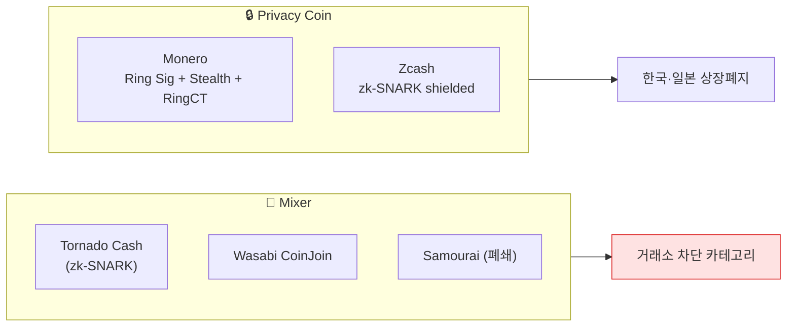

# Day 37 — Mixer + Privacy Coin

> Tornado Cash, Wasabi, Monero — 익명 도구 deep. ⏱️ ~80분.

## 📖 오늘 뭘 배우나

익명 도구의 두 축 — **Mixer**(서비스로서의 익명화)와 **Privacy Coin**(프로토콜로서의 익명화). Tornado Cash의 **zk-SNARK**, Monero의 **Ring Signature + Stealth Address**, Wasabi의 **CoinJoin** — 각 기술의 원리를 이해하면 왜 어떤 mixer는 폐쇄됐고 어떤 건 여전히 운영 중인지가 보입니다.


<!-- MAP-START -->
## 🗺 오늘의 지도


<!-- MAP-END -->

## 🎯 핵심 질문
1. Tornado Cash가 OFAC 제재 → 해제된 경위?
2. Monero가 거의 추적 불가능한 기술적 이유?
3. 한국 거래소가 privacy coin 상장 안 하는 이유?

## 📖 읽기 (~55분)
- 메인: [`../notes/3-crypto-aml/defi-nft-risks.md`](../notes/3-crypto-aml/defi-nft-risks.md) — 3절 (Privacy Coin)
- 보조: [`../notes/3-crypto-aml/onchain-typology.md`](../notes/3-crypto-aml/onchain-typology.md) — 1절 A (Mixer)

## 🌐 외부 자료 (~15분)
- [Sanction Scanner — Tornado Cash 분석](https://www.sanctionscanner.com/blog/tornado-cash-a-crypto-mixing-service-now-blacklisted-by-the-us-treasury-675)

## 🛠️ 미니 챌린지 (~10분)
- Mixer 5종 (Tornado/Wasabi/Samourai/JoinMarket/Cryptomixer) 각 한 줄 정리
- Privacy coin 4종 (Monero/Zcash/Dash/Grin) 각 핵심 기술 1개씩

## ✅ 체크포인트
- [ ] zk-SNARK 작동 원리 (대략) 안다
- [ ] Tornado Cash 2022-08 OFAC 제재 → 2024-11 Van Loon 판결 → 2025-03-21 지정 해제 흐름 안다
- [ ] Monero ring signature + stealth address 안다
- [ ] 한국 4대 거래소 privacy coin 미상장 안다

## 💭 오늘의 한 줄

## 💼 실무 현장 (Industry Reality)

### 한국 VASP에서는

**Privacy coin 4종(Monero·Zcash·Dash·Grin)은 Upbit·Bithumb·Coinone·Korbit 전부 미상장.** 과거 2019~2020년에 일부 상장되어 있었으나, 2021-03 특금법 시행 + DAXA 공통 기준 합의 후 **전원 상장폐지**. 이유는 KYT 벤더가 privacy coin 입금의 자금원천을 증빙할 수 없어 **기술적으로 STR이 불가능**하기 때문. 현재 privacy coin 입금 시도는 **자동 전액 반송(auto-return)**.

Mixer direct 노출 정책:
- **Tornado Cash direct ≥ 1%** → 자동 차단(입금 반송/출금 거부)
- **Wasabi/Samourai CoinJoin** → 거래소별 편차. Upbit는 차단, 일부는 경고/검토 큐
- **Tornado 0%지만 2-hop에 있음** → 검토 큐(FP 많음)

### 글로벌에서는

**Tornado Cash 연대기**:
- **2022-08** — OFAC이 스마트컨트랙트 주소 자체를 SDN 지정(사상 처음)
- **2022-10** — 공동 창업자 Alexey Pertsev 네덜란드 체포
- **2023-04** — 미국 내 사용자 집단소송(Van Loon v. Treasury)
- **2024-11** — 제5순회법원 "스마트컨트랙트는 property 아니다" 판결 → OFAC 지정 위법
- **2025-03-21** — 재무부 Tornado Cash 지정 공식 해제
- **2025** — Roman Storm 재판 진행(미국 자금세탁 공모 혐의)

지정 해제 후에도 **대부분 대형 거래소는 여전히 Tornado exposure 차단**을 유지 — 법적 리스크가 완전히 해소되지 않았고, 투자자 보호 관점에서 자체 정책으로 유지.

Monero는 **Bitsquare/Haveno 같은 탈중앙 P2P 거래소**가 유일한 법정화폐 진출구. 일본은 2018년부터 privacy coin 전면 상장 금지(FSA). EU는 2027 AMLR로 **privacy coin 취급 VASP 전면 금지 예정**.

### Privacy coin 차단 룰 pseudocode

```
RULE: privacy_coin_inbound
WHEN deposit.asset IN ("XMR", "ZEC_shielded", "DASH_privatesend", "GRIN") OR
     deposit.counterparty_cluster IN tornado_contracts
THEN action = REJECT_AND_RETURN
     notify = ["AMLO"]
     auto_close_ticket = false   # 수동 종결 필요
     log = "privacy-coin/mixer inbound rejected per DAXA common policy"
```

### 자주 나오는 오해

- **"Monero는 완전 추적 불가"** — 기술적으로 ring signature + stealth가 강력하지만, **입출금 구간(거래소 gateway)**, **IP 기반 de-anonymization**, **타이밍 분석**으로 추적 가능한 경우가 존재. CipherTrace·Chainalysis가 FBI용 Monero 추적 툴을 제공한 이력 있음.
- **"Tornado 제재 해제 → 자유 사용"** — 법적 지정은 풀렸으나 **자금세탁 의도로 사용하면 여전히 형사 처벌 대상**. 거래소 정책은 별개.
- **"Privacy coin을 상장 안 하는 건 과한 규제"** — 실무적으로는 KYT 벤더가 익명 트랜잭션의 자금원천을 증빙 불가 → STR 작성 자체 불가 → 기록보관 의무(특금법) 위반 리스크 존재. 기술적 불가능이 규제 준수의 본질.

