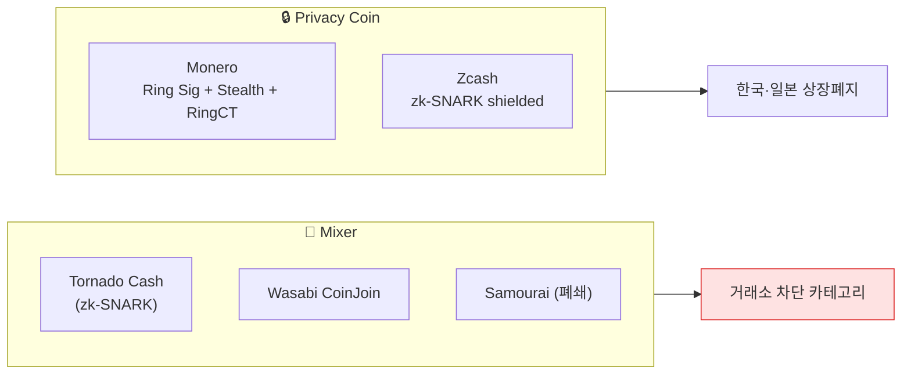

# Day 37 — Mixer + Privacy Coin

> Tornado Cash, Wasabi, Monero — 익명 도구 deep. ⏱️ ~80분.

## 📖 오늘 뭘 배우나

익명 도구의 두 축 — **Mixer**(서비스로서의 익명화)와 **Privacy Coin**(프로토콜로서의 익명화). Tornado Cash의 **zk-SNARK**, Monero의 **Ring Signature + Stealth Address**, Wasabi의 **CoinJoin** — 각 기술의 원리를 이해하면 왜 어떤 mixer는 폐쇄됐고 어떤 건 여전히 운영 중인지가 보입니다.

<!-- MAP-START -->
## 🗺 오늘의 지도

<!-- MAP-END -->

## 🎯 핵심 질문
1. Tornado Cash가 OFAC 제재 → 해제된 경위?
2. Monero가 거의 추적 불가능한 기술적 이유?
3. 한국 거래소가 privacy coin 상장 안 하는 이유?

## 📖 읽기 (~55분)
- 메인: [`../notes/3-crypto-aml/defi-nft-risks.md`](../notes/3-crypto-aml/defi-nft-risks.md) — 3절 (Privacy Coin)
- 보조: [`../notes/3-crypto-aml/onchain-typology.md`](../notes/3-crypto-aml/onchain-typology.md) — 1절 A (Mixer)

## 🌐 외부 자료 (~15분)
- [Sanction Scanner — Tornado Cash 분석](https://www.sanctionscanner.com/blog/tornado-cash-a-crypto-mixing-service-now-blacklisted-by-the-us-treasury-675)

## 🛠️ 미니 챌린지 (~10분)
- Mixer 5종 (Tornado/Wasabi/Samourai/JoinMarket/Cryptomixer) 각 한 줄 정리
- Privacy coin 4종 (Monero/Zcash/Dash/Grin) 각 핵심 기술 1개씩

## ✅ 체크포인트
- [ ] zk-SNARK 작동 원리 (대략) 안다
- [ ] Tornado Cash 2022-08 OFAC 제재 → 2024-11 Van Loon 판결 → 2025-03-21 지정 해제 흐름 안다
- [ ] Monero ring signature + stealth address 안다
- [ ] 한국 4대 거래소 privacy coin 미상장 안다

## 💭 오늘의 한 줄
