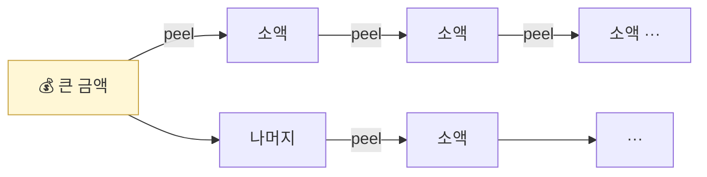

# Day 38 — Peel Chain + Smurfing

> 분할로 추적 회피. ⏱️ ~70분.

## 📖 오늘 뭘 배우나

전통 금융 AML의 **smurfing**(분할 입금)이 온체인에서는 **peel chain**(소액을 한 번씩 떼어내는 긴 사슬)으로 진화했습니다. 두 패턴 모두 "사람의 눈에 띄지 않게 여러 개로 쪼개기"라는 같은 원리지만, 온체인에서는 그래프 분석(in-degree/out-degree)으로 시각적 탐지가 가능합니다.


<!-- MAP-START -->
## 🗺 오늘의 지도


<!-- MAP-END -->

## 🎯 핵심 질문
1. Peel chain의 시각적 패턴?
2. Smurfing(structuring)과 peel chain의 차이?
3. 두 패턴의 탐지 휴리스틱은?

## 📖 읽기 (~45분)
- 메인: [`../notes/3-crypto-aml/onchain-typology.md`](../notes/3-crypto-aml/onchain-typology.md) — 1절 D (Peel chain)
- 보조: [`../notes/1-foundations/what-is-aml.md`](../notes/1-foundations/what-is-aml.md) — 2절 (Smurfing 언급)

## 🛠️ 미니 챌린지 (~20분)
- Peel chain 그림 그리기 (10단계)
- Smurfing 시나리오 그리기 (10명 → 1 wallet 합산)
- 두 패턴의 탐지 룰 의사코드 작성:
  ```
  IF (in_degree > 5 AND each_amount < threshold AND time_window < 24h)
    THEN flag as smurfing
  ```

## ✅ 체크포인트
- [ ] Peel chain 패턴 시각적으로 구별 가능
- [ ] Smurfing = 분할 입금 = KYC 회피 안다
- [ ] 그래프 분석 (in-degree/out-degree) 개념 안다
- [ ] 룰 기반 탐지의 한계 (adversarial) 인지

## 💭 오늘의 한 줄
