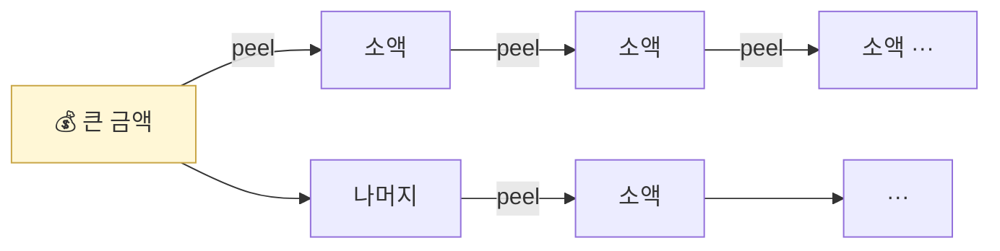

# Day 38 — Peel Chain + Smurfing

> 분할로 추적 회피. ⏱️ ~70분.

## 📖 오늘 뭘 배우나

전통 금융 AML의 **smurfing**(분할 입금)이 온체인에서는 **peel chain**(소액을 한 번씩 떼어내는 긴 사슬)으로 진화했습니다. 두 패턴 모두 "사람의 눈에 띄지 않게 여러 개로 쪼개기"라는 같은 원리지만, 온체인에서는 그래프 분석(in-degree/out-degree)으로 시각적 탐지가 가능합니다.


<!-- MAP-START -->
## 🗺 오늘의 지도


<!-- MAP-END -->

## 🎯 핵심 질문
1. Peel chain의 시각적 패턴?
2. Smurfing(structuring)과 peel chain의 차이?
3. 두 패턴의 탐지 휴리스틱은?

## 📖 읽기 (~45분)
- 메인: [`../notes/3-crypto-aml/onchain-typology.md`](../notes/3-crypto-aml/onchain-typology.md) — 1절 D (Peel chain)
- 보조: [`../notes/1-foundations/what-is-aml.md`](../notes/1-foundations/what-is-aml.md) — 2절 (Smurfing 언급)

## 🛠️ 미니 챌린지 (~20분)
- Peel chain 그림 그리기 (10단계)
- Smurfing 시나리오 그리기 (10명 → 1 wallet 합산)
- 두 패턴의 탐지 룰 의사코드 작성:
  ```
  IF (in_degree > 5 AND each_amount < threshold AND time_window < 24h)
    THEN flag as smurfing
  ```

## ✅ 체크포인트
- [ ] Peel chain 패턴 시각적으로 구별 가능
- [ ] Smurfing = 분할 입금 = KYC 회피 안다
- [ ] 그래프 분석 (in-degree/out-degree) 개념 안다
- [ ] 룰 기반 탐지의 한계 (adversarial) 인지

## 💭 오늘의 한 줄

## 💼 실무 현장 (Industry Reality)

### 한국 VASP에서는

**Peel chain + Smurfing은 한국 거래소 STR 작성 사유 중 Top 3**. 특히 **보이스피싱 편취금·P2P 사기·중고거래 사기** 환전 패턴에서 반복 관찰. 전형적 사례:
- 가해자가 피해자로부터 **여러 계좌로 분할 편취** → 편취 계좌에서 원화 출금 → 거래소 원화 입금 **(100만원 단위 소액 반복)** → USDT(Tron) 매수 → **소액 반복 출금** → CMLN OTC에서 환전

탐지는 **룰 기반 1차 + 벤더 KYT 2차** 병행:
- 1차 룰(자체): "입금 5건/24h + 각 건 100만원 이하 + 즉시 출금" → 검토 큐
- 2차 KYT: 출금 주소의 exposure 확인

### 글로벌에서는

미국 BSA **Structuring** 규제가 엄격 — **$10K 미만 거래로 나눠도 CTR 회피 의도만 있으면 형사범죄**(31 USC 5324). Coinbase 같은 MSB는 **"smurfing pattern detection"**을 FinCEN SAR 의무사유로 명시. FinCEN 2023 가이드는 온체인에서도 **"aggregated view"** 로 24h 누적을 봐야 한다고 해석.

### 탐지 룰 SQL (실제 운영 패턴)

```sql
-- 24시간 내 분할 입금 + 분할 출금 패턴(smurfing+peel 복합)
WITH inbound_agg AS (
  SELECT customer_id,
         COUNT(*) AS n_in,
         SUM(krw_amount) AS total_in,
         MIN(ts) AS first_ts,
         MAX(ts) AS last_ts
  FROM deposits
  WHERE ts >= NOW() - INTERVAL '24 hours'
  GROUP BY customer_id
  HAVING COUNT(*) >= 5
     AND SUM(krw_amount) BETWEEN 5000000 AND 99000000  -- CTR 직전
     AND MAX(krw_amount) < 3000000                      -- 각 건 소액
),
outbound_agg AS (
  SELECT customer_id, COUNT(*) AS n_out, SUM(krw_amount) AS total_out
  FROM withdrawals
  WHERE ts >= NOW() - INTERVAL '24 hours'
  GROUP BY customer_id
  HAVING COUNT(*) >= 5
)
SELECT i.customer_id, i.n_in, i.total_in, o.n_out, o.total_out
FROM inbound_agg i
JOIN outbound_agg o USING (customer_id);
```

### AML Analyst 시각 — 현장에서 보는 패턴

- **피해자 쪽 alert가 먼저 온다** — 피해자가 은행에 지급정지를 걸면 은행이 KoFIU에 보고 → KoFIU가 거래소에 관련 지갑 조회 공문 → 역추적으로 smurfing 탐지
- **출금 주소 재활용** — 같은 출금 주소가 10~50개 사용자에게서 받으면 거의 확실한 money mule hub
- **Peel chain은 온체인 그래프에서 시각적으로 "뱀 모양"** — Neo4j 뷰어로 보면 긴 사슬

### 자주 나오는 오해

- **"분할 입금은 일반 소액거래와 구분 불가"** — 맞지만 **"여러 명이 같은 수신 주소로 입금"**이 결정적 signal. 개별 주체만 보면 정상으로 보이지만 카운터파티 기준으로 집계하면 money mule hub 드러남.
- **"룰 임계치만 잘 맞추면 된다"** — 자금세탁범이 룰 임계치를 학습(adversarial). 고정 임계치보다 **ML 기반 이상치 탐지**(Isolation Forest 등)를 혼용하는 게 현장 흐름.

