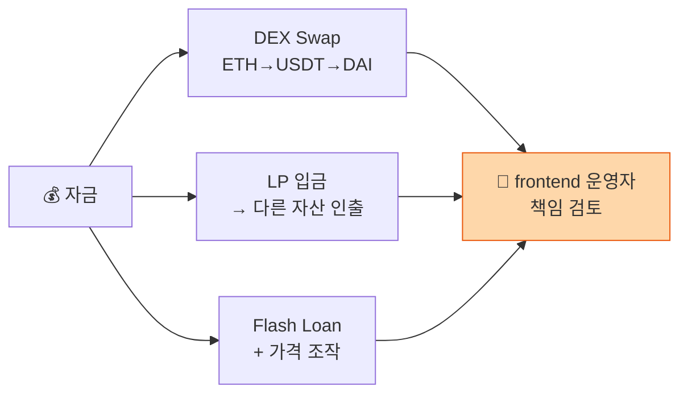

# Day 39 — DeFi 자금세탁 (DEX / LP / Flash Loan)

> 무중개 금융이 layering 인프라가 되는 방식. ⏱️ ~80분.

## 📖 오늘 뭘 배우나

DeFi는 원래 AML 목적을 위해 설계된 게 아니지만, **운영자 없음 + KYC 없음 + 전역 접근**이라는 속성 때문에 자연스럽게 layering 인프라가 됐습니다. DEX swap·LP 입출금·Flash loan의 layering 메커니즘, 그리고 **frontend 운영자**에게 규제가 집중되는 이유(Uniswap Labs 사례)까지.


<!-- MAP-START -->
## 🗺 오늘의 지도


<!-- MAP-END -->

## 🎯 핵심 질문
1. DEX swap이 layering에 효과적인 이유?
2. Liquidity Pool 입출금이 출처 단절시키는 메커니즘?
3. Flash loan attack + 자금세탁 결합 방식?

## 📖 읽기 (~55분)
- 메인: [`../notes/3-crypto-aml/defi-nft-risks.md`](../notes/3-crypto-aml/defi-nft-risks.md) — 1절 (DeFi)
- 보조: [`../notes/3-crypto-aml/onchain-typology.md`](../notes/3-crypto-aml/onchain-typology.md) — 1절 E, F

## 🌐 외부 자료 (~15분)
- [Transnet — DeFi Compliance 2026 Guide](https://transnetinc.com/navigating-compliance-challenges-in-defi-a-2026-guide)

## 🛠️ 미니 챌린지 (~10분)
- DEX → Lending → LP token → 다른 자산 인출 흐름 한 그림
- "DeFi가 fully decentralized면 AML은 누가 책임?" 자기 답변 3줄

## ✅ 체크포인트
- [ ] DEX swap 노출 차단 정책 이해
- [ ] LP 입금 layering 효과 안다
- [ ] Flash loan 기본 메커니즘 안다
- [ ] DeFi의 frontend 운영자 책임 가능성 안다 (Uniswap Labs)

## 💭 오늘의 한 줄

## 💼 실무 현장 (Industry Reality)

### 한국 VASP에서는

한국 거래소는 **DeFi 직접 연결을 통제하기보다 입출금 주소 정책으로 우회**. 구체적으로:
- **DEX 라우터(Uniswap V3·V4, 1inch 등) 직연결 출금** → 대부분 자동 검토 큐
- **LP 컨트랙트 주소 직접 입출금** → 보통 차단
- **Flash loan·Aave·Compound 같은 lending 컨트랙트** → 출금 시 exposure 재산정, 고위험이면 EDD 요청

실제로는 거래소→DeFi 직접 출금은 드물고, 사용자들이 **개인 지갑 경유**해서 DeFi에 들어가는 게 일반적. 그래서 거래소의 방어선은 **재입금(re-deposit) 시점**에서 발동 — 개인 지갑에서 Uniswap 돌고 돌아 다시 거래소 입금할 때 **카운터파티 이력을 보고 exposure 재계산**.

### 글로벌에서는

**Uniswap Labs 사례 (2024)** — SEC가 Wells Notice 발부 → 2024-09 Uniswap Labs가 **NY·NC 등 일부 주에서 특정 토큰 제한 + frontend 필터링**으로 응답. CFTC는 2023-09 Uniswap 제재(wash trading 관련). 이 흐름이 **"프로토콜은 탈중앙이라도 frontend 운영자는 규제 대상"**이라는 업계 이해의 기초.

**EU MiCA(2024-12 시행) + AMLR(2027 예정)**이 "DeFi가 충분히 탈중앙화되지 않으면 CASP(VASP) 규제 적용"을 명시 → 2026년부터 **DeFi 프로토콜 자체가 라이선스 대상**이 될 가능성.

미국 FinCEN 2023 가이드는 **"Controlling entity"가 있으면 MSB 등록 의무**.

### DeFi 노출 탐지 룰 예시

```
RULE: defi_layering_suspect
WHEN withdrawal.counterparty IN (
      uniswap_router_v3, curve_pool_*, aave_v3_pool, compound_ctoken_*
     )
  AND customer.last_edd_at < NOW() - INTERVAL '180 days'
  AND withdrawal.krw_amount > 50_000_000
THEN action = QUEUE_FOR_REVIEW
     require = [
       "counterparty chain after 2-hop",
       "customer declaration of DeFi usage purpose"
     ]
     sla = 48h

RULE: lp_token_as_layering
WHEN deposit.asset.contract IN known_lp_tokens
  AND deposit.krw_amount > 10_000_000
THEN action = FREEZE
     reason = "LP token는 출처 단절 용도로 자주 쓰임"
```

### 자주 나오는 오해

- **"DeFi는 규제 불가"** — 프로토콜 자체는 탈중앙이지만 **frontend·governance token 보유자·multisig 운영자**는 규제 대상. 2024~2025 Tornado·Uniswap 판례가 이 경계 정리 중.
- **"Flash loan은 해킹 도구"** — Flash loan 자체는 합법적 DeFi 원시 연산. 가격 조작 공격·거버넌스 공격과 결합될 때 문제. 탐지는 **대출금+조작거래+상환이 1 tx에 패키징**되는 패턴.
- **"LP 입금은 투자, 단순 자산변경"** — FATF 2025 가이던스는 "**LP token 수령은 자산 성격 변경으로 VA service**"로 해석. 한국 FIU도 유사 입장.

