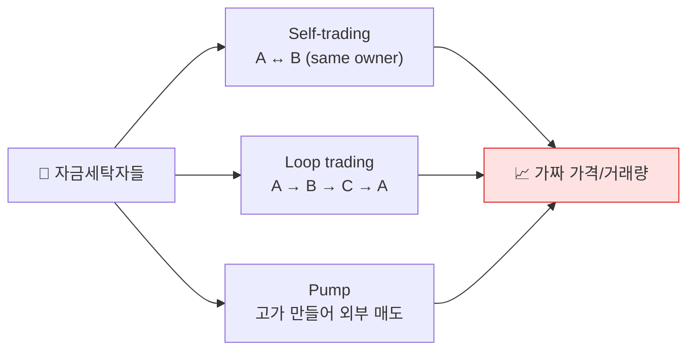

# Day 40 — NFT Wash Trading

> 가격을 임의로 만드는 자금세탁. ⏱️ ~70분.

## 📖 오늘 뭘 배우나

NFT는 **가격이 시장에 의해 강제되지 않는다**는 특성이 자금세탁자에게 매력적입니다. 자기들끼리 고가에 사고팔아 가격을 부풀린 뒤 외부 바이어에게 넘기는 패턴. 오늘은 Self-trading·Loop trading·Pump 3가지 패턴과 FATF·한국 FSC의 NFT VA 분류 기준을 정리합니다.


<!-- MAP-START -->
## 🗺 오늘의 지도


<!-- MAP-END -->

## 🎯 핵심 질문
1. NFT가 자금세탁에 매력적인 이유?
2. Wash trading 패턴 3가지?
3. FATF의 NFT 분류 기준?

## 📖 읽기 (~45분)
- 메인: [`../notes/3-crypto-aml/defi-nft-risks.md`](../notes/3-crypto-aml/defi-nft-risks.md) — 2절 (NFT)

## 🌐 외부 자료 (~15분)
- [Chainalysis — NFT 관련 Crypto Crime](https://www.chainalysis.com/) (사이트 내 검색)

## 🛠️ 미니 챌린지 (~10분)
- Self-trading 시나리오 직접 그리기 (A→B→A 같은 NFT)
- Loop trading 시나리오 (3자 순환)
- 탐지 룰 의사코드:
  ```
  IF (same_NFT_traded ≥3 times in 7d 
      AND price_change > 5x
      AND addresses share cluster)
    THEN flag as wash trade
  ```

## ✅ 체크포인트
- [ ] NFT 자금세탁 매력 (가격 자율 + 글로벌 즉시) 안다
- [ ] Wash trading 3패턴 (Self/Loop/Pump) 안다
- [ ] 한국 2024-06 FSC NFT 가이드라인 인지
- [ ] FATF NFT VA 분류 기준 안다

## 💭 오늘의 한 줄

## 💼 실무 현장 (Industry Reality)

### 한국 VASP에서는

한국 4대 원화거래소는 **NFT 직접 취급을 하지 않습니다** — 특금법상 NFT는 VA(가상자산)에 포함되지 않는다는 2022 FSC 유권해석이 있지만, 2024-06 FSC가 **"결제·지불 기능, 증권 유사 특성이 있으면 VA로 판단 가능"** 으로 가이드라인 업데이트. 이후 Upbit NFT는 2024년 중단, Korbit NFT는 2023년 중단. 현재 거래소의 NFT 노출은 **OpenSea·Blur·Magic Eden에서 ETH·SOL 유입** 형태로만 들어옴.

탐지는 **출금 주소가 NFT 마켓플레이스 컨트랙트인지** 체크하는 정도. Wash trading 자체 탐지는 글로벌 벤더(Chainalysis Storyline)에 의존.

### 글로벌에서는

**Chainalysis 2022 보고서** — NFT wash trading 추정 규모 **$8.9M/일** 수준이었고, 상위 262개 주소가 관련. OpenSea는 2022-09 **creator royalty 정책** + **제재 주소 차단**을 도입. 2023-02 **LooksRare·X2Y2**가 wash trading 방조 이슈로 거래량 급감.

**미국 IRS·DOJ**: 2022-05 NFT wash trading 관련 첫 형사 기소(Nathaniel Chastain, OpenSea insider trading). 2024년 **Bored Ape 관련 rug pull** 여러 건에서 자금세탁 혐의 추가.

**FATF 2023 업데이트**: "**collectible NFT**는 VA 아님, 하지만 **fungible 성격 또는 결제수단 유사 성격**이면 VA로 취급." 한국 FSC 가이드라인도 이 기준을 수용.

### Wash trade 탐지 룰 (실제 운영 패턴)

```
RULE: nft_wash_trade
WHEN same_nft_token_id traded 3+ times in 7d
  AND price_change_ratio > 5.0
  AND distinct_buyer_seller_cluster_count < 3      -- 같은 클러스터 순환
  AND counterparty_funding_same_source = true       -- 종잣돈 출처 동일
THEN flag = "wash_trade_suspect"
     action = EXCLUDE_FROM_VOLUME_REPORT
     investigate = true
```

Chainalysis Storyline은 이걸 **"Self-financed trading"**이라는 태그로 자동 라벨링.

### 자주 나오는 오해

- **"NFT는 그림이라 자금세탁 불가"** — 한 작품을 본인들끼리 고가에 매매하면 **시장가 창출 → 외부 매도 → 합법 수익화** 완성. FATF가 2022년부터 경고.
- **"거래소가 NFT 안 하니 무관"** — NFT 판매대금이 ETH/USDC로 거래소에 재입금되는 경로가 남아 있음. 거래소 KYT는 **counterparty가 OpenSea Seaport 같은 계약인지** 체크.
- **"Wash trading은 NFT만의 문제"** — 토큰 DEX에서도 LP·bot을 쓴 wash 거래가 다수(특히 소형 ERC-20). Chainalysis 2025 보고서가 확대 다룸.

