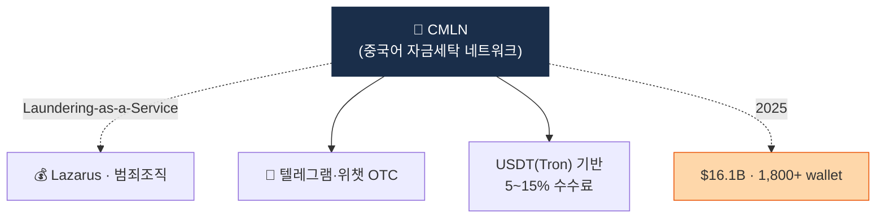

# Day 41 — CMLN (Chinese Money Laundering Networks)

> 2025-2026 가장 큰 자금세탁 인프라. ⏱️ ~70분.

## 📖 오늘 뭘 배우나

2025년 자금세탁의 중심축이 된 **CMLN (Chinese Money Laundering Networks)**. 텔레그램·위챗 OTC 네트워크가 5~15% 수수료로 **Laundering-as-a-Service**를 제공하며, Lazarus도 이 네트워크를 통해 OTC 환전합니다. 단일 범죄자가 아닌 **분업 생태계**의 등장이 왜 방어를 어렵게 만드는지 이해.


<!-- MAP-START -->
## 🗺 오늘의 지도


<!-- MAP-END -->

## 🎯 핵심 질문
1. CMLN의 2025 처리 규모?
2. Laundering-as-a-Service 모델?
3. 북한 라자루스가 CMLN을 활용하는 방식?

## 📖 읽기 (~45분)
- 메인: [`../notes/3-crypto-aml/onchain-typology.md`](../notes/3-crypto-aml/onchain-typology.md) — 3절 (CMLN)
- 보조: [`../notes/6-cases/lazarus-dprk.md`](../notes/6-cases/lazarus-dprk.md) — 4절 (Lazarus 자금세탁 단계)

## 🌐 외부 자료 (~20분)
- [Chainalysis 2026 Crypto Crime Report — Money Laundering 챕터](https://www.chainalysis.com/reports/crypto-crime-2026/)

## 🛠️ 미니 챌린지 (~5분)
- CMLN의 텔레그램 OTC 모델 + 수수료 (5~15%) 메모
- "한국 거래소가 CMLN 노출 wallet을 어떻게 식별/차단할까" 3줄 메모

## ✅ 체크포인트
- [ ] CMLN $16.1B/년 + 1,800 wallet + $40M/일 안다
- [ ] Laundering-as-a-Service 분업 생태계 안다
- [ ] Tron + USDT 활용 (저수수료) 안다
- [ ] 라자루스 + CMLN 연결 안다

## 💭 오늘의 한 줄

## 💼 실무 현장 (Industry Reality)

### 한국 VASP에서는

**CMLN·Pig butchering은 한국 STR 작성 건수 증가의 주요 원인.** 2024~2025년 FIU 통계에서 **보이스피싱·로맨스스캠 관련 STR이 2배 이상 급증**. 패턴은 거의 획일적:
- 피해자가 SNS·투자앱·텔레그램에서 접근받음 → 가상자산 투자 유도 → 피해자가 거래소에서 USDT(Tron) 매수 → 스캐머가 알려준 외부 지갑으로 송금 → **CMLN 허브 지갑으로 집계** → 수수료 제하고 법정화폐 환전

한국 거래소 실무 대응:
- **Pig butchering 의심 탐지 룰**: 신규 가입 30일 이내 + 고액 USDT 매수 + 즉시 외부 Tron 지갑 출금
- **피해자 쪽 탐지**: 신고 접수(1일 수십건) → 즉시 출금 제한 + KoFIU 보고
- **DAXA 공유 블랙리스트**: CMLN 허브 지갑 수천 개가 공통 차단

### 글로벌에서는

**Chainalysis 2025 Crypto Crime Report**:
- CMLN 처리 규모: 연 약 $16.1B
- 일일 평균: 약 $40M
- 관련 지갑: 1,800개+
- 주요 체인: Tron USDT (약 80%), Ethereum USDT, BSC

**미 재무부 FinCEN 2024-09** — Cambodia의 **Huione Group**(캄보디아 기반 CMLN 연계 그룹)을 "primary money laundering concern"으로 지정. **중국 정부 공식 협력이 거의 없어 국제 공조 어려움**이 특징 — Lazarus도 CMLN에 의존하는 이유가 이것.

**Lazarus (북한) + CMLN**: 2022 Ronin Bridge 해킹 $625M 중 상당 부분이 CMLN 경유 OTC 환전으로 추적됨(Chainalysis·TRM 공동 보고).

### CMLN 허브 지갑 탐지 휴리스틱

```
IDENTIFY_CMLN_HUB(wallet):
    # 1. Tron USDT 거래 비중
    if usdt_tron_volume_ratio < 0.6: return false
    # 2. fan-in/fan-out 패턴
    if unique_inbound_counterparties_30d < 50: return false
    # 3. 즉시 재송금 (hold time < 1h)
    if median_hold_time_hours > 2: return false
    # 4. 수수료 패턴 — CMLN은 5~15%를 떼는 경우
    if detected_fee_pattern != true: return false
    # 5. 텔레그램 OTC 라벨 존재
    if osint_telegram_linked == false: return false
    return "CMLN_HUB_SUSPECT"
```

### Pig butchering 피해자 대응 SOP (한국 거래소)

1. **09:00 직후** — 전날 신고 접수 건 일괄 확인, 가해자 출금 주소 즉시 자체 블랙리스트
2. **10:00~** — 피해자 계좌 일시 출금 제한 + 피해자 연락(은행 지급정지 유도)
3. **~12:00** — KoFIU STR 작성(패턴 Code 적용)
4. **오후** — 경찰청 사이버수사대 공문 수신 시 거래내역 제출
5. **주간** — DAXA 공유 채널에 허브 지갑 공유

### 자주 나오는 오해

- **"CMLN은 해외 문제"** — 피해자가 한국인이면 출금 경로가 한국 VASP 경유. 한국 거래소는 **미들맨**. 범죄수익 회수는 어렵고 피해자 구제 의무는 존재.
- **"피해자 보호만 하면 된다"** — 동시에 **가해자(money mule) 계좌 신속 탐지**도 의무. 둘 다 안 하면 검사 대응에서 "대응 미흡" 지적.
- **"USDT Tron은 자금세탁 코인"** — Tron 네트워크 자체는 합법이지만 **CMLN의 선호 수단**인 건 사실(수수료 낮음, 봇 친화). Tether가 2024년부터 불법 주소 freeze 확대.

