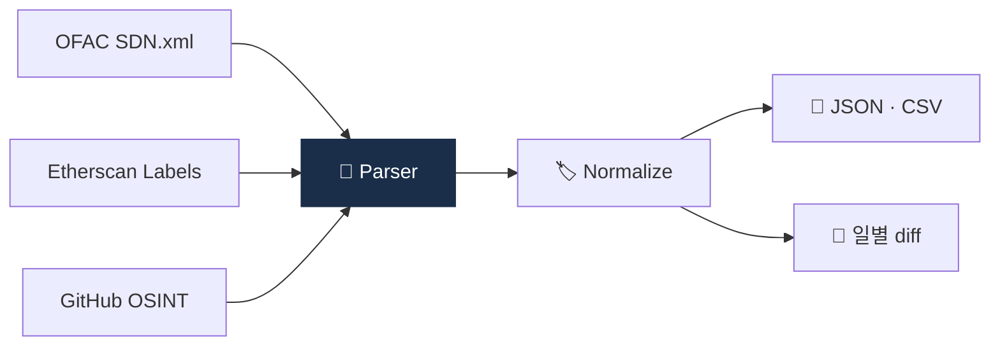

# Day 42 — 🛠️ 미니 프로젝트 3: Mixer 주소 라벨 fetcher + 6주 리뷰

> 위험 데이터셋 직접 만들어보기. ⏱️ ~150분.

## 📖 오늘 뭘 배우나

Week 6의 결산. 위험 주소 데이터셋을 **OSINT(OFAC SDN, Etherscan label 등 공개 소스)** 에서 수집해 표준 형식으로 저장하는 스크립트를 짭니다. 자체 라벨 DB의 어려움과 가치를 체감하는 과정이며, 결과물은 Capstone의 Sanctions 모듈로 연결됩니다.


<!-- MAP-START -->
## 🗺 오늘의 지도


<!-- MAP-END -->

## 🎯 회고 질문
1. 자금세탁 7유형 중 한국 시장 1위?
2. CMLN의 영향이 한국 사업자에게 미치는 길은?
3. 자체 라벨 DB 구축의 가치는?

## 🛠️ 미니 프로젝트 3 (~120분)

### 목표
**알려진 mixer 주소를 공개 소스에서 fetch + 표준 형식으로 저장**

### 사양
- 입력: 없음 (공개 소스 자동 수집)
- 출력: JSON/CSV 형식의 mixer 주소 리스트 + 메타데이터

### 구현 가이드
프로젝트: `aml/projects/03-mixer-fetcher/`

```python
# main.py 의사코드
import requests, csv, json
from datetime import datetime

# 공개 소스 (예시)
SOURCES = {
    "ofac_sdn": "https://www.treasury.gov/ofac/downloads/sdn.xml",
    "etherscan_label_tornado": "https://etherscan.io/accounts/label/tornado-cash",
    # 그 외 OSINT 소스 (Wasabi, Samourai 등)
}

def fetch_ofac_crypto_addresses() -> list[dict]:
    """OFAC SDN XML 파싱 → 가상자산 주소만 추출"""
    ...

def fetch_etherscan_label(label: str) -> list[str]:
    """Etherscan label 페이지 스크랩 (라벨 DB)"""
    ...

def normalize(addr: str, label: str, source: str) -> dict:
    return {
        "address": addr.lower(),
        "label": label,
        "source": source,
        "fetched_at": datetime.utcnow().isoformat(),
    }

def save(records: list[dict]):
    """JSON + CSV 저장"""
    ...
```

### 산출물
- `projects/03-mixer-fetcher/main.py`
- `projects/03-mixer-fetcher/README.md`
- `projects/03-mixer-fetcher/data/mixer_addresses.json`
- `projects/03-mixer-fetcher/data/mixer_addresses.csv`

→ 자세한 가이드: [`../projects/03-mixer-fetcher/README.md`](../projects/03-mixer-fetcher/README.md)

### 보너스
- 일일 cron으로 자동 갱신
- diff 비교 (어제 vs 오늘 추가된 주소)

## ✅ 체크포인트
- [ ] Fetcher 작동
- [ ] 최소 OFAC SDN 가상자산 주소 수십 개 수집
- [ ] [`progress.md`](progress.md) Week 6 + W6 미니 프로젝트 체크
- [ ] git commit + push

## 💭 6주차 회고

가장 의외였던 자금세탁 패턴:
직접 만들어보니 라벨 DB의 어려움:
다음주 컴플 운영 기대:
