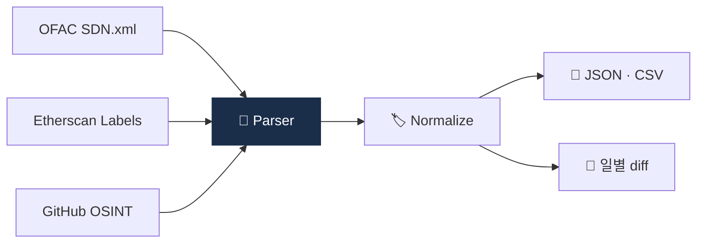

# Day 42 — 🛠️ 미니 프로젝트 3: Mixer 주소 라벨 fetcher + 6주 리뷰

> 위험 데이터셋 직접 만들어보기. ⏱️ ~150분.

## 📖 오늘 뭘 배우나

Week 6의 결산. 위험 주소 데이터셋을 **OSINT(OFAC SDN, Etherscan label 등 공개 소스)** 에서 수집해 표준 형식으로 저장하는 스크립트를 짭니다. 자체 라벨 DB의 어려움과 가치를 체감하는 과정이며, 결과물은 Capstone의 Sanctions 모듈로 연결됩니다.


<!-- MAP-START -->
## 🗺 오늘의 지도


<!-- MAP-END -->

## 🎯 회고 질문
1. 자금세탁 7유형 중 한국 시장 1위?
2. CMLN의 영향이 한국 사업자에게 미치는 길은?
3. 자체 라벨 DB 구축의 가치는?

## 🛠️ 미니 프로젝트 3 (~120분)

### 목표
**알려진 mixer 주소를 공개 소스에서 fetch + 표준 형식으로 저장**

### 사양
- 입력: 없음 (공개 소스 자동 수집)
- 출력: JSON/CSV 형식의 mixer 주소 리스트 + 메타데이터

### 구현 가이드
프로젝트: `aml/projects/03-mixer-fetcher/`

```python
# main.py 의사코드
import requests, csv, json
from datetime import datetime

# 공개 소스 (예시)
SOURCES = {
    "ofac_sdn": "https://www.treasury.gov/ofac/downloads/sdn.xml",
    "etherscan_label_tornado": "https://etherscan.io/accounts/label/tornado-cash",
    # 그 외 OSINT 소스 (Wasabi, Samourai 등)
}

def fetch_ofac_crypto_addresses() -> list[dict]:
    """OFAC SDN XML 파싱 → 가상자산 주소만 추출"""
    ...

def fetch_etherscan_label(label: str) -> list[str]:
    """Etherscan label 페이지 스크랩 (라벨 DB)"""
    ...

def normalize(addr: str, label: str, source: str) -> dict:
    return {
        "address": addr.lower(),
        "label": label,
        "source": source,
        "fetched_at": datetime.utcnow().isoformat(),
    }

def save(records: list[dict]):
    """JSON + CSV 저장"""
    ...
```

### 산출물
- `projects/03-mixer-fetcher/main.py`
- `projects/03-mixer-fetcher/README.md`
- `projects/03-mixer-fetcher/data/mixer_addresses.json`
- `projects/03-mixer-fetcher/data/mixer_addresses.csv`

→ 자세한 가이드: [`../projects/03-mixer-fetcher/README.md`](../projects/03-mixer-fetcher/README.md)

### 보너스
- 일일 cron으로 자동 갱신
- diff 비교 (어제 vs 오늘 추가된 주소)

## ✅ 체크포인트
- [ ] Fetcher 작동
- [ ] 최소 OFAC SDN 가상자산 주소 수십 개 수집
- [ ] [`progress.md`](progress.md) Week 6 + W6 미니 프로젝트 체크
- [ ] git commit + push

## 💭 6주차 회고

가장 의외였던 자금세탁 패턴:
직접 만들어보니 라벨 DB의 어려움:
다음주 컴플 운영 기대:

## 💼 실무 현장 (Industry Reality)

### 한국 VASP에서는

자체 라벨 DB는 **벤더 KYT의 보완재**로 운영. 한국 거래소의 "자체 블랙리스트"는 보통 **3~5만 건 규모**이며 다음으로 구성:
- **OFAC SDN 가상자산 주소** (~500~1,000건, 벤더와 중복 많음)
- **UN·EU·한국 외교부 제재 리스트** 매핑 주소
- **DAXA 공유 블랙리스트** (회원사 간 실시간 공유, 수천~만 건)
- **자체 STR 이력 주소** (3년 누적, 수천~만 건)
- **피해자 신고 연관 지갑** (일별 갱신, 월 수백~수천건)

OFAC SDN.xml은 **일 1~2회 자동 폴링 + diff**. 업데이트 지연 시 감독당국 지적 사유.

### 글로벌에서는

**Chainalysis Data Accuracy Flywheel** — 고객사가 벤더에 feedback(오라벨 제보) → 벤더가 라벨 개선 → 전 고객 품질 개선. 이게 **벤더의 경쟁 우위 본질**. 대형 거래소(Coinbase·Binance·Kraken)는 자체 **"투명성 센터"** 를 운영하며 신고받은 주소를 공개 리스트로 발표(사용자 보호용).

**OFAC SDN Crypto Address List** — 2018년 첫 등재(이란 관련 2건). 현재 수백 건 수준, 주로 이란·북한·러시아·Hamas·Lazarus. 매 분기 수십 건 추가.

OSINT 데이터 소스:
- **OFAC SDN** — https://www.treasury.gov/ofac/downloads/sdn.xml (공식, 일일 갱신)
- **Etherscan labels** — 비공식이지만 라벨 다양성 1위
- **Chainabuse** (Chainalysis 운영) — 피해자 신고 집계 사이트
- **ScamSniffer·CryptoScamDB** — 오픈소스 사기 지갑 DB
- **Tornado Cash contract list** — GitHub OSINT에서 fork 가능

### 자체 라벨 DB 운영 체크리스트

```
DAILY:
  - OFAC SDN diff 확인, 신규 주소 sync
  - DAXA 공유 채널 신규 블랙리스트 흡수
  - STR 작성 건의 수취인 주소 자체 DB 등록

WEEKLY:
  - 벤더 라벨과 자체 라벨 불일치 리포트
  - 오라벨 이의제기 수거 (False Positive 보고)

MONTHLY:
  - 3개월 이상 미갱신 라벨 재검증 (라벨 drift 방지)
  - 신규 OSINT 소스 평가 + 통합
```

### 자주 나오는 오해

- **"벤더 라벨이면 충분"** — 한국 특수 범죄(보이스피싱 편취 지갑 등)는 벤더 DB에 반영이 느림(수주~수개월). 자체 DB 없이는 신속 대응 불가.
- **"크롤링만으로 라벨을 얻을 수 있다"** — Etherscan은 **대량 크롤링 금지** + Cloudflare 차단 강화. 공식 API 또는 partner 계약 필요. 많은 거래소가 OSINT와 파트너십 혼합으로 운영.
- **"라벨 DB는 운영팀 업무"** — 라벨 품질은 곧 **FP rate → STR 수 → 감독당국 평가**로 연결. 실제로는 CISO·AMLO 레벨 KPI.
