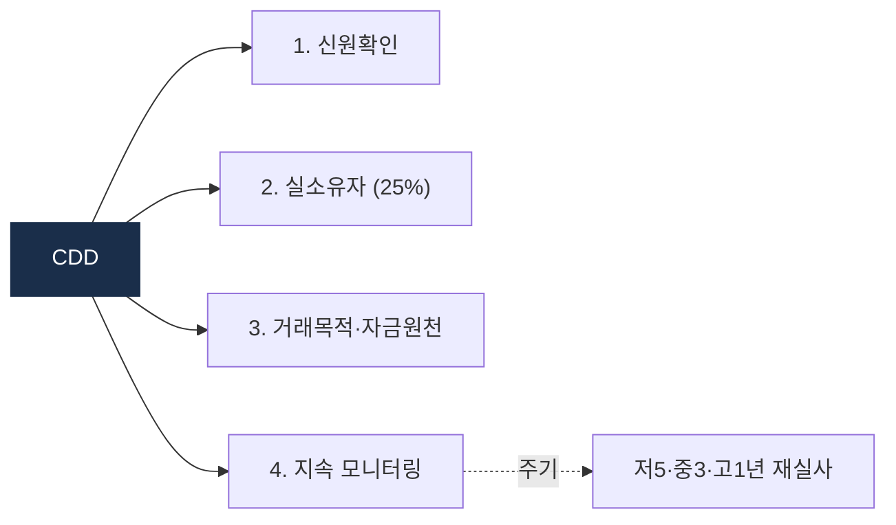

# Day 43 — CDD 4단계 운영

> 표준 실사 프로세스 deep. ⏱️ ~70분.

## 📖 오늘 뭘 배우나

Week 7은 컴플라이언스 운영 주간. 먼저 모든 고객에게 적용되는 **CDD 4단계**(식별·BO·목적·모니터링)를 운영 관점에서 깊이 봅니다. 특히 **지속 모니터링**이 onboarding 1회로 끝나지 않는다는 원칙, 그리고 한국 RBA 가이드라인의 재실사 주기(저5/중3/고1년)를 정리.


<!-- MAP-START -->
## 🗺 오늘의 지도


<!-- MAP-END -->

## 🎯 핵심 질문
1. CDD 4단계 (식별/BO/목적/모니터링) 각 핵심 과제?
2. 한국 가이드라인의 RBA 4 차원?
3. 지속 모니터링 재실사 주기 (저5/중3/고1)?

## 📖 읽기 (~50분)
- 메인: [`../notes/5-compliance/cdd-edd.md`](../notes/5-compliance/cdd-edd.md) — 1, 3절

## 🛠️ 미니 챌린지 (~15분)
- 가상 신규 고객 1명 시나리오 → CDD 4단계 모두 적용 메모
- "재실사 주기 알림 시스템" 가벼운 SQL 의사코드:
  ```sql
  SELECT customer_id FROM customers
  WHERE risk_level = 'HIGH' AND last_kyc_date < NOW() - INTERVAL '1 year'
  ```

## ✅ 체크포인트
- [ ] CDD 4단계 외운다
- [ ] BO 25% 기준 안다
- [ ] 한국 RBA 4차원 + 등급별 통제 차이 안다
- [ ] 지속 모니터링 ≠ onboarding 1회 안다

## 💭 오늘의 한 줄

## 💼 실무 현장 (Industry Reality)

### 한국 VASP에서는

CDD 4단계 운영은 **KYC 벤더 통합 + 내부 프로세스**로 쪼개짐:

| 단계 | 담당 시스템 | 한국 VASP 실무 |
|---|---|---|
| 1. 신원확인 | 본인확인기관 API(PASS·NICE·KCB) | 실명확인 + 휴대폰 명의 + 은행 실명계좌 3요소 |
| 2. 실소유자(BO) 확인 | 자체 + Sumsub/ARGOS 보조 | 25% 이상 지분 확인. 법인 KYB는 ARGOS 표준 |
| 3. 거래목적·자금원천 | 자체 설문 + EDD 트리거 | 가입 시 간단 설문, 고위험 감지 시 EDD |
| 4. 지속 모니터링 | 자체 RBA 스코어링 + KYT | 리스크 점수 변동 시 재실사 트리거 자동 발동 |

**RBA 재실사 주기(FIU 가이드라인)**: 저위험 5년, 중위험 3년, 고위험 1년. 실무적으로는 **리스크 등급 상승이 감지되면 주기 무관 즉시 재실사**. 예: 갑자기 고액 거래 시작 → 자동으로 EDD 요청.

### 글로벌에서는

**Sumsub·Jumio·Onfido·Persona**가 글로벌 KYC 벤더 4강. Sumsub는 APAC·EMEA 강점, Persona는 미국 핀테크 강점, Jumio는 은행 표준. 한국 진출 vendor는 **ARGOS Identity** (구 NEOPIN Identity)가 토종. Coinbase·Kraken은 **자체 KYC 플랫폼 + 벤더 병행** — 대량 처리와 국가별 규정 차이 대응.

**EU MiCA + GDPR** 이중 압력 — CDD 수집 데이터를 **최소 수집(data minimization)** 원칙 + 15년 보관. 보관 끝나면 즉시 삭제 의무. 한국은 개인정보보호법 + 특금법 5년 + 이용자보호법 15년으로 복잡.

### CDD 4단계 pseudocode

```python
def onboard_customer(applicant):
    # 1. 신원확인
    identity = kyc_vendor.verify(applicant.name, applicant.resident_id, applicant.phone)
    if not identity.verified: return reject("identity_fail")
    # 2. BO 확인 (법인이면)
    if applicant.is_corporate:
        bo_list = kyb_vendor.get_beneficial_owners(applicant.corp_id, threshold=0.25)
        if any(b.is_sanctioned for b in bo_list): return reject("bo_sanctioned")
    # 3. 거래목적·자금원천 수집
    purpose = applicant.declared_purpose
    sof = applicant.declared_source_of_funds
    # 4. 초기 리스크 등급
    risk = compute_risk(identity, purpose, sof, applicant.country)
    customer = create_customer(applicant, risk_level=risk)
    # 5. 지속 모니터링 예약
    schedule_next_kyc(customer, months=recurrence_by_risk(risk))  # 저60/중36/고12
    return customer

def ongoing_monitoring(customer):
    # 리스크 점수 재계산 (거래 이력 기반)
    new_risk = recompute_risk(customer.recent_txs_90d, customer.kyt_alerts)
    if new_risk > customer.risk_level:
        trigger_edd(customer)
    elif time_since_last_kyc(customer) > recurrence_limit(customer.risk_level):
        trigger_periodic_refresh(customer)
```

### 자주 나오는 오해

- **"KYC는 가입 시 한 번만"** — 틀림. 지속 모니터링이 CDD의 4단계. 재실사는 주기 + 이벤트 트리거 둘 다 있음.
- **"BO 25%는 고정"** — 기본값이고, **고위험 업종(카지노·원전·방산)은 10% 적용** 권고. FATF R.10 + 한국 특금법 시행령.
- **"벤더 KYC로 모든 게 끝"** — 벤더는 신원확인까지. **리스크 스코어링·EDD·지속 모니터링은 자체 책임**. 감독당국 검사에서 이 부분이 주로 지적됨.

