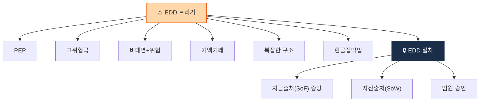

# Day 44 — EDD 트리거 + 자금원천 증빙

> 강화실사가 발동하는 6가지 + 자금출처 추적. ⏱️ ~75분.

## 📖 오늘 뭘 배우나

EDD의 본질은 **자금원천 증빙**. 일반 CDD 위에 **SoF(Source of Funds)·SoW(Source of Wealth) 서류 요구 + 고위경영진 승인**을 얹는 강화 절차이며, PEP·고위험국·비대면+위험 같은 6가지 트리거가 자동 발동됩니다. 가상자산 특화의 **Wallet Ownership Verification**(지갑 소유 증명)까지 연결.

<!-- MAP-START -->
## 🗺 오늘의 지도

<!-- MAP-END -->

## 🎯 핵심 질문
1. EDD 트리거 6가지?
2. Source of Funds vs Source of Wealth 차이?
3. EDD 결재 라인 (고위경영진 승인)?

## 📖 읽기 (~50분)
- 메인: [`../notes/5-compliance/cdd-edd.md`](../notes/5-compliance/cdd-edd.md) — 2, 5절
- 보조: [`../notes/5-compliance/cdd-edd.md`](../notes/5-compliance/cdd-edd.md) — 4절 (가상자산 특화)

## 🛠️ 미니 챌린지 (~15분)
- EDD 트리거 6가지 시나리오 만들기:
  - PEP / 고위험국 / 비대면+위험 / 거액 / 복잡한 구조 / 현금집약 업종
- Wallet Ownership Verification 3가지 방법 (Satoshi/Signed/사진) 정리

## ✅ 체크포인트
- [ ] EDD 6 트리거 외운다
- [ ] Source of Funds vs Wealth 차이 즉답
- [ ] 고위경영진 승인 필수 안다
- [ ] 가상자산 특화 (Wallet 소유 증명) 안다

## 💭 오늘의 한 줄
