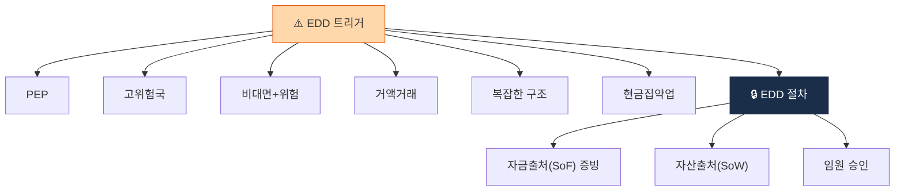

# Day 44 — EDD 트리거 + 자금원천 증빙

> 강화실사가 발동하는 6가지 + 자금출처 추적. ⏱️ ~75분.

## 📖 오늘 뭘 배우나

EDD의 본질은 **자금원천 증빙**. 일반 CDD 위에 **SoF(Source of Funds)·SoW(Source of Wealth) 서류 요구 + 고위경영진 승인**을 얹는 강화 절차이며, PEP·고위험국·비대면+위험 같은 6가지 트리거가 자동 발동됩니다. 가상자산 특화의 **Wallet Ownership Verification**(지갑 소유 증명)까지 연결.

<!-- MAP-START -->
## 🗺 오늘의 지도

<!-- MAP-END -->

## 🎯 핵심 질문
1. EDD 트리거 6가지?
2. Source of Funds vs Source of Wealth 차이?
3. EDD 결재 라인 (고위경영진 승인)?

## 📖 읽기 (~50분)
- 메인: [`../notes/5-compliance/cdd-edd.md`](../notes/5-compliance/cdd-edd.md) — 2, 5절
- 보조: [`../notes/5-compliance/cdd-edd.md`](../notes/5-compliance/cdd-edd.md) — 4절 (가상자산 특화)

## 🛠️ 미니 챌린지 (~15분)
- EDD 트리거 6가지 시나리오 만들기:
  - PEP / 고위험국 / 비대면+위험 / 거액 / 복잡한 구조 / 현금집약 업종
- Wallet Ownership Verification 3가지 방법 (Satoshi/Signed/사진) 정리

## ✅ 체크포인트
- [ ] EDD 6 트리거 외운다
- [ ] Source of Funds vs Wealth 차이 즉답
- [ ] 고위경영진 승인 필수 안다
- [ ] 가상자산 특화 (Wallet 소유 증명) 안다

## 💭 오늘의 한 줄

## 💼 실무 현장 (Industry Reality)

### 한국 VASP에서는

EDD의 **실제 발동은 거의 금액 트리거**. 이론상 6가지(PEP·고위험국·비대면+위험·거액·복잡한 구조·현금집약업)이지만, 실제 일상에서 가장 많이 걸리는 건:
- **1일 누적 원화 입출금 1억원 초과** → 자금원천 증빙 요청
- **월 누적 3억원 초과** → 고액거래 리포트 + EDD 재실사
- **신규 가입 30일 이내 고액(3천만원+)** → "벼락 거액" 룰로 EDD

증빙 서류는 대부분 아래 중 하나:
- 급여명세서 최근 3개월 + 원천징수영수증
- 사업자등록증 + 매출세금계산서
- 부동산 매도계약서 + 등기부등본
- 주식 양도 증빙 + 양도소득세 신고서
- 해외 송금 이력(SWIFT 기록)

**PEP 스크리닝**은 **Dow Jones·Refinitiv·LexisNexis WorldCheck** 중 하나의 DB를 사용. 한국 VASP는 대부분 **Dow Jones Risk & Compliance** 구독(연 수천만원~수억원). PEP 매치 시 예외 없이 임원 승인 필수.

### 글로벌에서는

**Coinbase EDD SOP**는 자산 규모 티어별:
- Tier 3 (일반): $100K+ 거래 시 SoF 증빙
- Tier 4 (VIP): 자산·소득·사업소득 전반 증빙 + 연 1회 재검토
- Tier 5 (Institution): 법인 구조 전체, 모든 BO 증빙, 외부 감사 보고서

**Binance**는 2024년 **"Wealth Manager" program** 분리 — 고자산 고객 전담 EDD. OKX는 2025-02 $504M 합의 이후 **"Legacy KYC 전수 재검토"** — 이전 가입자 수백만명 재실사.

### 가상자산 특화 — Wallet Ownership Verification

EDD에서 외부 지갑을 등록할 때 **"이 지갑이 당신 것임을 증명"** 하라고 요구. 3가지 방법:

1. **Satoshi Test** (소액 송금 테스트): 거래소가 사용자 지갑에 지정 금액(예: 0.00001 BTC)을 보내고, 그 주소에서 회사 지정 주소로 같은 금액 되돌려 보내게 함
2. **Signed Message**: 거래소가 nonce 문자열을 주고, 사용자가 지갑의 private key로 서명 → 서명 검증
3. **사진 인증** (deprecated): 지갑 화면 + 본인 얼굴 셀카. Travel Rule 시행 이후 신뢰도 낮아 사실상 폐기

EU TFR(Travel Rule) + MiCA는 **Self-Hosted Wallet** 입출금마다 소유 증명 요구 — 시스템 부담이 큼.

### 자주 나오는 오해

- **"EDD는 고위험 고객만"** — 트리거 기반. **일반 고객도 거액 거래 시작하면 즉시 발동**. 티어 업그레이드 개념.
- **"증빙은 PDF 받으면 끝"** — 증빙 서류의 **진위 확인**까지가 EDD. 위조 의심 시 발급기관 직접 조회. 한국은 **홈택스 연동으로 원천징수영수증 실시간 검증** 가능.
- **"Wallet Ownership은 형식적"** — 실제로는 자금세탁범이 공범 지갑을 자기 것이라 주장하는 패턴 많음. **Signed message + on-chain 활동 이력**을 함께 봐야 진짜 소유자 판단.

