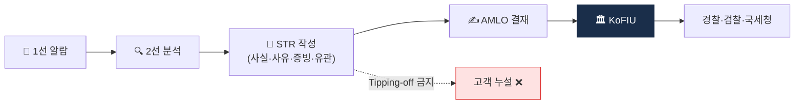

# Day 45 — STR 작성 SOP

> 좋은 STR vs 나쁜 STR. ⏱️ ~75분.

## 📖 오늘 뭘 배우나

STR은 AML 시스템의 **최종 출구**. 오늘은 **좋은 STR의 4요소**(사실·의심사유·증빙·유관거래)와 **Tipping-off 금지**를 중심으로 실제 작성 SOP를 익힙니다. 감독당국이 STR 수가 적은 회사를 오히려 의심한다는 점, 그래서 "의심이 들면 문서화 후 STR, 아니면 사유 기록"이 표준 문화인 이유까지.


<!-- MAP-START -->
## 🗺 오늘의 지도


<!-- MAP-END -->

## 🧮 STR 실무 템플릿 (오늘의 핵심)

### 7개 필수 섹션 (FIU-TIS 기준)

1. 보고기관 정보  2. 의심거래 개요 (5W1H)  3. 고객 정보 (KYC snapshot)
4. 거래 상세  5. 의심 근거  6. 첨부자료  7. 보고자 의견

### Good vs Bad STR 차이

- **❌ Bad**: "큰 금액 출금" (사유 빈약, 근거 없음)
- **✅ Good**: "KYT score 72 + 7일 structuring 패턴 + Tornado 5% exposure + 자금원천 증빙 무응답"

### 품질 체크리스트 (8개)

- [ ] 5W1H 완성
- [ ] 금액·일시·주소 정확 (ms 정밀도)
- [ ] KYT 점수 + 데이터 첨부
- [ ] OFAC 조회 캡처
- [ ] 관련 거래 7일 윈도우
- [ ] 자금원천 증빙 시도 기록
- [ ] Tipping-off 통제 ✓
- [ ] 의심 수준 명시

### 🛠️ 오늘의 미니 챌린지 업그레이드

샘플 케이스로 Good STR 작성:
- 고객 A, 5억원 출금, Tornado 5% + OFAC 2-hop 8%
- 위 7개 섹션 + 8개 체크리스트 모두 충족하여 작성
- 실제로 FIU에 제출 가능한 수준인지 동료 리뷰

**상세 템플릿**: [`../notes/5-compliance/str-ctr.md`](../notes/5-compliance/str-ctr.md) §9 참조.

## 🎯 핵심 질문
1. 좋은 STR 4요소?
2. Tipping-off 위반의 처벌?
3. STR 사후 흐름 (KoFIU → 어디?)

## 📖 읽기 (~50분)
- 메인: [`../notes/5-compliance/str-ctr.md`](../notes/5-compliance/str-ctr.md) — 1, 3, 5, 6절

## 🛠️ 미니 챌린지 (~20분)
- 가상 STR 1건 직접 작성 (사실/사유/증빙/유관거래)
  - 시나리오: "신규 고객 A가 가입 직후 입금 즉시 mixer로 전액 출금 요청"
- "Tipping-off 위반 사례 → 처벌" 짧은 메모

## ✅ 체크포인트
- [ ] STR 4요소 (사실/의심사유/증빙/유관거래) 외운다
- [ ] Tipping-off 처벌 (1년/1천만원) 안다
- [ ] STR 사후 흐름 (KoFIU → 경찰/검찰/국세청 등) 안다
- [ ] STR 패턴 7가지 (Mixer/SDN/Smurfing/Pass-through/신원불일치/도난/사기) 인지

## 💭 오늘의 한 줄

## 💼 실무 현장 (Industry Reality)

### 한국 VASP에서는

**STR 제출 시스템은 KoFIU FIU-TIS 포털**. 2025년 기준 API 제출도 가능하지만 한국 거래소 대부분은 **웹 포털 수기 업로드**를 사용. 표준 포맷:
- 보고서 번호 + 보고기관 정보
- 의심거래 개요 (요약 200~500자)
- 고객 정보 (신원/거래내역)
- 의심사유 상세 (2000자 이상이 일반적)
- 증빙 자료 첨부 (거래내역 엑셀, KYT 스크린샷, 제재 리스트 매치 기록)
- 유관 거래 (같은 패턴 거래 목록)

**제출 후 7일 이내 수리 통보**가 표준. 긴급성 판단 시 FIU가 즉시 경찰청·검찰·국세청·관세청에 이첩.

**Analyst 1인당 월 STR 3~10건**(한국 평균). 거래소 규모에 따라 회사 전체 **월 STR 수십~수백건**. Upbit는 연간 수천건 규모로 업계 최다.

### 글로벌에서는

**FinCEN SAR (미국)**: E-Filing API로 제출. Coinbase FCI 팀이 연간 수만 건 제출한다고 2023 Transparency Report. **제출 후 30일 이내 의무**. 고의 미제출 시 기관 벌금 최대 $100K/건, 개인 형사처벌.

**EU MiCA + AMLR**: 2027부터 EU 전역 단일 **goAML** 시스템 도입 예정. 현재는 국가별 FIU(독일 FIU·프랑스 TRACFIN 등).

**"좋은 SAR/STR"의 글로벌 기준** (FinCEN 2024 가이드):
- **Who** (대상 명확)
- **What** (행위 구체)
- **When** (시간·날짜)
- **Where** (지갑·계좌·IP)
- **Why** (왜 의심)
- **How** (어떻게 발견)
→ 5W1H가 빠짐 없어야 함. 형식적 STR은 오히려 **감독당국 감점 요인**.

### STR 작성 SOP (한국 표준)

```
1. KYT Alert → Analyst 1차 리뷰 (false positive 제외)
2. 의심거래 확정 시 조사 티켓 오픈(Jira·자체 case tool)
3. 증거 수집:
   - 온체인 tx 해시, 카운터파티 라벨
   - 고객 KYC 정보, 거래 이력 90일
   - 벤더 KYT exposure report 스크린샷
   - 제재 리스트 매치 기록
4. STR 초안 작성(5W1H 충족)
5. AMLO 결재 (검토 24~48h)
6. FIU-TIS 포털 제출
7. 내부 기록 보관(5년)
8. *** Tipping-off 금지 — 고객·제3자에게 누설 절대 금지 ***
```

### Tipping-off 위반의 실제 처벌

한국 특금법 §5의2: **1년 이하 징역 또는 1천만원 이하 벌금**. FIU 실사례:
- 2022년 국내 VASP 직원이 STR 대상 고객에게 "조심하라"는 사적 연락 → 형사 기소
- 2024년 한 은행 직원이 친척 관련 STR을 귀띔 → 해고 + 벌금

내부 시스템에서 STR 대상 고객 **VIP 담당 영업·마케팅 접근 자동 차단**이 일반적인 내부통제.

### 자주 나오는 오해

- **"STR 많이 내면 잘하는 것"** — 틀림. 수량보다 **품질**. 형식적 대량 STR은 FIU 검사에서 "분석 미흡" 평가. 실제 수사로 이어진 STR 비율이 핵심 KPI.
- **"STR 제출하면 자동 수사"** — 아님. KoFIU는 **수집·분석·배포 기관**. 경찰·검찰이 자체 판단으로 수사 개시. STR 대부분은 정보로만 활용, 수사 비율은 **전체 STR의 5~15%**.
- **"STR은 개인정보 침해"** — 법적 의무라 개인정보보호법 예외 대상. 하지만 **내부 접근 통제·암호화·보관기간 준수** 의무는 여전. 침해는 Tipping-off 별개로 처벌.
