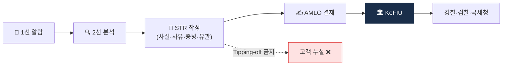

# Day 45 — STR 작성 SOP

> 좋은 STR vs 나쁜 STR. ⏱️ ~75분.

## 📖 오늘 뭘 배우나

STR은 AML 시스템의 **최종 출구**. 오늘은 **좋은 STR의 4요소**(사실·의심사유·증빙·유관거래)와 **Tipping-off 금지**를 중심으로 실제 작성 SOP를 익힙니다. 감독당국이 STR 수가 적은 회사를 오히려 의심한다는 점, 그래서 "의심이 들면 문서화 후 STR, 아니면 사유 기록"이 표준 문화인 이유까지.

<!-- MAP-START -->
## 🗺 오늘의 지도

<!-- MAP-END -->

## 🎯 핵심 질문
1. 좋은 STR 4요소?
2. Tipping-off 위반의 처벌?
3. STR 사후 흐름 (KoFIU → 어디?)

## 📖 읽기 (~50분)
- 메인: [`../notes/5-compliance/str-ctr.md`](../notes/5-compliance/str-ctr.md) — 1, 3, 5, 6절

## 🛠️ 미니 챌린지 (~20분)
- 가상 STR 1건 직접 작성 (사실/사유/증빙/유관거래)
  - 시나리오: "신규 고객 A가 가입 직후 입금 즉시 mixer로 전액 출금 요청"
- "Tipping-off 위반 사례 → 처벌" 짧은 메모

## ✅ 체크포인트
- [ ] STR 4요소 (사실/의심사유/증빙/유관거래) 외운다
- [ ] Tipping-off 처벌 (1년/1천만원) 안다
- [ ] STR 사후 흐름 (KoFIU → 경찰/검찰/국세청 등) 안다
- [ ] STR 패턴 7가지 (Mixer/SDN/Smurfing/Pass-through/신원불일치/도난/사기) 인지

## 💭 오늘의 한 줄
