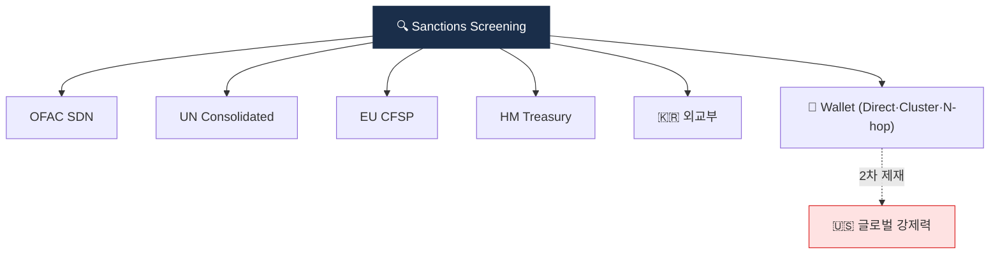

# Day 46 — 제재 스크리닝 (이름 + Wallet)

> OFAC/UN/EU/외교부 + 가상자산 SDN. ⏱️ ~80분.

## 📖 오늘 뭘 배우나

제재 스크리닝은 거래 **전·중·후** 3단 체크로 작동합니다. 오늘은 **5대 리스트**(OFAC SDN·UN·EU·HM Treasury·한국 외교부)와 **이름 fuzzy 매칭의 함정**, 그리고 **Wallet 주소 매칭 3종**(Direct·Cluster·Hop)을 정리. False Positive 처리(Disposition)가 왜 감독 검사의 핵심 증빙이 되는지도 이해.


<!-- MAP-START -->
## 🗺 오늘의 지도


<!-- MAP-END -->

## 🎯 핵심 질문
1. 핵심 제재 리스트 5개?
2. 이름 fuzzy 매칭의 함정?
3. Wallet 주소 매칭 3가지 (Direct/Cluster/Hop)?

## 📖 읽기 (~55분)
- 메인: [`../notes/5-compliance/sanctions-screening.md`](../notes/5-compliance/sanctions-screening.md) — 1~7절

## 🌐 외부 자료 (~15분)
- [OFAC SDN 검색](https://sanctionssearch.ofac.treas.gov/)
- [UN Consolidated List](https://www.un.org/securitycouncil/content/un-sc-consolidated-list)

## 🛠️ 미니 챌린지 (~10분)
- "Kim Min-soo" 같은 흔한 이름 → false positive 처리 흐름 메모
- Disposition 코드 3개 정의 (TP-Confirmed / FP-Different DOB / Pending)

## ✅ 체크포인트
- [ ] OFAC SDN + UN + EU + 외교부 5대 리스트 안다
- [ ] Wallet 매칭 3종 (Direct/Cluster/Hop) 안다
- [ ] False Positive disposition 흐름 안다
- [ ] OFAC 2차 제재의 글로벌 영향 안다

## 💭 오늘의 한 줄

## 💼 실무 현장 (Industry Reality)

### 한국 VASP에서는

**제재 스크리닝은 KYC onboarding + 매 거래**에서 2번 돌아감. Upbit·Bithumb·Coinone·Korbit 모두 이름 매칭은 **Sumsub·Jumio·ARGOS**(KYC 벤더 내장) 또는 자체 fuzzy 엔진(주로 **Jaro-Winkler** + 음차 변환 테이블)을 쓰고, **wallet 주소 매칭은 Chainalysis KYT**의 `identifications` 필드로 처리. 외교부 "금융제재대상자" 엑셀은 매일 09:00에 수동 다운로드·diff 비교하는 곳이 아직 많음(API 미개방). DAXA 5사는 공동 제재 주소 블랙리스트를 **VerifyVASP 내부 채널**로 공유.

### 글로벌에서는

**Coinbase Sanctions Operations 팀**이 별도 부서로 존재(약 50~80명). OFAC SDN + UK OFSI + EU CFSP + UN + Canada OSFI + 호주 DFAT 최소 6개 리스트를 병렬 매칭. **Binance는 2023 DOJ 합의 이후** 제재 리스트를 시간당 sync(기존은 일 1회)로 변경. **OKX $504M 합의(2025-02)**의 주요 원인도 "이란·시리아 등 제재국 사용자 필터 미흡".

### 기술 스택 (실제 도구)

- **이름 매칭**: Elasticsearch + `fuzziness:AUTO` 또는 **LexisNexis WorldCompliance**·**Refinitiv World-Check**(글로벌 표준)
- **Wallet 매칭**: Chainalysis KYT `screenAddress` API · Elliptic Navigator · TRM Wallet Screening
- **SDN fetch**: OFAC `sdn_advanced.xml`(crypto 필드는 `<Feature>` 태그 "Digital Currency Address") 일 1회 배치

### 실제 룰 (pseudocode)

```
RULE sanctions_wallet_direct
WHEN tx.counterparty_address IN ofac_sdn_crypto_cache
THEN action = FREEZE_IMMEDIATELY
     str_required = TRUE
     sla = 0h   # 즉시
     notify = ["AMLO", "LEGAL", "CEO"]

RULE sanctions_wallet_2hop
WHEN chainalysis.exposure.indirect.sanctions > 0.01
THEN action = REVIEW_QUEUE
     sla = 24h
```

### 자주 나오는 오해

- **"OFAC은 미국 회사에만 적용"** — **2차 제재(secondary sanctions)** 때문에 사실상 글로벌 강제력. 한국 VASP도 달러 코르레스·USDC·Tether 청산 경로가 미국이라 전원 OFAC 준수.
- **"이름만 같으면 차단하면 된다"** — "Kim Min-soo" 매칭은 월 수천 건 FP 발생. **생년월일·국적·주소** 2차 필드 대조 없이는 운영 불가.
