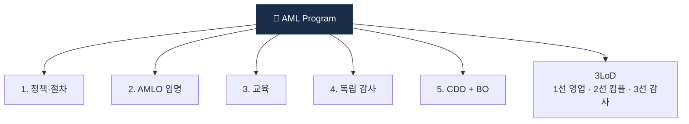

# Day 47 — 내부통제 5 pillars + 3LoD

> AML 거버넌스의 뼈대. ⏱️ ~75분.

## 📖 오늘 뭘 배우나

"AML은 시스템보다 거버넌스가 본질". 오늘은 **5 Pillars**(정책·AMLO·교육·감사·CDD)와 **3중 방어선**(영업-컴플-감사)을 정리하고, **ERA (Enterprise-wide Risk Assessment)** 가 왜 매년 수행돼야 하는지 이해합니다. 정책 매뉴얼의 12 챕터 구조는 실무 작성 시 참조 템플릿.

<!-- MAP-START -->
## 🗺 오늘의 지도

<!-- MAP-END -->

## 🎯 핵심 질문
1. AML 5 pillars 이름?
2. 3중 방어선 각 라인의 역할?
3. ERA = 무엇? 왜 매년?

## 📖 읽기 (~55분)
- 메인: [`../notes/5-compliance/internal-controls.md`](../notes/5-compliance/internal-controls.md) — 1~4, 6절

## 🛠️ 미니 챌린지 (~10분)
- AML 정책 매뉴얼 12 챕터 구조 외워서 메모
- "1선 vs 2선 vs 3선" 한 줄 차이 정리

## ✅ 체크포인트
- [ ] 5 pillars (정책/AMLO/교육/감사/CDD) 외운다
- [ ] 3LoD 외운다
- [ ] ERA 의 4 차원 + 연 1회 안다
- [ ] 정책 매뉴얼 12 챕터 구조 안다

## 💭 오늘의 한 줄
