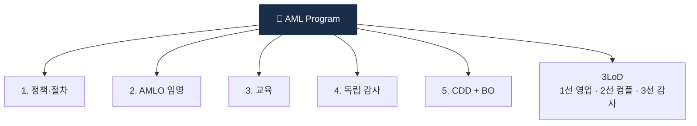

# Day 47 — 내부통제 5 pillars + 3LoD

> AML 거버넌스의 뼈대. ⏱️ ~75분.

## 📖 오늘 뭘 배우나

"AML은 시스템보다 거버넌스가 본질". 오늘은 **5 Pillars**(정책·AMLO·교육·감사·CDD)와 **3중 방어선**(영업-컴플-감사)을 정리하고, **ERA (Enterprise-wide Risk Assessment)** 가 왜 매년 수행돼야 하는지 이해합니다. 정책 매뉴얼의 12 챕터 구조는 실무 작성 시 참조 템플릿.


<!-- MAP-START -->
## 🗺 오늘의 지도


<!-- MAP-END -->

## 🎯 핵심 질문
1. AML 5 pillars 이름?
2. 3중 방어선 각 라인의 역할?
3. ERA = 무엇? 왜 매년?

## 📖 읽기 (~55분)
- 메인: [`../notes/5-compliance/internal-controls.md`](../notes/5-compliance/internal-controls.md) — 1~4, 6절

## 🛠️ 미니 챌린지 (~10분)
- AML 정책 매뉴얼 12 챕터 구조 외워서 메모
- "1선 vs 2선 vs 3선" 한 줄 차이 정리

## ✅ 체크포인트
- [ ] 5 pillars (정책/AMLO/교육/감사/CDD) 외운다
- [ ] 3LoD 외운다
- [ ] ERA 의 4 차원 + 연 1회 안다
- [ ] 정책 매뉴얼 12 챕터 구조 안다

## 💭 오늘의 한 줄

## 💼 실무 현장 (Industry Reality)

### 한국 VASP에서는

**5 Pillars와 3LoD는 FIU 정기검사 단골 질문 항목**. 한국 VASP의 정책 매뉴얼은 보통 **12챕터·60~100페이지**이고, 버전 관리는 Confluence 또는 Notion에서 하며 **연 1회 이사회 승인**을 받음. 2선 컴플라이언스는 통상 5~10명 규모(Upbit 최대 ~20명), 3선 내부감사는 **외부 회계법인(삼일PwC·삼정KPMG·딜로이트안진)** 위탁이 보통. **ERA(Enterprise-wide Risk Assessment)**는 연 1회 의무이며 FIU 검사 시 "ERA 결과와 실제 룰 설계가 일치하는가"를 봄.

### 글로벌에서는

**Coinbase·Kraken은 5 Pillars가 아닌 "6 Pillars"** 사용(BSA 2020 개정으로 **Risk Assessment**가 공식 추가). **Binance 2023 DOJ 합의서**에 명시된 개선 사항이 곧 "3LoD 붕괴"의 표본 케이스 — 1선이 영업 KPI에 종속되어 2선이 거부권 행사 불가했던 구조. 이후 모든 미국 진출 VASP의 **CCO는 CEO 직속·이사회 직접 보고** 의무화.

### 3LoD 실제 분담 (VASP 예시)

| 업무 | 1선 (영업/운영) | 2선 (컴플) | 3선 (감사) |
|---|---|---|---|
| KYC 심사 | 심사 수행 | 기준·룰 제정·샘플 검증 | 연 1회 전수 audit |
| KYT Alert | 미관여 | Alert 처리·STR 작성 | Alert SLA·품질 감사 |
| 신상품 출시 | 제안 | AML 영향평가(Pre-assessment) | 사후 감사 |
| 룰 튜닝 | 피드백 제공 | 월 1회 룰 위원회 운영 | 연 1회 효과성 감사 |

### 정책 매뉴얼 12챕터 (실제 구조)

```
1. 목적·적용범위
2. 용어 정의
3. 거버넌스·AMLO
4. 위험기반접근(RBA)·ERA
5. 고객확인(CDD/EDD)
6. 거래모니터링(KYT)
7. 제재 스크리닝
8. 의심거래보고(STR)
9. Travel Rule
10. 기록보관 (15년/5년)
11. 임직원 교육
12. 내부감사·이의제기
```

### 자주 나오는 오해

- **"5 Pillars만 갖추면 완성"** — FinCEN 2020 개정 후 **6번째 pillar인 Risk Assessment**가 별도 인정. 한국도 FIU 검사에서 "ERA 품질"을 5 Pillars와 동급으로 봄.
- **"3선 내부감사는 형식"** — Paxful 2025 FinCEN action의 지적 1위가 "3선이 독립성 없었다". 3선은 **이사회 감사위원회 직접 보고**가 필수.
