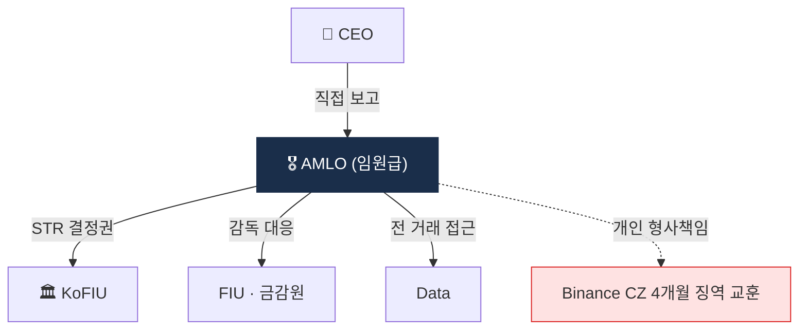

# Day 48 — AMLO 역할 + 거버넌스

> AML 책임자 = 회사 운영의 정점. ⏱️ ~70분.

## 📖 오늘 뭘 배우나

AMLO는 단순 직책이 아니라 **CEO 직접 보고 + STR 최종 결정권**을 가진 임원. 오늘은 한국 특금법이 요구하는 요건, 권한·책임·함정(영업 압력·자원 부족·개인 형사 책임)을 정리합니다. Binance CZ 사례에서 확인된 CCO·CEO **개인 형사 책임**이 왜 업계 표준이 됐는지도.

<!-- MAP-START -->
## 🗺 오늘의 지도

<!-- MAP-END -->

## 🎯 핵심 질문
1. AMLO 한국 요건 (임원급 + ...)?
2. AMLO 핵심 권한 4가지?
3. AMLO 개인 책임의 위험성?

## 📖 읽기 (~50분)
- 메인: [`../notes/5-compliance/internal-controls.md`](../notes/5-compliance/internal-controls.md) — 3, 8~10절

## 🛠️ 미니 챌린지 (~15분)
- 거버넌스 구조 그리기 (이사회 → 감사위/리스크위 → CCO → AMLO)
- RACI 매트릭스 5행 작성 (KYC/알람/STR/정책/검사대응)

## ✅ 체크포인트
- [ ] AMLO 한국 임원급 요건 안다
- [ ] AMLO CEO 직접 보고 채널 + STR 결정권 안다
- [ ] Binance CZ 4개월 징역 사례 인지
- [ ] 검사 단골 지적 10가지 인지

## 💭 오늘의 한 줄
