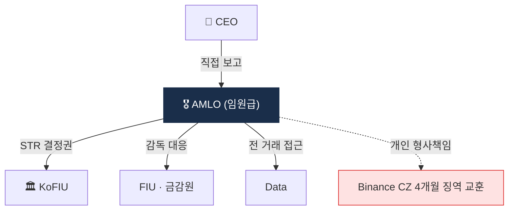

# Day 48 — AMLO 역할 + 거버넌스

> AML 책임자 = 회사 운영의 정점. ⏱️ ~70분.

## 📖 오늘 뭘 배우나

AMLO는 단순 직책이 아니라 **CEO 직접 보고 + STR 최종 결정권**을 가진 임원. 오늘은 한국 특금법이 요구하는 요건, 권한·책임·함정(영업 압력·자원 부족·개인 형사 책임)을 정리합니다. Binance CZ 사례에서 확인된 CCO·CEO **개인 형사 책임**이 왜 업계 표준이 됐는지도.


<!-- MAP-START -->
## 🗺 오늘의 지도


<!-- MAP-END -->

## 🎯 핵심 질문
1. AMLO 한국 요건 (임원급 + ...)?
2. AMLO 핵심 권한 4가지?
3. AMLO 개인 책임의 위험성?

## 📖 읽기 (~50분)
- 메인: [`../notes/5-compliance/internal-controls.md`](../notes/5-compliance/internal-controls.md) — 3, 8~10절

## 🛠️ 미니 챌린지 (~15분)
- 거버넌스 구조 그리기 (이사회 → 감사위/리스크위 → CCO → AMLO)
- RACI 매트릭스 5행 작성 (KYC/알람/STR/정책/검사대응)

## ✅ 체크포인트
- [ ] AMLO 한국 임원급 요건 안다
- [ ] AMLO CEO 직접 보고 채널 + STR 결정권 안다
- [ ] Binance CZ 4개월 징역 사례 인지
- [ ] 검사 단골 지적 10가지 인지

## 💭 오늘의 한 줄

## 💼 실무 현장 (Industry Reality)

### 한국 VASP에서는

**AMLO(자금세탁방지책임자)는 특금법 시행령상 "임원급"이 요건**. 실제 한국 4대 원화거래소 AMLO는 전원 **상무급 이상**이며 FIU에 이름·경력·변경 사항을 신고해야 함. 대부분 금감원·FIU 출신, 시중은행 준법감시인 출신, 대형 로펌(김앤장·광장·세종·율촌) AML 변호사 출신으로 채워짐. 연봉은 약 **1.5~3억원(+stock option/RSU)** 수준이고, AMLO 개인은 특금법 §15(과태료)·§17(형사)의 **개인 책임 대상**이라 **임원배상책임보험(D&O)** 가입이 사실상 필수.

### 글로벌에서는

**Binance CZ 사례(2024)**: CZ는 CEO이자 사실상 CCO 역할을 했는데 BSA 위반으로 **4개월 실형 + $50M 개인 벌금**. 이후 모든 글로벌 VASP가 CCO/AMLO를 **CEO와 분리된 독립 라인**으로 재편. **Coinbase Paul Grewal(CLO) + Carlos Medeiros(CCO) 투톱** 구조가 업계 표준이 되었고, CCO는 **분기별 이사회 리스크위원회 직접 보고** 의무.

### AMLO 핵심 권한 (한국 기준)

```
1. STR 최종 결정권 (CEO도 무효화 불가)
2. 전 거래·고객 데이터 무제한 접근권
3. 고위험 거래·고객 거래 거절·종결 권한
4. 예산·인력 요청권 (이사회 직접)
```

### AMLO 하루 루틴 (실제)

- **08:30~09:30** — 야간 고위험 Alert·언론·제재 이슈 검토(Reuters·Bloomberg·The Block 브리핑)
- **10:00~11:00** — 주간 STR 승인(통상 5~20건/주, 팀장 선제 리뷰 후 최종 서명)
- **11:00~12:00** — 경영진 미팅(신상품 AML 영향평가·리스크 이슈)
- **14:00~15:00** — FIU 검사 대응·외부 감사 커뮤니케이션
- **16:00~17:00** — 룰 위원회·정책 개정·이사회 리포트 초안
- **수시** — 법무·보안·데이터팀과 공동 대응(해킹·제재 이벤트 시)

### 자주 나오는 오해

- **"AMLO는 책임만 많고 권한 없다"** — 한국 특금법은 **"STR 결정은 AMLO 전속"**을 명시. CEO가 STR 막으면 CEO가 형사책임. 반대로 AMLO가 STR 누락하면 AMLO가 개인 형사책임. 권한=책임이 1:1.
- **"사외이사·감사위원이 대신할 수 있다"** — 불가. **상근 임원**이어야 함. 겸직·비상근 AMLO는 FIU 검사 지적 사유.

## 🧭 감독 검사 대응 — 오늘의 실행 자료

한국 VASP가 연 1~2회 받는 FIU/FSS 현장 검사를 **워크북 수준**으로 정리했다.

- **4주 타임라인** — 통지 → 자료 준비 → 모의 → 현장 → 사후
- **40개 자체 진단 체크리스트** — A 신고 ~ G Travel Rule
- **40종 필수 서류 리스트** — 정책·증빙·사건 대응 기록
- **예상 질의 FAQ 5개 + 모범 답변 프레임**
- **흔한 실패 사례 Top 5**

상세: [`../notes/5-compliance/inspection-response.md`](../notes/5-compliance/inspection-response.md)

### 🛠️ 오늘의 미니 챌린지 업그레이드

워크북의 **40개 체크리스트**를 인쇄해서 가상의 회사(자체 설정)에 적용. 어느 항목이 아직 미흡한지 마킹 + 3개월 이행 계획 스케치.
