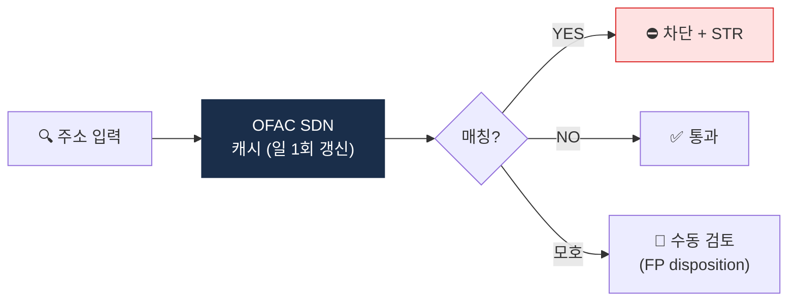

# Day 49 — 🛠️ 미니 프로젝트 4: OFAC SDN crypto wallet 스크리너 + 7주 리뷰

> 실제 OFAC 데이터로 스크리너 만들어보기. ⏱️ ~150분.

## 📖 오늘 뭘 배우나

Week 7의 결산. OFAC SDN의 **가상자산 주소를 실시간 파싱**해 입력 주소를 스크리닝하는 함수를 직접 만듭니다. 일 1회 자동 갱신·캐시·bulk screening까지 실무에 가까운 구조로 짜보면 "OFAC 제재는 시스템 없이는 불가능하다"는 현실이 체감됩니다. Capstone의 Sanctions 모듈의 기반.


<!-- MAP-START -->
## 🗺 오늘의 지도


<!-- MAP-END -->

## 🎯 회고 질문
1. CDD/EDD/STR 중 가장 까다로운 운영은?
2. 한국 컴플 운영의 특수성 1가지?
3. AMLO의 권한 부족이 부르는 위험?

## 🛠️ 미니 프로젝트 4 (~120분)

### 목표
**OFAC SDN의 가상자산 주소를 fetch + 입력 주소 스크리닝 함수**

### 사양
- 입력: 가상자산 지갑주소 1개
- 출력: 매칭 결과 (TRUE/FALSE) + 매칭 시 SDN entity 정보

### 구현 가이드
프로젝트: `aml/projects/04-ofac-screener/`

```python
# main.py 의사코드
import requests
from xml.etree import ElementTree as ET

OFAC_SDN_XML = "https://www.treasury.gov/ofac/downloads/sdn.xml"
# 또는 SDN.csv, advanced consolidated list

def fetch_ofac_crypto_addresses() -> dict[str, dict]:
    """
    OFAC SDN.xml 파싱 → {wallet_address.lower(): {entity_name, sdn_id, programs, listed_date}}
    """
    ...

CACHE = {}  # 일 1회 갱신

def screen(address: str) -> dict:
    """
    return {
        "matched": bool,
        "address": address,
        "match_info": {...} | None,
    }
    """
    addr = address.lower()
    info = CACHE.get(addr)
    return {
        "matched": info is not None,
        "address": address,
        "match_info": info,
    }

def bulk_screen(addresses: list[str]) -> list[dict]:
    return [screen(a) for a in addresses]

if __name__ == "__main__":
    # 테스트: 알려진 SDN crypto address (공개) + 정상 wallet
    test_addrs = ["0xKnownSDN...", "0xNormal..."]
    for r in bulk_screen(test_addrs):
        print(r)
```

### 산출물
- `projects/04-ofac-screener/main.py`
- `projects/04-ofac-screener/cache/sdn_crypto.json` (캐시)
- `projects/04-ofac-screener/README.md`
- `projects/04-ofac-screener/test.py`

→ 가이드: [`../projects/04-ofac-screener/README.md`](../projects/04-ofac-screener/README.md)

### 보너스
- Cluster matching (Etherscan label 또는 자체 데이터셋과 결합)
- 일일 배치 + diff 알람

## ✅ 체크포인트
- [ ] 스크리너 작동
- [ ] OFAC SDN crypto 주소 수십 개 캐시
- [ ] 테스트 케이스 통과
- [ ] [`progress.md`](progress.md) Week 7 + W7 미니 프로젝트 체크
- [ ] git commit + push

## 💼 실무 현장 (Industry Reality)

### 한국 VASP에서는

**OFAC SDN crypto 주소 수는 2026년 기준 약 600~700개**(BTC·ETH·TRX·BNB·SOL 등 분산). 한국 4대 거래소는 전원 **Chainalysis KYT의 `identifications` 필드**로 SDN 매칭을 얻고, 동시에 **자체 OFAC fetcher**(일 1회 cron)로 이중화. 이유는 벤더 장애 시 공백 방지 + FIU 검사 때 "자체 판단 능력" 증빙. 매칭되면 **즉시 freeze + AMLO 통지 + 24시간 내 STR 제출**이 표준 SLA.

### 글로벌에서는

**Coinbase·Kraken·Gemini**는 OFAC SDN을 **실시간 API**(sanctions.io·OpenSanctions)로 받음. SDN advanced XML에 **crypto address는 `<Feature FeatureTypeID="344">` 태그로 임베딩**되어 있고, FeatureTypeID별로 체인이 구분됨(344=BTC, 345=ETH 등). OFAC은 **사전 경고 없이 주간 3~5회 업데이트**하므로 일 1회 batch는 최대 24시간 공백이 생길 수 있어 대형사는 시간당 polling.

### SDN advanced XML 샘플 (실제 포맷)

```xml
<sdnEntry>
  <uid>12345</uid>
  <sdnType>Individual</sdnType>
  <firstName>...</firstName>
  <featureList>
    <feature featureTypeId="344">
      <featureVersion>
        <versionDetail>1A1zP1eP5QGefi2DMPTfTL5SLmv7DivfNa</versionDetail>
      </featureVersion>
    </feature>
  </featureList>
</sdnEntry>
```

### 실무 파싱 체크리스트

```
1. SDN advanced XML 다운로드 (일 1회 이상)
2. <feature featureTypeId="344~360"> 범위 전체 파싱
3. 주소를 lower-case로 정규화 (ETH), BTC는 case-sensitive 유지
4. diff 계산 → 신규/삭제 주소 Slack 알람
5. 기존 거래 이력 backfill 검사 (신규 지정 주소로 과거 거래 재조회)
```

### 자주 나오는 오해

- **"해제된 Tornado Cash 주소는 지워도 된다"** — 2025-03 OFAC 지정 해제됐지만 **다수 VASP는 내부 블랙리스트에 유지**. 이유는 "mixer 노출" 자체가 여전히 고위험 카테고리.
- **"주소만 보면 된다"** — OFAC은 **cluster·hop·entity 이름**도 보호 대상. Chainalysis의 cluster attribution(같은 지갑 클러스터의 다른 주소)까지 넓혀야 완전.

## 💭 7주차 회고

가장 어려웠던 컴플 운영:
가장 자동화 가치가 큰 영역:
다음주 사례 중 가장 기대되는:
