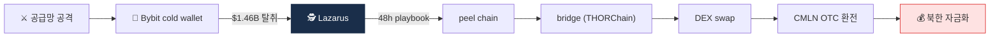
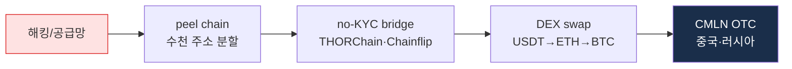

# Day 50 — 케이스: Lazarus DPRK + Bybit Hack

> 가상자산 1순위 위협 + 사상 최대 사건. ⏱️ ~80분.

## 📖 오늘 뭘 배우나

Week 8은 사례·리서치·AI 주간. 첫날은 가상자산 업계의 **1순위 위협**인 DPRK Lazarus와 **사상 최대 사건** Bybit hack($1.46B). 공급망 공격이라는 새 패턴, 48시간 내 layering 완료라는 속도, 그리고 **가짜 채용·Insider threat**이라는 HR·보안의 새 영역까지 실무 대응책을 정리합니다.

<!-- MAP-START -->
## 🗺 오늘의 지도

<!-- MAP-END -->

## 🎯 핵심 질문
1. 2025-02 Bybit hack 규모 + 공격 방식?
2. Lazarus 자금세탁 5단계?
3. Lazarus 누적 탈취액?

## 📖 읽기 (~55분)
- 메인: [`../notes/6-cases/lazarus-dprk.md`](../notes/6-cases/lazarus-dprk.md)

## 🌐 외부 자료 (~20분)
- [TRM Labs — Bybit Hack 분석](https://www.trmlabs.com/resources/blog/the-bybit-hack-following-north-koreas-largest-exploit)
- [38 North — Crypto Superpower](https://www.38north.org/2026/01/from-digital-kleptocracy-to-rogue-crypto-superpower/)

## 🛠️ 미니 챌린지 (~5분)
- Bybit 공격 → 48h $160M 세탁 흐름을 5단계로 압축 메모
- 가짜 채용(Fake Recruitment) 위협을 회사가 막는 방법 3가지

## ✅ 체크포인트
- [ ] Bybit 2025-02-21 $1.46B 탈취 안다 (ETH + stETH/mETH/cmETH 혼합)
- [ ] TraderTraitor (FBI) 명칭 안다
- [ ] 라자루스 누적 $6.75B 안다
- [ ] DPRK 76% of 2025 service compromises 안다

## 💭 오늘의 한 줄

## 💼 실무 현장 (Industry Reality)

### 한국 VASP에서는

**Lazarus(DPRK) 노출은 한국 AML 최우선 과제**. 한국은 지리적·정치적으로 1차 표적이며 실제 **2017 Bithumb·2018 Coinrail·2019 Upbit $49M** 모두 Lazarus 소행으로 귀속(FBI·Chainalysis). 모든 한국 VASP는 **Chainalysis의 "North Korea" entity tag + TRM의 "DPRK-linked" label**을 이중 적용하고, **입금 주소가 DPRK 노출 >0.5%면 자동 freeze**가 기본 룰. **Bybit hack(2025-02)** 이후 DAXA 5사는 **Safe{Wallet}·cold wallet 공급망 보안** 재점검 공동 지침을 채택.

### 글로벌에서는

**Bybit $1.46B hack(2025-02-21)**은 Safe{Wallet} 공급망 공격으로 시작 → 48시간 내 **THORChain·Chainflip 등 no-KYC bridge**로 layering 완료. TRM Labs와 Chainalysis가 **24시간 내 wallet freeze 공조**를 시도했으나 이미 **$160M가 오프램프 완료**. 이후 **Tether·Circle**은 공조 freeze SLA를 2시간으로 단축, THORChain은 validator 투표로 일부 주소 blacklist 추가(논란).

### DPRK 자금세탁 5단계 플레이북

### 가짜 채용(Fake IT Worker) 방어 체크리스트

- **이력서 중복 검증**: 동일 GitHub·LinkedIn 이력이 다수 후보에게 재사용되는 패턴
- **화상 면접 필수**: 음성·영상 sync, 타이핑 딜레이, VPN IP 분석
- **Payroll 주소 검증**: 급여 입금 주소 국적·실명 대조
- **코드 리뷰 백도어 탐지**: npm·PyPI 의존성 감사 자동화

### 자주 나오는 오해

- **"Lazarus는 기술적 해킹만 한다"** — 2024~2026 FBI·Mandiant 보고의 절반 이상이 **소셜 엔지니어링(가짜 채용·Slack 피싱)**. HR·보안이 AML과 공동 책임.
- **"Bybit는 cold wallet이라 안전했다"** — Cold wallet 자체는 안전했으나 **서명 UI(Safe{Wallet} 프론트엔드)가 공격됨**. "Cold" 개념도 end-to-end 관점에서 재정의 필요.
