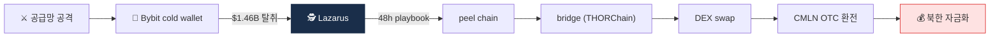

# Day 50 — 케이스: Lazarus DPRK + Bybit Hack

> 가상자산 1순위 위협 + 사상 최대 사건. ⏱️ ~80분.

## 📖 오늘 뭘 배우나

Week 8은 사례·리서치·AI 주간. 첫날은 가상자산 업계의 **1순위 위협**인 DPRK Lazarus와 **사상 최대 사건** Bybit hack($1.46B). 공급망 공격이라는 새 패턴, 48시간 내 layering 완료라는 속도, 그리고 **가짜 채용·Insider threat**이라는 HR·보안의 새 영역까지 실무 대응책을 정리합니다.

<!-- MAP-START -->
## 🗺 오늘의 지도

<!-- MAP-END -->

## 🎯 핵심 질문
1. 2025-02 Bybit hack 규모 + 공격 방식?
2. Lazarus 자금세탁 5단계?
3. Lazarus 누적 탈취액?

## 📖 읽기 (~55분)
- 메인: [`../notes/6-cases/lazarus-dprk.md`](../notes/6-cases/lazarus-dprk.md)

## 🌐 외부 자료 (~20분)
- [TRM Labs — Bybit Hack 분석](https://www.trmlabs.com/resources/blog/the-bybit-hack-following-north-koreas-largest-exploit)
- [38 North — Crypto Superpower](https://www.38north.org/2026/01/from-digital-kleptocracy-to-rogue-crypto-superpower/)

## 🛠️ 미니 챌린지 (~5분)
- Bybit 공격 → 48h $160M 세탁 흐름을 5단계로 압축 메모
- 가짜 채용(Fake Recruitment) 위협을 회사가 막는 방법 3가지

## ✅ 체크포인트
- [ ] Bybit 2025-02-21 $1.5B 탈취 안다
- [ ] TraderTraitor (FBI) 명칭 안다
- [ ] 라자루스 누적 $6.75B 안다
- [ ] DPRK 76% of 2025 service compromises 안다

## 💭 오늘의 한 줄
