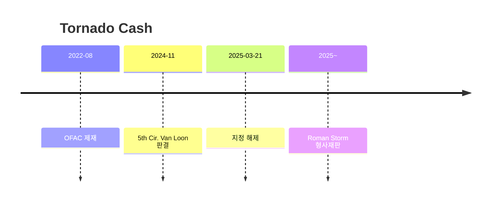

# Day 51 — 케이스: Tornado Cash + DeFi 제재의 한계

> 코드를 제재할 수 있는가? ⏱️ ~80분.

## 📖 오늘 뭘 배우나

Tornado Cash 사건은 "**코드 자체를 제재할 수 있는가**"라는 질문의 사법적 답을 처음 보여준 판례입니다. 2022 OFAC 제재 → 2024 5th Circuit Van Loon 판결 → 2025-03 해제라는 3년 흐름과, 동시에 진행 중인 **Roman Storm 개발자 형사재판**(별개)을 정리합니다. "코드는 제재 못 해도 개발자는 책임질 수 있다"는 결론이 DeFi 규제의 뉴노멀.

<!-- MAP-START -->
## 🗺 오늘의 지도

<!-- MAP-END -->

## 🎯 핵심 질문
1. Tornado Cash 제재 timeline (2022-08 → 2024-11 → 2025-03)?
2. 5th Circuit 판결의 핵심 논리?
3. Roman Storm 형사 재판이 별개인 이유?

## 📖 읽기 (~55분)
- 메인: [`../notes/6-cases/tornado-cash.md`](../notes/6-cases/tornado-cash.md)

## 🌐 외부 자료 (~20분)
- [Venable — Treasury Lifts Tornado Sanctions](https://www.venable.com/insights/publications/2025/04/a-legal-whirlwind-settles-treasury-lifts-sanctions)
- [Steptoe — DeFi AML implications](https://www.steptoe.com/en/news-publications/blockchain-blog/critical-tornado-cash-developments-have-significant-implications-for-defi-aml-and-sanctions-compliance.html)

## 🛠️ 미니 챌린지 (~5분)
- "Tornado 노출 wallet → 회사 정책" 의사결정 트리 메모 (2025-03 해제 후에도 차단 유지)
- 다른 mixer 운명 5개 (Blender/Sinbad/Wasabi/Samourai/JoinMarket) 정리

## ✅ 체크포인트
- [ ] Tornado Cash 전체 타임라인: 2022-08 OFAC 제재 → 2024-11 5th Cir. Van Loon 판결 → 2025-03-21 지정 해제
- [ ] 5th Circuit "코드는 property 아니다" 안다
- [ ] 개발자 형사책임 가능성 안다 (Storm 재판)
- [ ] 회사 정책: mixer = 위험 카테고리 유지 안다

## 💭 오늘의 한 줄
