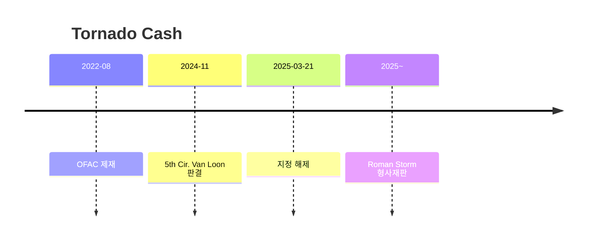
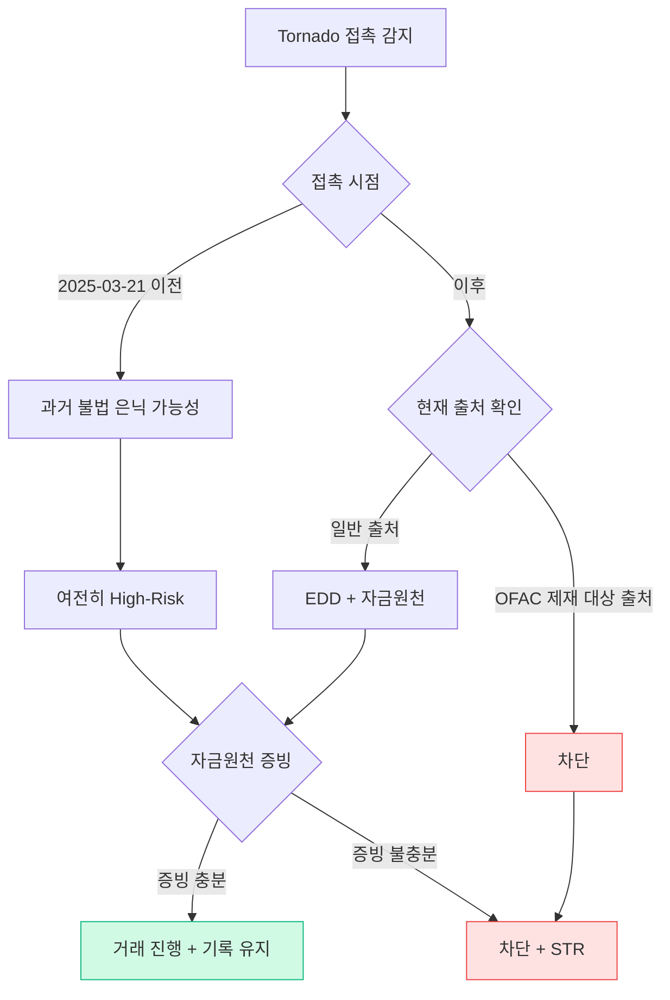

# Day 51 — 케이스: Tornado Cash + DeFi 제재의 한계

> 코드를 제재할 수 있는가? ⏱️ ~80분.

## 📖 오늘 뭘 배우나

Tornado Cash 사건은 "**코드 자체를 제재할 수 있는가**"라는 질문의 사법적 답을 처음 보여준 판례입니다. 2022 OFAC 제재 → 2024 5th Circuit Van Loon 판결 → 2025-03 해제라는 3년 흐름과, 동시에 진행 중인 **Roman Storm 개발자 형사재판**(별개)을 정리합니다. "코드는 제재 못 해도 개발자는 책임질 수 있다"는 결론이 DeFi 규제의 뉴노멀.


<!-- MAP-START -->
## 🗺 오늘의 지도


<!-- MAP-END -->

## 🎯 핵심 질문
1. Tornado Cash 제재 timeline (2022-08 → 2024-11 → 2025-03)?
2. 5th Circuit 판결의 핵심 논리?
3. Roman Storm 형사 재판이 별개인 이유?

## 📖 읽기 (~55분)
- 메인: [`../notes/6-cases/tornado-cash.md`](../notes/6-cases/tornado-cash.md)

## 🌐 외부 자료 (~20분)
- [Venable — Treasury Lifts Tornado Sanctions](https://www.venable.com/insights/publications/2025/04/a-legal-whirlwind-settles-treasury-lifts-sanctions)
- [Steptoe — DeFi AML implications](https://www.steptoe.com/en/news-publications/critical-tornado-cash-developments-have-significant-implications-for-defi-aml-and-sanctions-compliance.html)

## 🛠️ 미니 챌린지 (~5분)
- "Tornado 노출 wallet → 회사 정책" 의사결정 트리 메모 (2025-03 해제 후에도 차단 유지)
- 다른 mixer 운명 5개 (Blender/Sinbad/Wasabi/Samourai/JoinMarket) 정리

## ✅ 체크포인트
- [ ] Tornado Cash 전체 타임라인: 2022-08 OFAC 제재 → 2024-11 5th Cir. Van Loon 판결 → 2025-03-21 지정 해제
- [ ] 5th Circuit "코드는 property 아니다" 안다
- [ ] 개발자 형사책임 가능성 안다 (Storm 재판)
- [ ] 회사 정책: mixer = 위험 카테고리 유지 안다

## 💭 오늘의 한 줄

## 💼 실무 현장 (Industry Reality)

### 한국 VASP에서는

**Tornado Cash 지정 해제(2025-03) 이후에도 한국 4대 거래소는 전원 "mixer 노출 주소" 내부 블랙리스트 유지**. Chainalysis의 "Mixing" 카테고리 노출 >1%면 EDD 트리거, >5%면 freeze가 표준. 이유는 **특금법 §5의2(의심거래 보고)**는 OFAC 지정과 무관하게 "자금세탁 의심"을 독립 판단 대상으로 두기 때문. DAXA 가이드라인도 "mixer는 제재 유무와 무관하게 고위험 카테고리"로 명시.

### 글로벌에서는

**Coinbase·Kraken**은 2025-03 해제 직후 Tornado Cash 주소 **복원(unblock)**이 아니라 **카테고리를 "Sanctioned"에서 "High-Risk Mixer"로 재분류**. **Circle**은 USDC의 Tornado Cash 관련 blacklist를 **일부** 풀었지만 신규 유입은 계속 모니터링. **Roman Storm 재판(2025)**에서 유죄가 나오면 **"mixer 개발자 = 무등록 MSB"** 선례가 되어 프라이버시 도구 산업 전반에 충격.

### "코드 제재"의 법적 결론 (Van Loon 판결)

```
5th Circuit 핵심 논리:
1. Immutable smart contract = "property"가 아님
2. OFAC IEEPA(1977)은 "property" 지정 권한만 부여
3. 따라서 OFAC이 code 자체를 제재할 권한 없음

→ 그러나 개발자 개인(Roman Storm)의 
   무등록 MSB 운영·제재 회피 방조는 별개 형사 문제
```

### 회사 정책 의사결정 트리 (실무)

```
IF wallet has Tornado Cash direct exposure:
    IF exposure occurred BEFORE 2022-08-08 (지정 전):
        → LOW risk (증빙 보관)
    IF exposure occurred 2022-08 ~ 2025-03 (지정 기간):
        → BLOCK + STR (OFAC 위반 소급)
    IF exposure AFTER 2025-03-21 (해제 후):
        → HIGH risk (mixer 노출) + EDD
```

### 자주 나오는 오해

- **"제재 해제됐으니 지워도 된다"** — 한국·EU VASP 대다수는 **"mixer = 위험 카테고리"**로 별도 유지. 제재 해제 ≠ AML 위험 해제.
- **"코드는 법적 책임 없다"** — Van Loon은 **정부의 제재 권한**을 제한했을 뿐, **개발자의 형사 책임**은 별개(Storm 재판). "익명성 도구 제공 = 무등록 MSB"라는 해석이 살아있음.

## 🧭 Tornado 해제 후 — VASP 의사결정 프레임 (2025-03-21 이후)

### 핵심 원칙

**OFAC 제재 해제 ≠ 회사 정책 자동 완화**. 각 VASP는 자체 위험 기반 접근(RBA)에 따라 독립적으로 정책을 결정할 법적 권한·의무가 있다 (한국 특금법 §5의2, 미국 BSA §1020.210, EU AMLR Article 8).

### 해제 이후 4개 상황과 의사결정

| 시나리오 | OFAC 변화 | 한국 VASP 표준 대응 | 근거 |
|---|---|---|---|
| 과거 Tornado 이용 직접 주소 | SDN 제거 | **여전히 High-Risk 라벨 유지** | 2022~2025 기간 익명화 이용 이력은 자체 RBA로 판단 |
| 새로운 Tornado 지갑 | 제재 대상 아님 | **Chainalysis·TRM 라벨 유지 시 High-Risk** | 벤더 분류는 독립적 |
| Lazarus·Ransomware가 Tornado 경유 | 제재 대상(Lazarus 지정됨) | **출처 제재 대상이면 여전히 차단** | OFAC 50% Rule 여전 적용 |
| 일반 프라이버시 목적 이용 | 제재 대상 아님 | **거래 진행 + EDD 실시** | 자금원천 증빙 요구 |

### 실제 주요 VASP의 정책 (추정)

- **Coinbase**: 해제 후 Tornado "관찰" 라벨로 하향, 하지만 **2-hop 이내 접촉 주소는 여전히 EDD 필수**
- **Binance**: 지역별 차등 — EU/US는 여전히 rejected list, 기타 지역은 enhanced review
- **한국 4대 (Upbit·Bithumb·Coinone·Korbit)**: DAXA 공동 가이드 2025-04 발표 — **당분간 High-Risk 유지**
- **Kraken**: 2025-Q2 내부 정책으로 "제재 해제는 OFAC 판단일 뿐, KYT 점수는 독립적"

### 의사결정 플로차트



### 법적 근거

- **특금법 §5의2** — 자체 위험 평가·통제 권한
- **특금법 §5의3** — STR 보고 의무 (자금원천 의심 시)
- **OFAC 50% Rule** — 제재 대상자가 50%+ 소유·지배하는 자산은 자동 블록 (Lazarus가 Tornado 사용 시 여전 적용)
- **EU AMLR Article 8** — VASP 자체 RBA 강제

### 규제 당국 질의 대응

FIU 검사 시 "Tornado 해제됐는데 왜 계속 차단?"라는 질의에 답변:
- "특금법 §5의2에 따라 **자체 위험 평가**에 기반한 독립적 판단"
- "과거 이용 이력의 자금세탁 위험 여전 존재"
- "DAXA 공동 가이드에 따른 표준 대응"
- 문서화: 정책 결정 근거·AMLO 서명·이사회 승인
