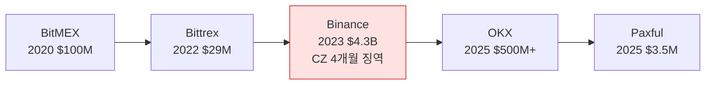

# Day 52 — 케이스: Binance / OKX / Paxful Enforcement

> 거대 벌금 + CEO 책임의 시대. ⏱️ ~80분.

## 📖 오늘 뭘 배우나

5년 만에 가상자산 벌금이 $98K(BitGo 2021) → $4.3B(Binance 2023)로 **1만배 성장**. 이 궤적이 보여주는 건 규제당국이 "학습기"에서 "집행기"로 전환했다는 것. CEO 개인 형사 책임(CZ 4개월)·모니터십(5년 감시)·소형도 표적(Paxful)이 3대 트렌드.

<!-- MAP-START -->
## 🗺 오늘의 지도

<!-- MAP-END -->

## 🎯 핵심 질문
1. Binance $4.3B 합의의 4가지 위반?
2. CZ 개인 처벌은?
3. OKX, Paxful 사례의 시사점?

## 📖 읽기 (~55분)
- 메인: [`../notes/6-cases/major-enforcement.md`](../notes/6-cases/major-enforcement.md) — 1~3절

## 🌐 외부 자료 (~20분)
- [Akin — Paxful FinCEN action](https://www.akingump.com/en/insights/alerts/fincen-publishes-first-set-of-compliance-considerations-in-parallel-civil-and-doj-enforcement-actions-against-crypto-company-paxful)
- [Corporate Compliance Insights — DOJ/FinCEN VA platform AML](https://www.corporatecomplianceinsights.com/doj-fincen-resolution-virtual-asset-platform-aml-violations/)

## 🛠️ 미니 챌린지 (~5분)
- Top 5 enforcement 사례 (Binance/OKX/BitMEX/Bittrex/Paxful) 표로 (벌금/년도/위반)
- "CEO/CCO 형사 책임 트리거" 패턴 메모

## ✅ 체크포인트
- [ ] Binance $4.3B + CZ 4개월 안다
- [ ] OKX $500M+ 안다
- [ ] Paxful $3.5M (소형도 표적) 안다
- [ ] 모니터십 (multi-year) 개념 안다

## 💭 오늘의 한 줄
