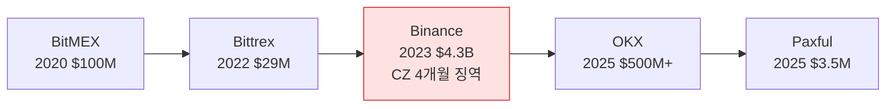

# Day 52 — 케이스: Binance / OKX / Paxful Enforcement

> 거대 벌금 + CEO 책임의 시대. ⏱️ ~80분.

## 📖 오늘 뭘 배우나

5년 만에 가상자산 벌금이 $98K(BitGo 2021) → $4.3B(Binance 2023)로 **1만배 성장**. 이 궤적이 보여주는 건 규제당국이 "학습기"에서 "집행기"로 전환했다는 것. CEO 개인 형사 책임(CZ 4개월)·모니터십(5년 감시)·소형도 표적(Paxful)이 3대 트렌드.


<!-- MAP-START -->
## 🗺 오늘의 지도


<!-- MAP-END -->

## 🎯 핵심 질문
1. Binance $4.3B 합의의 4가지 위반?
2. CZ 개인 처벌은?
3. OKX, Paxful 사례의 시사점?

## 📖 읽기 (~55분)
- 메인: [`../notes/6-cases/major-enforcement.md`](../notes/6-cases/major-enforcement.md) — 1~3절

## 🌐 외부 자료 (~20분)
- [Akin — Paxful FinCEN action](https://www.akingump.com/en/insights/alerts/fincen-publishes-first-set-of-compliance-considerations-in-parallel-civil-and-doj-enforcement-actions-against-crypto-company-paxful)
- [Corporate Compliance Insights — DOJ/FinCEN VA platform AML](https://www.corporatecomplianceinsights.com/doj-fincen-resolution-virtual-asset-platform-aml-violations/)

## 🛠️ 미니 챌린지 (~5분)
- Top 5 enforcement 사례 (Binance/OKX/BitMEX/Bittrex/Paxful) 표로 (벌금/년도/위반)
- "CEO/CCO 형사 책임 트리거" 패턴 메모

## ✅ 체크포인트
- [ ] Binance $4.3B + CZ 4개월 안다
- [ ] OKX $500M+ 안다
- [ ] Paxful $3.5M (소형도 표적) 안다
- [ ] 모니터십 (multi-year) 개념 안다

## 💭 오늘의 한 줄

## 💼 실무 현장 (Industry Reality)

### 한국 VASP에서는

**Binance $4.3B·OKX $504M·Paxful $3.5M는 한국 AMLO 주간 브리핑 필수 아이템**. 특히 **"한국 사용자 대상 무신고 영업"**이 OKX·Binance 합의서의 주요 위반 중 하나여서, 한국 VASP는 **해외 거래소의 한국어 지원·원화 페어링 여부**를 DAXA 차원에서 모니터링해 KoFIU에 제보. 또한 **Binance 5년 모니터십(2024-2029)**이 글로벌 컴플 채용 시장에 **전직 DOJ·FinCEN 모니터 출신 수요 폭증**을 일으킴(한국 대형 거래소도 외국인 컴플 임원 영입 추세).

### 글로벌에서는

**Binance 모니터십 구조**: **BDO·Sullivan & Cromwell 등 외부 모니터**가 Binance 본사에 상주(Full-time 20~40명 규모) → **DOJ·FinCEN·OFAC 동시 보고**. 이들이 **Binance의 거의 모든 AML 결정에 거부권** 행사 가능. 비용은 Binance가 전액 부담(추정 연 $100M+). **OKX는 2025-02 합의 후 5년 Ernst & Young 모니터십** 동일 구조.

### 벌금 규모의 진화 (실제 타임라인)

| 연도 | 사건 | 벌금 | 개인 책임 |
|---|---|---|---|
| 2021-12 | BitGo | $98K | — |
| 2020 | BitMEX | ~$100M | Hayes 6개월 |
| 2022 | Bittrex | $29M | — |
| 2023-11 | Binance | **$4.3B** | CZ 4개월 + $50M |
| 2025-02 | OKX | **$504M** | — |
| 2025 | Paxful | $3.5M | Youssef 5년 보호관찰 |

### CEO·CCO 개인 형사책임 트리거 패턴

```
패턴 1: CEO가 AML 경고를 받고도 영업 우선
  → Paxful Youssef, Binance CZ

패턴 2: CCO가 내부 리포트를 숨김·조작
  → BitMEX Hayes

패턴 3: AML 프로그램 서명·선서 허위
  → 반드시 개인 기소 (CCO Certification 제도)
```

### 자주 나오는 오해

- **"우리는 미국 진출 안 하니 상관없다"** — USDC·USDT 청산 경로가 미국, 코르레스 은행이 미국, 달러 프리미엄 중재도 미국 → **2차 제재**로 사실상 글로벌 강제력.
- **"벌금은 회사가 낸다"** — 2023년 이후 **CCO Certification·개인 확약서** 제도 확대. CCO가 서명한 연례 AML Certification이 허위면 **위증죄 + 개인 벌금**.
