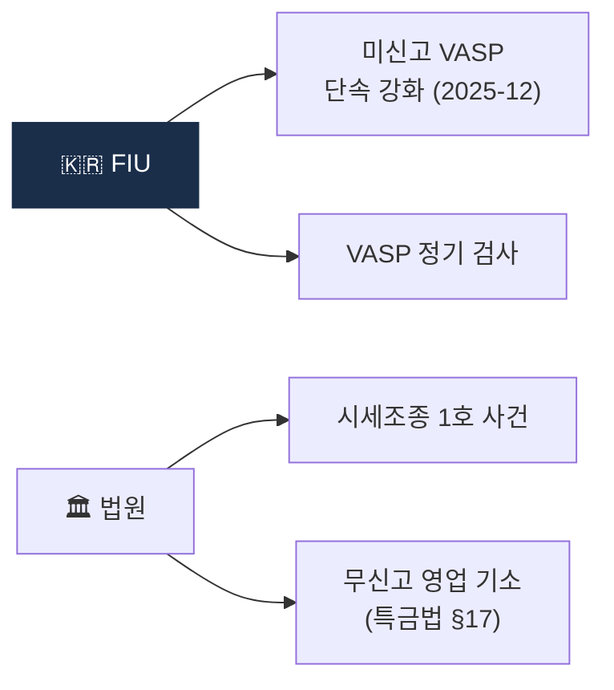
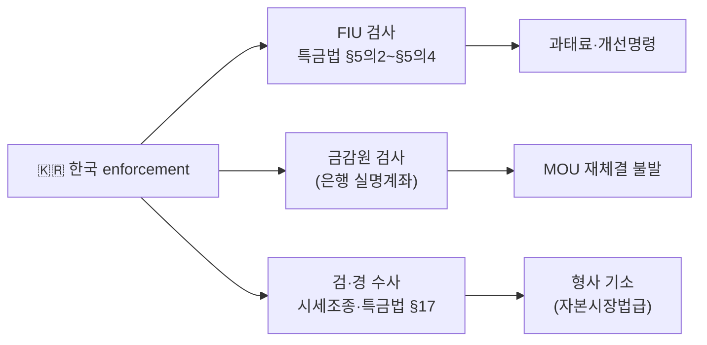

# Day 53 — 케이스: 한국 Enforcement

> 한국 특유의 검사·단속·시세조종. ⏱️ ~70분.

## 📖 오늘 뭘 배우나

한국은 아직 미국 수준 거대 벌금은 없지만 **2024-07 이용자보호법 시행 이후 enforcement 본격 축적기**에 들어섰습니다. 2025-12 미신고 VASP 단속·시세조종 1호 사건·특금법 §17 무신고 영업 기소 사례들이 쌓이며 한국 고유의 집행 방식이 정립되고 있습니다.

<!-- MAP-START -->
## 🗺 오늘의 지도

<!-- MAP-END -->

## 🎯 핵심 질문
1. 2025-12 FIU 미신고 단속의 표적?
2. 가상자산이용자보호법 시세조종 1호 사건?
3. 한국 enforcement가 상대적으로 적은 이유?

## 📖 읽기 (~50분)
- 메인: [`../notes/6-cases/major-enforcement.md`](../notes/6-cases/major-enforcement.md) — 3절 (한국)
- 보조: [`../notes/2-regulations/korea-user-protection.md`](../notes/2-regulations/korea-user-protection.md) — 7절 (시세조종 처벌)

## 🌐 외부 자료 (~15분)
- [법률신문 — 미신고 VASP FIU 단속 (2025-12)](https://m.lawtimes.co.kr)
- [CaseNote — 서울남부지법 2024고단89](https://casenote.kr/%EC%84%9C%EC%9A%B8%EB%82%A8%EB%B6%80%EC%A7%80%EB%B0%A9%EB%B2%95%EC%9B%90/2024%EA%B3%A0%EB%8B%A889)

## 🛠️ 미니 챌린지 (~5분)
- 한국 enforcement Top 3 가상 시나리오 (앞으로 일어날 법한)
- "한국에 진출한 외국 VASP가 가장 위험한 시점" 메모

## ✅ 체크포인트
- [ ] 2025-12 미신고 단속 강화 안다
- [ ] 시세조종 자본시장법급 처벌 안다
- [ ] 한국 enforcement 증가 추세 안다
- [ ] 외국 VASP 한국 차단 메커니즘 안다

## 💭 오늘의 한 줄

## 💼 실무 현장 (Industry Reality)

### 한국 VASP에서는

**2024-07 가상자산이용자보호법 시행 이후 enforcement 축적기**. **K뱅크(Upbit 실명계좌 제공사)**는 2025 금감원 검사에서 Upbit 관련 AML 절차가 지적 사항이 됨(공개 세부 미상·업계 관찰). **Coinone·Korbit**도 2024~2025 사이 FIU 검사에서 **EDD 증빙 미흡·STR 품질** 지적을 받고 개선 권고를 받은 것으로 알려짐. **Bithumb은 2025 IPO 추진 과정에서 AML·KYC 이력이 재조명**되며 상장주관사 실사 대상이 됨.

### 글로벌에서는 한국 시장을

**한국은 원화 프리미엄(kimchi premium)·소매 거래량 세계 3~5위**라서 무신고 영업의 표적. **2025-12 FIU 단속**은 한국어 지원·원화 페어 제공하는 해외 거래소를 표적으로 **앱스토어·구글플레이·ISP 차단 요청**을 병행. **비자(Visa)·마스터카드** 카드결제도 한국 IP 차단 강화.

### 한국 enforcement의 실제 3갈래

### 한국 특유의 enforcement 특성

- **벌금 규모 작음**: 한국 행정 과태료 한도는 특금법 기준 **건당 1억원**(미국 $10M+ 대비 현저히 낮음).
- **그러나 실명계좌 박탈의 충격**: 원화 입출금이 막히면 사실상 영업 불가 → **규제 밀도는 낮아도 파급력은 큼**.
- **자본시장법 준용**: 이용자보호법 시세조종은 **자본시장법 수준 형량**(최대 무기징역 + 이익의 3~5배 벌금) 적용.

### 자주 나오는 오해

- **"한국은 벌금이 작아서 널널하다"** — **실명계좌 박탈 리스크**가 존재. 은행(K뱅크·NH·카카오뱅크·KB)이 AML 실패를 이유로 MOU 재체결 거부하면 즉시 영업 중단.
- **"해외 거래소는 한국 규제 영향 없다"** — 2025-12 이후 **앱스토어 차단 + ISP 차단 + 카드결제 차단** 3중 봉쇄로 한국 시장 접근 사실상 차단됨.
