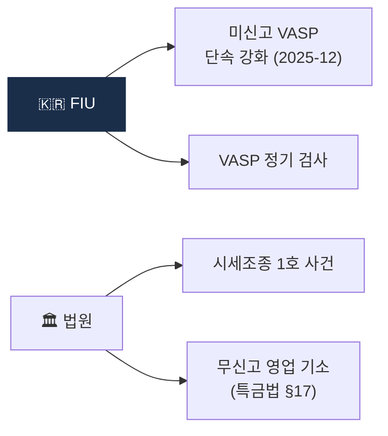

# Day 53 — 케이스: 한국 Enforcement

> 한국 특유의 검사·단속·시세조종. ⏱️ ~70분.

## 📖 오늘 뭘 배우나

한국은 아직 미국 수준 거대 벌금은 없지만 **2024-07 이용자보호법 시행 이후 enforcement 본격 축적기**에 들어섰습니다. 2025-12 미신고 VASP 단속·시세조종 1호 사건·특금법 §17 무신고 영업 기소 사례들이 쌓이며 한국 고유의 집행 방식이 정립되고 있습니다.

<!-- MAP-START -->
## 🗺 오늘의 지도

<!-- MAP-END -->

## 🎯 핵심 질문
1. 2025-12 FIU 미신고 단속의 표적?
2. 가상자산이용자보호법 시세조종 1호 사건?
3. 한국 enforcement가 상대적으로 적은 이유?

## 📖 읽기 (~50분)
- 메인: [`../notes/6-cases/major-enforcement.md`](../notes/6-cases/major-enforcement.md) — 3절 (한국)
- 보조: [`../notes/2-regulations/korea-user-protection.md`](../notes/2-regulations/korea-user-protection.md) — 7절 (시세조종 처벌)

## 🌐 외부 자료 (~15분)
- [법률신문 — 미신고 VASP FIU 단속 (2025-12)](https://m.lawtimes.co.kr)
- [CaseNote — 서울남부지법 2024고단89](https://casenote.kr/%EC%84%9C%EC%9A%B8%EB%82%A8%EB%B6%80%EC%A7%80%EB%B0%A9%EB%B2%95%EC%9B%90/2024%EA%B3%A0%EB%8B%A889)

## 🛠️ 미니 챌린지 (~5분)
- 한국 enforcement Top 3 가상 시나리오 (앞으로 일어날 법한)
- "한국에 진출한 외국 VASP가 가장 위험한 시점" 메모

## ✅ 체크포인트
- [ ] 2025-12 미신고 단속 강화 안다
- [ ] 시세조종 자본시장법급 처벌 안다
- [ ] 한국 enforcement 증가 추세 안다
- [ ] 외국 VASP 한국 차단 메커니즘 안다

## 💭 오늘의 한 줄
