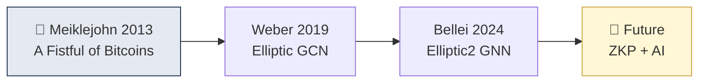

# Day 54 — 학술 논문 — Bitcoin Clustering Heuristics

> AML의 학술적 뿌리. ⏱️ ~90분.

## 📖 오늘 뭘 배우나

Chainalysis·Elliptic·TRM의 알고리즘은 **학계에서 시작**됐습니다. 2013 Meiklejohn의 "A Fistful of Bitcoins", Ron & Shamir, Androulaki 같은 논문이 Common Input Ownership을 학문적으로 검증했고, Weber et al. 2019(Elliptic dataset), Bellei et al. 2024(Elliptic2) 같은 ML 논문이 최신 방향. 오늘은 이 흐름을 통해 산업의 기술 깊이를 이해.

<!-- MAP-START -->
## 🗺 오늘의 지도

<!-- MAP-END -->

## 🎯 핵심 질문
1. Common Input Ownership 휴리스틱 첫 제안 논문은?
2. 학계가 보고한 클러스터링 정확도/한계?
3. 최신 ML 기반 클러스터링 방향?

## 📖 읽기 (~70분)
- 메인: [`../deep/papers.md`](../deep/papers.md) — Bitcoin clustering 섹션
- 논문: [Heuristic-Based Address Clustering in Bitcoin (PDF/요약)](https://www.researchgate.net/publication/347083664_Heuristic-Based_Address_Clustering_in_Bitcoin) — 추상 + 결론
- 논문: Meiklejohn et al. "A Fistful of Bitcoins" (2013) — 추상 검색

## 🛠️ 미니 챌린지 (~15분)
- 논문 1편의 핵심 주장 1줄 + 한계 1줄로 요약
- "이 논문이 지금 KYT 산업에 미친 영향" 3줄

## ✅ 체크포인트
- [ ] 1편 논문 추상 + 결론 읽음
- [ ] 휴리스틱의 통계적 정확도 (대략) 안다
- [ ] ML 기반 보완 방향 안다
- [ ] 학계 ↔ 산업 간격 인지

## 💭 오늘의 한 줄
