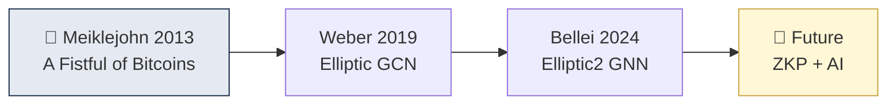

# Day 54 — 학술 논문 — Bitcoin Clustering Heuristics

> AML의 학술적 뿌리. ⏱️ ~90분.

## 📖 오늘 뭘 배우나

Chainalysis·Elliptic·TRM의 알고리즘은 **학계에서 시작**됐습니다. 2013 Meiklejohn의 "A Fistful of Bitcoins", Ron & Shamir, Androulaki 같은 논문이 Common Input Ownership을 학문적으로 검증했고, Weber et al. 2019(Elliptic dataset), Bellei et al. 2024(Elliptic2) 같은 ML 논문이 최신 방향. 오늘은 이 흐름을 통해 산업의 기술 깊이를 이해.


<!-- MAP-START -->
## 🗺 오늘의 지도


<!-- MAP-END -->

## 🎯 핵심 질문
1. Common Input Ownership 휴리스틱 첫 제안 논문은?
2. 학계가 보고한 클러스터링 정확도/한계?
3. 최신 ML 기반 클러스터링 방향?

## 📖 읽기 (~70분)
- 메인: [`../deep/papers.md`](../deep/papers.md) — Bitcoin clustering 섹션
- 논문: [Heuristic-Based Address Clustering in Bitcoin (PDF/요약)](https://www.researchgate.net/publication/347083664_Heuristic-Based_Address_Clustering_in_Bitcoin) — 추상 + 결론
- 논문: Meiklejohn et al. "A Fistful of Bitcoins" (2013) — 추상 검색

## 🛠️ 미니 챌린지 (~15분)
- 논문 1편의 핵심 주장 1줄 + 한계 1줄로 요약
- "이 논문이 지금 KYT 산업에 미친 영향" 3줄

## ✅ 체크포인트
- [ ] 1편 논문 추상 + 결론 읽음
- [ ] 휴리스틱의 통계적 정확도 (대략) 안다
- [ ] ML 기반 보완 방향 안다
- [ ] 학계 ↔ 산업 간격 인지

## 💭 오늘의 한 줄

## 💼 실무 현장 (Industry Reality)

### 학계 → 산업 이전 경로

**Chainalysis 창업 스토리**: 공동창업자 **Michael Gronager**(전 Kraken CTO)가 2014년 Meiklejohn 논문을 읽고 "이게 비즈니스다"라고 창업. 초기 clustering 엔진은 **Common Input Ownership + Change Detection** 등 2013~2015 학계 휴리스틱의 직접 구현. **Elliptic**도 유사 — **Tom Robinson**(UCL 물리학 박사)이 학계 기반으로 창업. **TRM Labs**는 **Esteban Castaño + Rahul Raina**(스탠퍼드)가 학계 + FinTech 경험 결합.

### 실제 기업 데이터 과학 팀

- **Chainalysis Research**: 약 30~50명(박사급 다수) · Crypto Crime Report·휴리스틱 개발
- **Coinbase Lynx**: 2024 발표한 **GNN 기반 내부 KYT 엔진**. Feast 피처스토어 + PyTorch Geometric 기반. 박사급 4~8명 + MLE 10~15명 추정
- **Elliptic Data Science**: **Elliptic++ dataset**(2023) 공개로 학계와 양방향 교류. Imperial College London 협업

### 학계 → 산업 기술 지도

| 논문·저자 | 연도 | 산업 적용 |
|---|---|---|
| Meiklejohn "A Fistful of Bitcoins" | 2013 | Chainalysis clustering 기반 |
| Androulaki et al. | 2013 | Change address heuristic |
| Weber et al. "Elliptic dataset" | 2019 | Elliptic + 학계 ML 협업 본격화 |
| Bellei et al. "Elliptic2" | 2024 | GNN·subgraph anomaly(Elliptic) |
| Coinbase Lynx | 2024 | 온체인 GNN 상용화 |

### 학계와 산업의 간격

```
학계 장점: 오픈 benchmark, 재현성, 피어리뷰
학계 한계: 라벨 데이터 부족 (Elliptic 공개셋도 2019년)

산업 장점: 실시간 라벨 수만~수십만 건 보유
산업 한계: 블랙박스, 재현 어려움, 규제상 설명가능성 제약
```

### 자주 나오는 오해

- **"휴리스틱은 옛날 얘기, 이제 AI가 푼다"** — 현장 KYT의 **90% 이상이 여전히 룰·휴리스틱 기반**. AI는 FP 감축·ranking 보조. 2026년에도 "첫 경보"는 룰.
- **"학계 정확도가 산업 수준"** — Elliptic 공개셋은 **"비용 없는 네거티브 샘플"** 이 부족해 실제 환경 대비 과대평가되기 쉬움. 산업 현장은 precision·recall 동시 튜닝이 훨씬 어려움.
