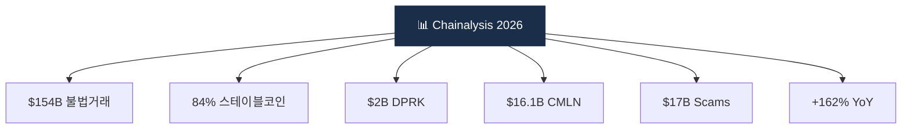

# Day 55 — 산업 리포트 — Chainalysis Crypto Crime 2026

> 가장 권위 있는 연간 리포트 정독. ⏱️ ~90분.

## 📖 오늘 뭘 배우나

**Chainalysis Crypto Crime Report**는 업계 연간 최대 참조 문서. 감독당국·언론·VASP가 모두 이를 인용하며, 여기 실린 통계($154B illicit·84% stablecoin·$2B DPRK·CMLN $16.1B 등)가 1년간 담론의 출발점이 됩니다. 오늘은 이 리포트를 직접 탐독해 **어느 챕터가 우리 회사에 영향을 주는지** 판단합니다.


<!-- MAP-START -->
## 🗺 오늘의 지도


<!-- MAP-END -->

## 🎯 핵심 질문
1. 2025 illicit address 수령 총액?
2. 가장 빠르게 성장한 범죄 유형?
3. 2026 트렌드 3개?

## 📖 읽기 (~70분)
- 메인: [`../deep/reports.md`](../deep/reports.md) — Chainalysis 섹션
- 리포트: [Chainalysis 2026 Crypto Crime Report](https://www.chainalysis.com/reports/crypto-crime-2026/) — Intro + Money Laundering + Sanctions + Scams 챕터

## 🌐 보조
- [Chainalysis Blog 2026 introduction](https://www.chainalysis.com/blog/2026-crypto-crime-report-introduction/)
- [Crypto Sanctions 2026](https://www.chainalysis.com/blog/crypto-sanctions-2026/)

## 🛠️ 미니 챌린지 (~15분)
- 리포트의 5대 통계 메모 ($154B/84% stablecoin/CMLN $16.1B/DPRK $2B/scams $17B)
- 자기 회사 입장에서 리포트의 한 챕터 → 실무 영향 1개

## ✅ 체크포인트
- [ ] illicit $154B (162% YoY) 안다
- [ ] 스테이블코인 84% 안다
- [ ] 러시아 A7A5 stablecoin $93.3B 안다
- [ ] CMLN/DPRK 통계 안다

## 💭 오늘의 한 줄

## 💼 실무 현장 (Industry Reality)

### 한국 VASP에서는

**Chainalysis Crypto Crime Report는 한국 AMLO 연례 필독**. 발간 직후(보통 2월) **DAXA 공동 스터디 + 각 사 경영진 브리핑**이 관행. **Upbit·Bithumb·Coinone·Korbit은 전원 Chainalysis 유료 구독**(연 수억~수십억 추정)하며 리포트 인용은 **FIU 검사·이사회 리포트에 기본 reference**로 들어감. **람다256 VerifyVASP** 내부 보고서도 Chainalysis 데이터 기반.

### 벤더별 리포트 경쟁 지도

| 벤더 | 플래그십 리포트 | 강점 |
|---|---|---|
| **Chainalysis** | Crypto Crime Report (연 1회) | 규모·규제당국 인용 표준 |
| **TRM Labs** | Illicit Crypto Economy Report | DPRK·제재 특화 |
| **Elliptic** | Typologies Report | 랜섬웨어·다크넷 |
| **Crystal Intelligence** | Crypto & Financial Crime Report | EU·UK 규제 특화 |
| **Merkle Science** | HackHub·Predictive Risk | 아시아·한국 특화 |

### 리포트 활용 실무 플로우

```
1. 2월 발간 → AMLO/팀장 선독 (1주)
2. 내부 요약 deck 작성 (리스크팀)
3. 임원 브리핑 + 이사회 리포트 반영 (3월)
4. ERA(연례 위험평가) 인용 (4~5월)
5. FIU 검사 시 인용 근거 (연중)
6. 룰 튜닝 근거 (예: stablecoin 84%면 관련 룰 가중치 상향)
```

### 2026 주요 통계 → 실무 의사결정 연결

- **illicit $154B (+162% YoY)**: 전반적 경계 상향 · KYT 알람 threshold 재조정
- **84% stablecoin**: USDT·USDC 이체 룰 강화 · Tron USDT 고위험 flag
- **$2B DPRK**: Lazarus 관련 주소·entity 자동 freeze 확장
- **CMLN $16.1B**: 중국계 OTC·Tether 현금화 경로 모니터링

### 자주 나오는 오해

- **"Chainalysis 숫자는 절대치"** — Chainalysis 본인도 "illicit addresses가 식별 완료된 것만 집계"라 **과소추정**을 인정. TRM·Elliptic과 수치 ±20~30% 차이가 흔함.
- **"한 벤더 리포트만 보면 충분"** — DPRK·제재는 TRM, 랜섬웨어는 Elliptic이 더 깊음. 대형사는 **Chainalysis + TRM + Elliptic 3사 병행**.
