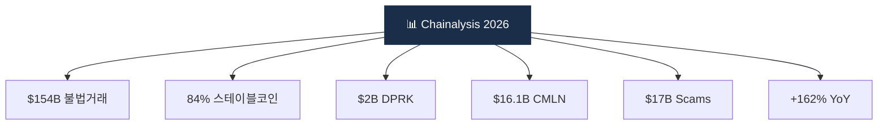

# Day 55 — 산업 리포트 — Chainalysis Crypto Crime 2026

> 가장 권위 있는 연간 리포트 정독. ⏱️ ~90분.

## 📖 오늘 뭘 배우나

**Chainalysis Crypto Crime Report**는 업계 연간 최대 참조 문서. 감독당국·언론·VASP가 모두 이를 인용하며, 여기 실린 통계($154B illicit·84% stablecoin·$2B DPRK·CMLN $16.1B 등)가 1년간 담론의 출발점이 됩니다. 오늘은 이 리포트를 직접 탐독해 **어느 챕터가 우리 회사에 영향을 주는지** 판단합니다.

<!-- MAP-START -->
## 🗺 오늘의 지도

<!-- MAP-END -->

## 🎯 핵심 질문
1. 2025 illicit address 수령 총액?
2. 가장 빠르게 성장한 범죄 유형?
3. 2026 트렌드 3개?

## 📖 읽기 (~70분)
- 메인: [`../deep/reports.md`](../deep/reports.md) — Chainalysis 섹션
- 리포트: [Chainalysis 2026 Crypto Crime Report](https://www.chainalysis.com/reports/crypto-crime-2026/) — Intro + Money Laundering + Sanctions + Scams 챕터

## 🌐 보조
- [Chainalysis Blog 2026 introduction](https://www.chainalysis.com/blog/2026-crypto-crime-report-introduction/)
- [Crypto Sanctions 2026](https://www.chainalysis.com/blog/crypto-sanctions-2026/)

## 🛠️ 미니 챌린지 (~15분)
- 리포트의 5대 통계 메모 ($154B/84% stablecoin/CMLN $16.1B/DPRK $2B/scams $17B)
- 자기 회사 입장에서 리포트의 한 챕터 → 실무 영향 1개

## ✅ 체크포인트
- [ ] illicit $154B (162% YoY) 안다
- [ ] 스테이블코인 84% 안다
- [ ] 러시아 A7A5 stablecoin $93.3B 안다
- [ ] CMLN/DPRK 통계 안다

## 💭 오늘의 한 줄
