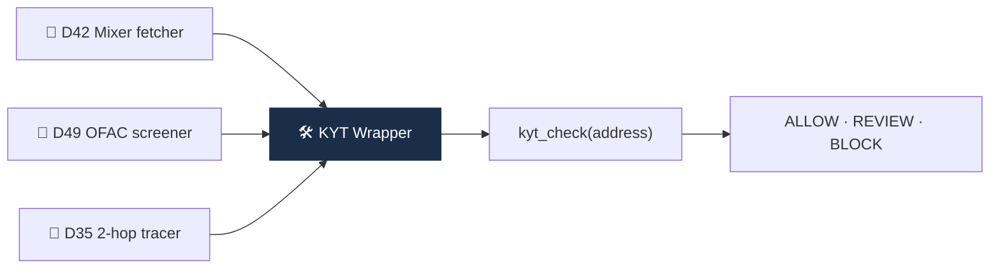

# Day 56 — 🛠️ 미니 프로젝트 5: KYT API 호출 wrapper + 8주 리뷰

> 벤더 KYT API 사용해보기. ⏱️ ~150분.

## 📖 오늘 뭘 배우나

Week 8의 결산이자 Capstone의 마지막 조각. D42(mixer fetcher)·D49(OFAC screener)·D35(2-hop tracer)의 결과물을 하나의 **KYT 호출 wrapper**로 통합. 결과 JSON에 `risk_score`·`risk_categories`·`exposure`·`recommended_action`이 담기면, 이게 그대로 Capstone Risk Engine의 **주요 입력**이 됩니다.


<!-- MAP-START -->
## 🗺 오늘의 지도


<!-- MAP-END -->

## 🎯 회고 질문
1. 8주차의 사례에서 가장 충격적이었던 것?
2. 학술 vs 산업 격차?
3. 벤더 KYT 도입 우선순위?

## 🛠️ 미니 프로젝트 5 (~120분)

### 목표
**KYT API 호출 wrapper 작성** (실제 무료 API 또는 Mock)

### 옵션 A: 실제 무료 API
- [AMLBot 무료 티어](https://amlbot.com/) — 일부 무료
- [Bitquery API](https://bitquery.io/) — GraphQL 무료 티어
- [Etherscan/BSCScan + 자체 라벨 매칭]

### 옵션 B: Mock API (학습용)
- 자기가 만든 OFAC fetcher (D49) + mixer fetcher (D42) 결과를 합쳐 자체 KYT 호출

### 사양
```python
# main.py 의사코드
def kyt_check(address: str) -> dict:
    """
    return {
        "address": "...",
        "risk_score": 0~100,
        "risk_categories": ["mixer", "sanctions", "ransomware", ...],
        "exposure": {
            "direct": [...],
            "indirect_2hop": [...],
        },
        "recommended_action": "ALLOW" | "REVIEW" | "BLOCK",
    }
    """
    ...
```

### 구현 가이드
프로젝트: `aml/projects/05-kyt-wrapper/`

- D42 (mixer fetcher) + D49 (OFAC screener) 결과를 통합
- exposure는 D35 (2-hop tracer)와 결합

### 산출물
- `projects/05-kyt-wrapper/main.py`
- `projects/05-kyt-wrapper/README.md`
- `projects/05-kyt-wrapper/sample_results/` (5개 주소 결과)

→ 가이드: [`../projects/05-kyt-wrapper/README.md`](../projects/05-kyt-wrapper/README.md)

## ✅ 체크포인트
- [ ] Wrapper 작동
- [ ] 5개 주소 sample 결과
- [ ] [`progress.md`](progress.md) Week 8 + W8 미니 프로젝트 체크
- [ ] git commit + push

## 💼 실무 현장 (Industry Reality)

### 한국 VASP에서는

**KYT 벤더 도입은 한국 4대 거래소 전원 Chainalysis**. 계약 구조는 보통 **연간 시트 라이선스 + API 호출량 tier**로 협상되며 대형 VASP 기준 **연 수억~수십억 규모**로 알려짐. 벤더 선정 요인 상위 3가지는 **(1) 한국 거래소·한국어 entity 라벨 깊이 (2) FIU·금감원 검사관 친숙도 (3) 람다256/VerifyVASP 연동성**. Upbit는 2023부터 **Chainalysis Reactor + KYT + Kryptos 풀 스택** 사용.

### 글로벌에서는

**Coinbase**는 자체 Lynx(GNN) + Chainalysis 병행. **Binance는 2023 합의 이후 Chainalysis + Elliptic 이중화 강제**. **Kraken**은 TRM 메인 + Chainalysis 보조. **OKX $504M 합의 후** TRM을 주 벤더로 전환한 것으로 관찰됨. **가격은 Enterprise tier 기준 연 $500K~$5M 범위**(호출량·좌석수·지역 구독에 따라).

### KYT wrapper 설계 패턴 (실제)

```python
# 실제 프로덕션 패턴: 벤더 fallback + 내부 룰 결합
def kyt_check(address, chain="ethereum"):
    # 1. 내부 캐시 (1시간 TTL)
    if cached := cache.get(address):
        return cached
    
    # 2. Primary vendor (Chainalysis)
    try:
        result = chainalysis.screen(address, chain)
    except VendorTimeout:
        # 3. Fallback (TRM or Elliptic)
        result = trm.screen(address, chain)
    
    # 4. 내부 룰 가중 (OFAC·mixer·DPRK 자체 라벨)
    result = apply_internal_rules(result)
    
    # 5. 최종 액션 결정
    result["action"] = decide_action(result["risk_score"])
    return result
```

### 벤더 API 응답 JSON 실제 필드 (Chainalysis 기준)

```json
{
  "address": "0x...",
  "risk": "Severe|High|Medium|Low",
  "riskReason": "Direct exposure to Sanctioned Entity",
  "cluster": {
    "name": "Lazarus Group",
    "category": "sanctions"
  },
  "exposures": [
    {"category": "mixing", "direction": "sent", "percentage": 7.3},
    {"category": "sanctions", "direction": "received", "percentage": 1.1}
  ]
}
```

### 자주 나오는 오해

- **"벤더 결과가 곧 진실"** — 벤더 라벨은 **확률적** 판단. 반드시 **내부 룰·자체 라벨**로 보완. 대형사 모두 "벤더 score + 자체 adjustment" 2단 구조.
- **"무료 API로 충분"** — 학습·PoC는 가능하나 프로덕션은 **attribution 깊이·coverage·SLA** 때문에 유료 필수. 벤더 attribution DB는 약 **수억~수십억 주소** 수준.

## 💭 8주차 회고 (캡스톤 직전)

전체 8주에서 가장 큰 변화:
가장 약한 영역 (보강 필요):
캡스톤 방향:
