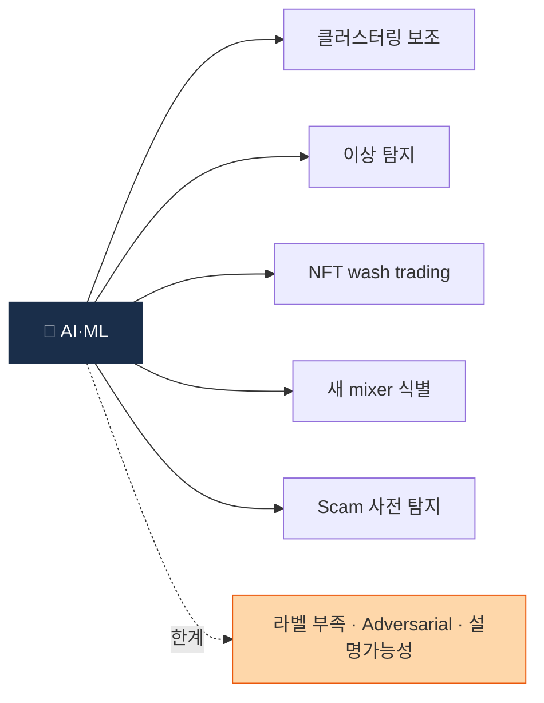

# Day 57 — AI/ML in AML

> 머신러닝 + AI 활용과 한계. ⏱️ ~80분.

## 📖 오늘 뭘 배우나

Capstone 시작 전 마지막 주제 — **AI·ML의 AML 활용**. ML이 강한 5영역(클러스터링 보조·이상거래·NFT wash·새 mixer 식별·scam 사전탐지)과 한계 3가지(라벨 부족·adversarial·**설명가능성**)를 정리합니다. 생성 AI(LLM)가 STR 초안·정책 비교·알람 분류에서 실무에 들어오는 시나리오까지.


<!-- MAP-START -->
## 🗺 오늘의 지도


<!-- MAP-END -->

## 🎯 핵심 질문
1. AML에서 ML이 강한 영역 5가지?
2. ML의 한계 (라벨/adversarial/설명가능성)?
3. LLM (생성 AI)이 AML 분석가를 대체할 수 있나?

## 📖 읽기 (~50분)
- 메인: [`../notes/4-technology/blockchain-analytics.md`](../notes/4-technology/blockchain-analytics.md) — 8절 (ML/AI)
- 보조: [`../deep/papers.md`](../deep/papers.md) — ML/AI 섹션

## 🌐 외부 자료 (~20분)
- [Merkle Science — Predictive Risk](https://www.merklescience.com/) (사이트 검색)
- [Featurespace AML 페이지](https://www.featurespace.com/)

## 🛠️ 미니 챌린지 (~10분)
- AML ML 활용 5영역 표 (클러스터/이상/wash/mixer/scam) + 자기가 강점 있다고 보는 1개
- LLM 활용 시나리오 3개 (STR 초안 작성 / 정책 비교 / 알람 분류)

## ✅ 체크포인트
- [ ] ML 적용 영역 5가지 안다
- [ ] 라벨 데이터 부족 문제 안다
- [ ] 설명가능성 규제 충돌 인지
- [ ] LLM 가능성 + 한계 인지

## 💭 오늘의 한 줄

## 💼 실무 현장 (Industry Reality)

### 한국 VASP에서는

**ML 도입은 "룰 보완"이 현실**. 한국 4대 거래소 모두 **XGBoost 기반 FP 감축 모델**을 2023~2025 사이 도입 — 기존 룰 Alert 중 "FP일 확률"을 계산해 **low-priority 큐로 자동 분류**. 이로 **Analyst 1인당 처리 Alert 20~30%** 감축 효과 보고. GNN은 아직 POC 단계(Upbit·람다256 내부 실험). **LLM은 STR 초안 작성(ChatGPT Enterprise·Claude for Work)** + **정책 문서 비교**에 2024~2026년 급속 확산.

### 글로벌에서는

**Coinbase Lynx(2024)**: 내부 발표된 **GNN 기반 KYT 엔진**. Feast 피처스토어 + PyTorch Geometric 기반, 기존 룰 대비 **precision 3배** 보고. **Binance는 2024 Sardine·자체 ML 팀** 확장. **Kraken은 Featurespace** 파트너십. **Sumsub·Jumio**의 KYC도 2024~2026 **face liveness + deepfake detection** ML 강화.

### ML 활용 5영역 + 한계

| 영역 | 실용도 | 주 벤더·도구 |
|---|---|---|
| 클러스터링 보조 | 상 | Chainalysis Research, Coinbase Lynx |
| 이상거래 탐지 | 상 | XGBoost, Isolation Forest 자체 |
| NFT wash trading | 중 | Graph embedding (TRM) |
| 새 mixer 식별 | 중 | Clustering + similarity search |
| Scam 사전 탐지 | 하~중 | Contract code embedding (Forta) |

### 설명가능성 요구 (실무 현실)

```
FIU·금감원 검사 시 필수 질문:
"이 거래가 왜 STR로 분류됐나?"

ML 블랙박스 답변: "모델이 score 0.87로 분류"
→ 검사관 불만족 → 지적사항

실제 해법:
1. SHAP·LIME 설명 함께 저장
2. ML score + 룰 근거 병행 제시
3. 최종 결정은 항상 Analyst 사람 (human-in-the-loop)
```

### LLM in AML (2026 기준 실제 활용)

- **STR 초안 자동 작성**: Analyst가 사실·증빙 입력 → LLM이 FIU 양식 초안 생성 → 사람 검수 (30% 시간 단축 보고)
- **정책 비교**: "우리 정책 vs EU TFR 차이" 질문 → GPT-4·Claude로 diff 생성
- **Alert triage**: 자연어 customer note → LLM 요약·분류
- **한계**: **hallucination 리스크** → 법·STR 등 책임 영역은 반드시 사람 최종 결정

### 자주 나오는 오해

- **"AI가 AML Analyst를 대체한다"** — 2026년 기준 대체 불가. **규제상 human accountability** 요구 + **설명가능성** 때문. Analyst의 업무가 "Alert 소거"에서 "ML 결과 검증·예외 처리"로 이동 중.
- **"데이터만 많으면 GNN 쉽다"** — **라벨 데이터 부족**이 최대 병목. Elliptic 공개셋도 20만 노드 수준. Adversarial adaptation(공격자가 패턴 회피)도 지속 이슈.
