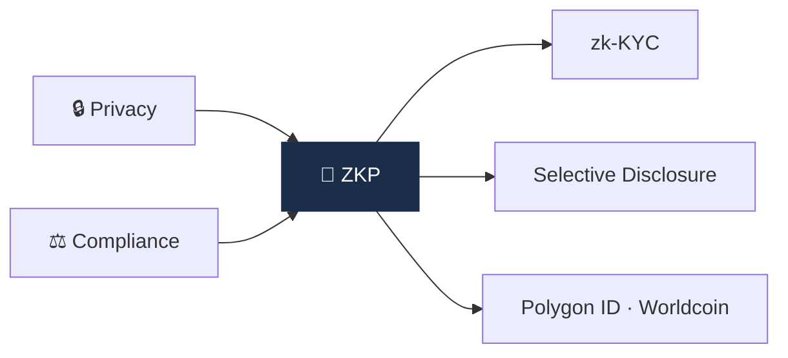
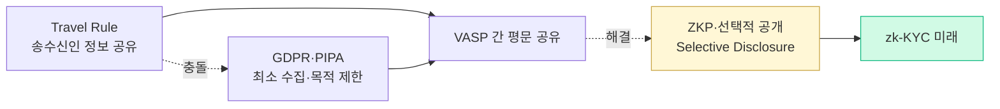

# Day 58 — ZKP + 프라이버시-컴플라이언스 양립의 미래

> Zero-Knowledge Proof로 둘 다 잡을 수 있나? ⏱️ ~80분.

## 📖 오늘 뭘 배우나

Travel Rule + GDPR·PIPA가 충돌하는 상황에서 ZKP(영지식 증명)가 "프라이버시와 컴플라이언스 양립"의 열쇠로 부상. **zk-KYC**, **Selective Disclosure**, **Polygon ID·Worldcoin** 같은 실제 프로젝트를 살피며 이 방향이 실용화 가능한지 가늠합니다. Capstone 설계 시 "10년 후 시스템"을 고려하는 장기 관점.


<!-- MAP-START -->
## 🗺 오늘의 지도


<!-- MAP-END -->

## 🎯 핵심 질문
1. ZKP가 AML/KYC에 적용되는 시나리오 3가지?
2. zk-KYC, Selective Disclosure 의 의미?
3. 한국·EU·US의 프라이버시 규제 vs Travel Rule 충돌?

## 📖 읽기 (~50분)
- 메인: [`../notes/3-crypto-aml/defi-nft-risks.md`](../notes/3-crypto-aml/defi-nft-risks.md) — 2025-2026 ZKP 트렌드 언급
- 보조: [`../notes/3-crypto-aml/travel-rule.md`](../notes/3-crypto-aml/travel-rule.md) — 7절 B (PII 보호)
- 보조: [`../deep/`](../deep/) — 추가 자료

## 🌐 외부 자료 (~25분)
- "zk-KYC" 검색 → 1~2 글
- Polygon ID, Worldcoin 등 ZK identity 프로젝트

## 🛠️ 미니 챌린지 (~5분)
- "프라이버시 + 컴플라이언스 양립" 3가지 미래 시나리오 메모
- 자기가 가장 가능성 높다고 보는 1개에 ★

## ✅ 체크포인트
- [ ] ZKP의 AML 응용 가능성 안다
- [ ] zk-KYC 컨셉 안다
- [ ] Selective Disclosure 안다
- [ ] 프라이버시 규제 vs Travel Rule 긴장 인지

## 💭 오늘의 한 줄

## 💼 실무 현장 (Industry Reality)

### 한국 VASP에서는

**ZKP는 아직 연구 단계, 그러나 프라이버시 규제 충돌은 현실**. **개인정보보호법(PIPA)**상 Travel Rule 이체 시 **수취인 개인정보를 타 VASP에 제공**하는 것은 엄격히 제한되는데, **특금법은 이를 요구**. 현재 **람다256 VerifyVASP**가 **송신 VASP에서 정보 암호화 → 수신 VASP에서만 복호화**하는 방식으로 타협하고 있음. **zk-KYC는 금융위·FIU 2026 혁신금융 샌드박스 후보**로 거론.

### 글로벌에서는

- **Polygon ID**: Polygon Labs 주도, Iden3 프로토콜 기반 ZK identity. 2024~2025 실제 서비스 적용 사례 등장
- **Worldcoin**: Tools for Humanity(Sam Altman) · iris scan → ZK proof of personhood. 한국·독일 등 프라이버시 규제 충돌
- **zkMe · Quadrata · Anima**: VC 소비자 대상 zk-KYC 신생 벤더
- **Mina Protocol**: zkApp 기반 compliance proof
- **2024 EU AMLR**: "ZKP 기반 KYC proof"를 명시적으로 고려한 첫 규제 문언

### 프라이버시 vs 컴플라이언스 충돌 지도



### zk-KYC 실제 작동 패턴 (개념 pseudocode)

```
사용자가 KYC 완료 → 신뢰 발급자(Issuer)가 Credential 서명

사용자는 VASP에 다음을 증명:
  "나는 >18세이다" (구체 나이 공개 안 함)
  "나는 OFAC SDN에 없다" (본인 이름 공개 안 함)
  "나는 한국 거주자다" (주소 공개 안 함)

VASP는 zk-SNARK로 proof 검증만 수행
→ 개인정보는 VASP에 저장되지 않음
```

### 한국 규제 vs Travel Rule 긴장

- **PIPA §15**: 개인정보 수집은 "최소한·목적 명시" 원칙
- **PIPA §17**: 제3자 제공은 "별도 동의" 필요
- **특금법 §6**: Travel Rule(100만원 이상) 정보 동반 의무
- **충돌 지점**: VASP 간 평문 공유 = PIPA 위반 소지 → **VerifyVASP의 E2E 암호화 모델**로 일단 해소

### 자주 나오는 오해

- **"ZKP = 익명"** — zk-KYC는 **Issuer가 여전히 신원 확인**. VASP만 모르는 것. 규제 시스템 안의 프라이버시이지 익명성은 아님.
- **"10년 내 ZKP가 KYC 대체"** — 기술적으로는 가능하나 **Issuer·Verifier 생태계 + 규제 인정**이 병목. 2030년에도 하이브리드(기존 KYC + zk proof) 예상.
