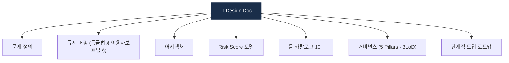
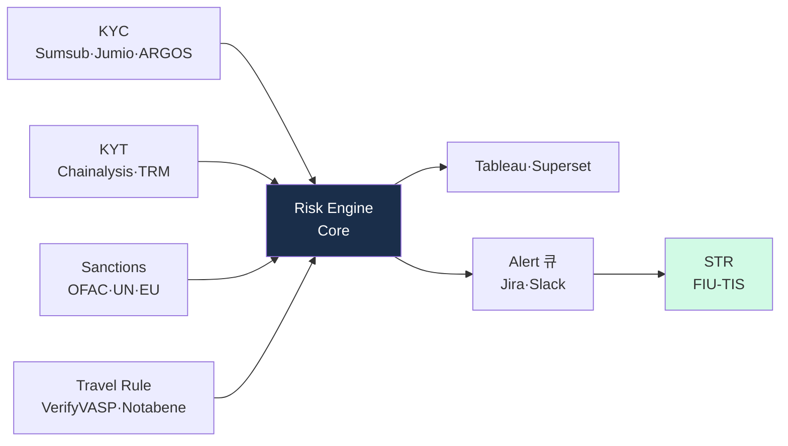

# Day 59 — 🎓 캡스톤: Mini AML Risk Engine 설계서

> 60일 학습을 통합해서 시스템 설계. ⏱️ ~150분 (사전 회고 30분 + 캡스톤 작성 120분).

<!-- MAP-START -->
## 🗺 오늘의 지도


<!-- MAP-END -->

## 🎯 캡스톤 목표

**Mini AML Risk Engine 설계서 작성** — 가상자산 거래소/수탁용 통합 위험엔진의 1차 설계 문서.

## 🛠️ 캡스톤 (~150분)

### 산출물
프로젝트: `aml/projects/06-capstone-risk-engine/DESIGN.md`

### 설계서 목차 (필수)

```markdown
# Mini AML Risk Engine — Design Document

## 1. 문제 정의
- 우리가 풀려는 문제 (시나리오)
- 사업유형 (거래소 / 수탁 / OTC ...)
- 성공 기준

## 2. 적용 규제 매핑
- 한국 특금법 § 매핑
- 가상자산이용자보호법 § 매핑
- (해외 영업 시) FATF / OFAC / TFR

## 3. 데이터 소스
- KYC: ___ 벤더 (또는 본인확인기관)
- KYT: ___ 벤더 또는 자체 + 외부 결합
- Sanctions: OFAC + UN + EU + 외교부
- PEP/Adverse Media: ___ 벤더
- Travel Rule: ___ 솔루션

## 4. 시스템 아키텍처
- 컴포넌트 다이어그램 (KYC → Risk Engine → KYT → Sanctions → Travel Rule → STR)
- 데이터 흐름 (실시간 / 배치)
- 인터페이스 (API)

## 5. Risk Score 모델
- 입력 변수 (KYC 위험 + KYT 노출 + 거래 패턴)
- 가중치
- 등급 매핑 (LOW/MED/HIGH)
- threshold + 자동 액션

## 6. 룰 카탈로그
- 최소 10개 룰 (Smurfing / Pass-through / Mixer 노출 / SDN / ...)

## 7. 운영 플로우
- Onboarding
- 거래 시
- 일일 배치
- STR 생성
- 검사 대응

## 8. 거버넌스
- 5 pillars 어떻게 충족
- 3LoD 매핑
- AMLO 권한
- 교육 + 감사

## 9. 단계적 도입 로드맵
- MVP (3개월)
- v1 (6개월)
- v2 (12개월)

## 10. 리스크와 한계
- False positive / negative 균형
- 비용
- 인력
- 미해결 영역 (DeFi / Privacy coin)

## 11. 참고 (인용)
- 이 60일에 사용한 모든 자료 인용
```

### 작성 팁
- 분량: 4~10 페이지 (마크다운 기준)
- 구체성 우선 (예: "KYT" → "Chainalysis KYT API + 자체 라벨 매칭")
- 다이어그램 1개 이상 (Mermaid 또는 ASCII)
- 자기 회사 사업유형 1개 가정

## ✅ 체크포인트
- [ ] DESIGN.md 11절 모두 작성
- [ ] 다이어그램 1개+
- [ ] 룰 10개+
- [ ] 60일 학습 자료 인용 5개+

## 💭 오늘의 한 줄

## 💼 실무 현장 (Industry Reality)

### 실제 AML Risk Engine 설계는 이렇게 시작한다

**한국 VASP 신규 Risk Engine 프로젝트 관찰 패턴**:

1. **Business Case 작성** (1~2주): AMLO + CTO 공동 서명, 이사회 승인
2. **Gap Analysis** (2~4주): 현 시스템 vs 특금법·이용자보호법·FATF R.15/16 매핑 표
3. **벤더 RFP** (4~8주): Chainalysis·Elliptic·TRM 등 3~5개사 벤치마크
4. **MVP 구축** (3~6개월): KYT + Sanctions + STR 워크플로 우선
5. **v1 배포** (6~12개월): Travel Rule + EDD 자동화 + BI 대시보드
6. **감사·FIU 검사 대응 문서화** (상시)

### 참조 아키텍처 (실무 표준)



### Mini Risk Engine 설계 시 꼭 들어갈 "현실 요소"

- **벤더 fallback**: Primary vendor 장애 시 Secondary로 전환 로직
- **휴먼 최종결정**: ML·룰 결과는 recommendation, 최종 block/freeze는 Analyst 서명
- **증거 체인(Audit Trail)**: 모든 결정에 "입력·룰 ID·결정자·시각" 불변 기록 (감사 요구)
- **SLA 명시**: Alert 생성→Analyst 1차 리뷰 4h / STR 제출 48h 등 구체
- **개인정보 파이프라인 분리**: PII는 별도 vault(Hashicorp·AWS KMS), 분석 파이프라인은 pseudonymized

### 설계서에 반드시 포함해야 할 것 (실무 기준)

```
1. 벤더 선정 이유 (1개 이상 비교 매트릭스)
2. 룰 카탈로그: 각 룰의 근거 규제 § 표기
3. 데이터 보관: 15년(이용자보호법) / 5년(특금법) 이원화
4. AMLO 결재 경로 (RACI)
5. 예산·인력: 연간 OpEx + CapEx 추정 (최소 5억~수십억)
6. 감사 대응 매뉴얼 (FIU 검사 Q&A 스크립트)
```

### 자주 나오는 오해

- **"설계서는 문서일 뿐"** — FIU 검사 1순위 요청 자료. "실제 운영 = 설계서 일치" 여부가 검사 기준.
- **"MVP는 룰 3~5개만 있으면 충분"** — MVP라도 **필수 8룰**(SDN 직접·mixer·DPRK·PEP·smurfing·pass-through·structuring·high-velocity)은 있어야 FIU 검사 통과.
