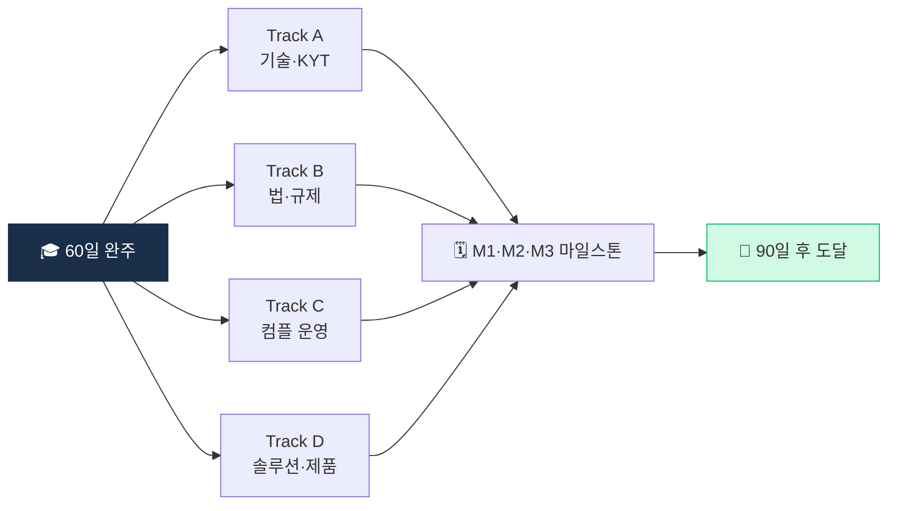

# Day 60 — 🎓 다음 90일 로드맵

> 60일 끝, 90일 시작. ⏱️ ~120분.

## 📖 오늘 뭘 배우나

60일의 마지막 날. 오늘은 **"앞으로 90일"** 의 구체 로드맵을 작성합니다. 4개 전공 트랙(기술·법·컴플라이언스·솔루션) 중 자신의 관심과 경력에 맞는 1개를 선택해 월별 마일스톤을 세우면, 60일 챌린지가 **지속 성장 궤도**로 이어집니다.


<!-- MAP-START -->
## 🗺 오늘의 지도


<!-- MAP-END -->

## 🎯 회고 질문 (60일 통합)

1. 가장 큰 변화 (Day 1과 Day 60의 나):
2. 가장 의외였던 영역:
3. 가장 약한 영역 (보강 필요):
4. 가장 흥미 있는 전공 영역:

## 🛠️ 90일 로드맵 작성 (~90분)

### 산출물
파일: `aml/curriculum/_artifacts/d60_90_day_roadmap.md`

### 4개 전공 트랙 중 선택

#### 트랙 A — 기술 (KYT/Analytics)
- 자체 attribution DB 구축
- ML 기반 클러스터링 실험
- Cross-chain tracing 깊이
- 산출물: 작동하는 KYT 프로토타입

#### 트랙 B — 법/규제
- 특금법 + 이용자보호법 § 단위 마스터
- FATF/EU/US 깊이 비교
- 한국 가상자산 변호사 자료 + 컨퍼런스 참석
- 산출물: 한국 VASP 컴플라이언스 핸드북

#### 트랙 C — 컴플라이언스 운영
- AMLO 실무 (정책/룰/감사 사이클)
- STR 분석가 트레이닝 자료
- ERA 작성
- 산출물: AMLO 운영 매뉴얼 + 룰 카탈로그

#### 트랙 D — 솔루션/제품
- KYT/Travel Rule 솔루션 시장 깊이
- 신규 제품 아이디어 (한국 특화 + 글로벌)
- 비즈니스 모델
- 산출물: 신규 솔루션 1-pager + MVP 사양

### 90일 플랜 템플릿

```markdown
# 90-day Roadmap — Track [A/B/C/D]

## 핵심 목표
- 90일 후 도달 상태 (구체):

## 월별 마일스톤
- M1 (1~30일): _______
- M2 (31~60일): _______
- M3 (61~90일): _______

## 주간 학습 페이스
- 평일: __h
- 주말: __h

## 산출물 (3개)
- 1. _______
- 2. _______
- 3. _______

## 리뷰 시점
- D30: 1차 리뷰
- D60: 2차 리뷰 + 조정
- D90: 최종 평가 + 다음 단계
```

## ✅ 체크포인트
- [ ] 60일 회고 작성
- [ ] 트랙 1개 선택
- [ ] 90일 로드맵 작성
- [ ] [`progress.md`](progress.md) Capstone 4일 모두 체크
- [ ] 60일 챌린지 git tag (예: `v1.0-60day-completed`)

## 💭 60일 마지막 한 줄

> 이 60일이 나에게 가르쳐준 것:
> 다음 90일에 시도할 한 가지:

---

🎉 **60일 챌린지 완주 축하!** 🎉

이제 [`../README.md`](../README.md) 우선순위 Top 5 를 다시 보면 — 시작할 때와 완전히 다른 눈으로 보일 거임.
