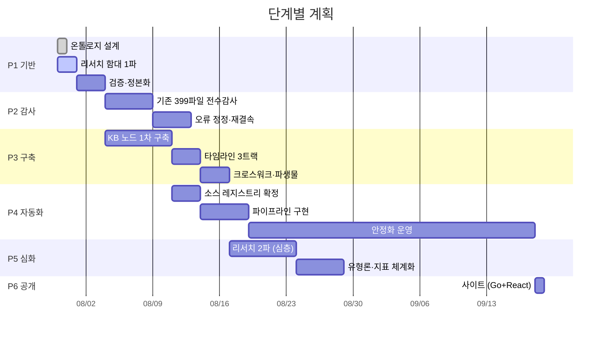
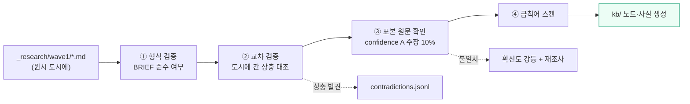
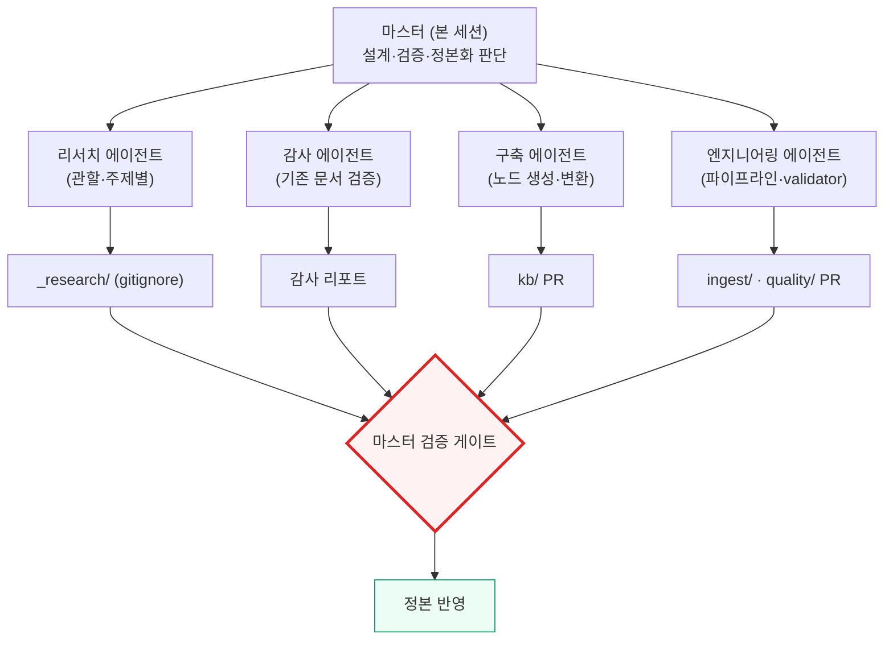

# 마스터 계획 — 가상자산 AML 지식베이스 구축

> **작성일**: 2026-07-30 · **상태**: Phase 1 진행 중
> **목표**: 학습 노트를 **질의 가능한 인텔리전스 지식베이스**로 전환하고, 매일 자동 갱신되게 만든다.

---

## 1. 최종 상태 정의 (Definition of Done)

이 프로젝트가 끝났다고 말할 수 있는 조건.

| # | 조건 | 측정 |
|---|---|---|
| 1 | 온톨로지 3계층이 확정되고 전 지식이 그 위에 올라가 있다 | 노드 1,200+, 고립 노드 0 |
| 2 | 모든 사실이 출처까지 추적된다 | 추적성 100%, 무증거 노드 0 |
| 3 | 시점 질의가 가능하다 | `as_of(T)` 로 임의 시점 규제 지형 재구성 |
| 4 | 매일 자동으로 갱신된다 | 파이프라인 30일 무중단, 소스 50+ |
| 5 | 역사 타임라인이 인과까지 연결되어 있다 | 3트랙 140+ 사건, `CAUSED` 엣지 |
| 6 | 기존 산문의 오류가 전수 검증되었다 | 399 파일 감사 완료 |
| 7 | 품질이 계측되고 관리된다 | 종합점수 85+, 미검증 부채 5% 미만 |
| 8 | 공개 저장소에 비공개 조직 관련 내용이 없다 | 금칙어 검출 0 |

---

## 2. 단계 구성

---

## 3. Phase 1 — 기반 (진행 중)

### 3.1 완료

| 산출물 | 위치 |
|---|---|
| 3계층 아키텍처 | `docs/architecture/01-overview.md` |
| 의미 계층 설계 | `docs/ontology/01-semantic-layer.md` |
| 동적 계층 설계 (이중시간) | `docs/ontology/02-dynamic-layer.md` |
| 운동 계층 설계 (파이프라인) | `docs/ontology/03-kinetic-layer.md` |
| 노드·엣지 전체 명세 | `docs/ontology/04-node-edge-spec.md` |
| 식별자 체계 | `docs/ontology/05-identifier-scheme.md` |
| 타임라인 데이터 모델 | `docs/ontology/06-timeline-model.md` |
| 기계판 온톨로지 | `kb/schema/ontology.yaml` |
| JSON Schema | `kb/schema/node.schema.json`, `edge.schema.json` |
| 데이터 품질 프레임워크 | `docs/governance/01-data-quality.md` |
| 출처·확신도·계보 | `docs/governance/02-provenance-confidence.md` |
| 검증 워크플로 | `docs/governance/03-review-workflow.md` |
| 소스 레지스트리 설계 | `docs/ingestion/01-source-registry.md` |
| 일일 파이프라인 설계 | `docs/ingestion/02-daily-pipeline.md` |
| 사이트 스케치 (보류) | `docs/architecture/03-site-blueprint.md` |
| 리서치 작업표준 | `_research/BRIEF.md` |

### 3.2 리서치 함대 1파 (10기)

모든 산출물은 `_research/wave1/` (gitignore) → 검증 후 `kb/` 정본화.

| # | 도시에 | 범위 |
|---|---|---|
| 1 | `fatf-intl-standards` | FATF R.15/R.16·가이던스·상호평가·회색명단·국제기구 |
| 2 | `us-regime` | BSA/FinCEN·OFAC·입법·집행·주 차원 |
| 3 | `eu-uk-regime` | MiCA·TFR·AML 패키지·AMLA·FCA·영국 신체계 |
| 4 | `apac-mena-regime` | 싱가포르·일본·홍콩·UAE·호주·인도·동남아 |
| 5 | `korea-regime` | 특금법·이용자보호법·2단계 입법·FIU·집행·업계 |
| 6 | `typologies-threat-actors` | 유형론 3단 계층·기법 40+·위협행위자·최신 동향 |
| 7 | `analytics-technology` | 클러스터링·귀속·리스크스코어링·프라이버시·GNN·트래블룰 기술 |
| 8 | `market-vendors` | 온체인분석·트래블룰·KYC·전통AML·한국시장·역량매트릭스 |
| 9 | `ingestion-sources` | 수집 소스 전수 발굴 + **실측 검증** |
| 10 | `historical-timeline` | 3트랙 타임라인·인과 사슬·국면 구분 |

### 3.3 검증·정본화 (다음)

**교차 검증이 핵심이다.** 10개 도시에가 독립적으로 작성되었으므로 겹치는 영역(예: FATF R.16 을 1·3·5번이 모두 언급)에서 불일치가 드러난다. 이 불일치가 곧 검증 대상 목록이 된다.

---

## 4. Phase 2 — 기존 자산 감사

현행 399 파일 · 22,000줄 전수 검증. [`governance/01-data-quality.md §7`](governance/01-data-quality.md) 참조.

| 단계 | 방법 | 산출 |
|---|---|---|
| 2-1 | 파일별 사실 주장 추출 | 주장 인벤토리 |
| 2-2 | 출처 유무 판정 | 무출처 주장 목록 |
| 2-3 | 리서치 도시에와 대조 | 상충·오류 목록 |
| 2-4 | 상대 시간 표현 검출 | 치환 대상 목록 |
| 2-5 | 상태 오류 검출 (제안/시행 혼동) | 정정 목록 |
| 2-6 | 링크 헬스체크 | 사망 링크 목록 |
| 2-7 | 정정 + `covers:` frontmatter 부착 | 그래프 결속 완료 |

**감사 결과 자체를 기록한다.** 어떤 주장이 확인되었고 어떤 것이 틀렸는지가 지식베이스에 남는다 — 조용히 고치지 않는다.

### 4.1 산문의 운명

| 폴더 | 처리 |
|---|---|
| `notes/` | 유지 + 그래프 결속 + 정정. 지식베이스의 서술 계층 |
| `curriculum/` | 유지하되 **부차적 뷰**로 격하. 60일 학습 경로는 KB 의 한 가지 투영 |
| `en/` | 유지 + 확대. 영문 접근성 |
| `projects/` | 유지. 구현 사양은 `CTL`·`IND` 노드와 결속 |
| `deep/`, `charts/`, `print/` | 유지 |
| ~~`meta/`~~ | ✅ **처리 완료 (2026-07-30)** — 아래 §4.2 |

---

### 4.2 디렉터리 구조 개편 (2026-07-30 완료)

설계 문서에 맞춰 역할별로 재배치했다. 도구가 "무엇을 하는가"가 아니라 "어디에 있는가"로 흩어져 있던 문제를 해소한다.

| 이동 | 이유 |
|---|---|
| `charts/validate_links.py` → `quality/` | 검증기는 검증 디렉터리로. 차트 생성과 무관 |
| `charts/validate_mermaid.py` → `quality/` | 상동. mmdc 툴체인은 `charts/` 참조 유지 |
| `charts/check_external_urls.py` → `quality/` | 상동 |
| `scripts/regulatory_rss.py` → `ingest/legacy/` | 수집기는 수집 계층으로. 전환 대상임을 위치로 표시 |
| `scripts/requirements.txt` → `ingest/legacy/` | 상동 |
| `meta/regulatory-watch.md` → `intel/watchlist/` | 규제 추적은 분석 산출물 |
| `meta/outreach/` → `_private/outreach/` | 홍보 초안은 지식이 아니며 공개 대상 아님 |
| `meta/submissions/` → `_private/submissions/` | 기관 제출 초안 = "무엇을 하겠다" 문서 |
| `meta/academic-publication-guide.md` → `_private/project-ops/` | 프로젝트 운영 문서 |
| `meta/official-review-request.md` → `_private/project-ops/` | 상동 |

`meta/` 디렉터리는 제거되었다. `scripts/` 는 **파생물 생성 전용**으로 재정의했다.

연동 수정: `.github/workflows/validate.yml`, `regulatory-watch.yml` 경로 갱신,
`kb-validate.yml` 신설, `README.md` 전면 개편, `CONTRIBUTING.md`·`deep/README.md`·
이슈 템플릿의 경로 참조 일괄 정정.

> `_private/` 로 옮긴 파일은 git 이력에는 남아 있으나 이후 커밋에서 추적되지 않는다.
> 되돌리려면 `git log --diff-filter=D` 로 찾아 복원할 수 있다.

---

## 5. Phase 3 — KB 구축

| 작업 | 목표 |
|---|---|
| L1 노드 1차 구축 | 1,200 노드 ([`ontology/01-semantic-layer.md §5`](ontology/01-semantic-layer.md)) |
| L2 사실 결속 | 검증된 원자적 사실 전량 |
| 타임라인 3트랙 | 사건 140+, 인과 엣지, 국면 노드 |
| 크로스워크 | 관할 비교표 자동 생성 |
| `build_graph` 구현 | SSOT → 그래프·인덱스·파생물 재생성 |
| validator 구현 | `quality/validate_kb.py`, CI 결합 |

---

## 6. Phase 4 — 자동화

| 작업 | 목표 |
|---|---|
| 소스 레지스트리 확정 | 실측 완료 소스 50+, P0 20+ |
| 수집기 구현 | rss·api·html·file 4종 |
| 변화 탐지 | 10종 신호 유형 |
| 검증 큐 | TASK 생성·체크리스트 |
| 브리프 자동 생성 | 일일·주간 |
| 품질 스코어카드 | 매일 |
| 기존 워처 흡수 | `scripts/regulatory_rss.py` 병행 후 교체 |

**안정화 기준**: 30일 무중단 + 일일 TASK 15건 이하 + 기각률 30% 이하.

---

## 7. Phase 5 — 심화 (리서치 2파)

1파가 지형을 그렸다면 2파는 깊이를 판다. **1파 결과의 `§8 미확인` 항목이 2파의 과제 목록**이 된다.

| 예상 주제 | 비고 |
|---|---|
| 조문 축조 해설 | 핵심 조문의 원문 축조 확보 (1파에서 원문 절단 다수 발생) |
| 관할별 감독·검사 실무 | 검사 절차·지적사항 유형 |
| 판례·법리 | 주요 판결의 법리 분석 |
| 유형론 심화 | 기법별 실제 사례 결속 |
| 탐지 지표 정교화 | 오탐률·데이터 요건 |
| 학술 문헌 | 알고리즘 원논문 확보 |
| 관할 확대 | 1파 미포함 관할 |

---

## 8. Phase 6 — 공개 사이트

**최종 단계 결정사항.** Go 백엔드 + React 프론트. 착수 전제조건 6개를 모두 충족한 뒤에만 시작한다. → [`architecture/03-site-blueprint.md`](architecture/03-site-blueprint.md)

---

## 9. 에이전트 운용 체계

작업 성격에 따라 역할을 나눈다.

| 유형 | 원칙 |
|---|---|
| **리서치** | 산출물은 항상 `_research/` 로. 직접 `kb/` 에 쓰지 않는다 |
| **감사** | 발견만 보고, 정정은 별도 승인 후 |
| **구축** | 스키마 검증 통과분만 PR |
| **엔지니어링** | 코드는 테스트 동반 |

**공통 제약**: 모든 에이전트에게 발주사·자사 언급 금지를 명시한다. 이것은 매 프롬프트에 반복해서 넣는다.

---

## 10. 리스크

| 리스크 | 영향 | 대응 |
|---|---|---|
| 국내 기관 사이트가 해외 CI 러너 차단 | 한국 수집 절반 손실 | 리서치 단계 실측 필수, 차단 시 대체 실행환경 |
| 규제 원문 접근 제한 (403·PDF 절단) | 확신도 하락 | 스냅샷 보관 + 2파에서 원문 재확보 |
| 온톨로지 조기 확정으로 인한 경직 | 재작업 | ADR 로 변경 이력 관리, 클래스 폭증 금지 |
| 검증 큐 과부하 | 게이트 무력화 | 큐 위생 지표 + 필터 학습 |
| 미검증 부채 누적 | 신뢰도 붕괴 | 5% 상한 강제 |
| 리서치 도시에 간 상충 방치 | 잘못된 지식 정본화 | 교차 검증 단계 필수화 |
| 비공개 내용 유출 | 되돌리기 어려움 | 금칙어 CI 차단 + `_private/` 분리 |

---

## 11. 다음 행동

1. 리서치 1파 10기 완료 대기 (진행 중)
2. 도시에 형식·교차 검증
3. 상충 목록 작성 → 재조사 과제 배정
4. `kb/` 정본화 착수 (관할·기관·규범 골격부터)
5. `validate_kb.py` 구현 및 CI 결합
6. 소스 레지스트리 실측 결과 반영
