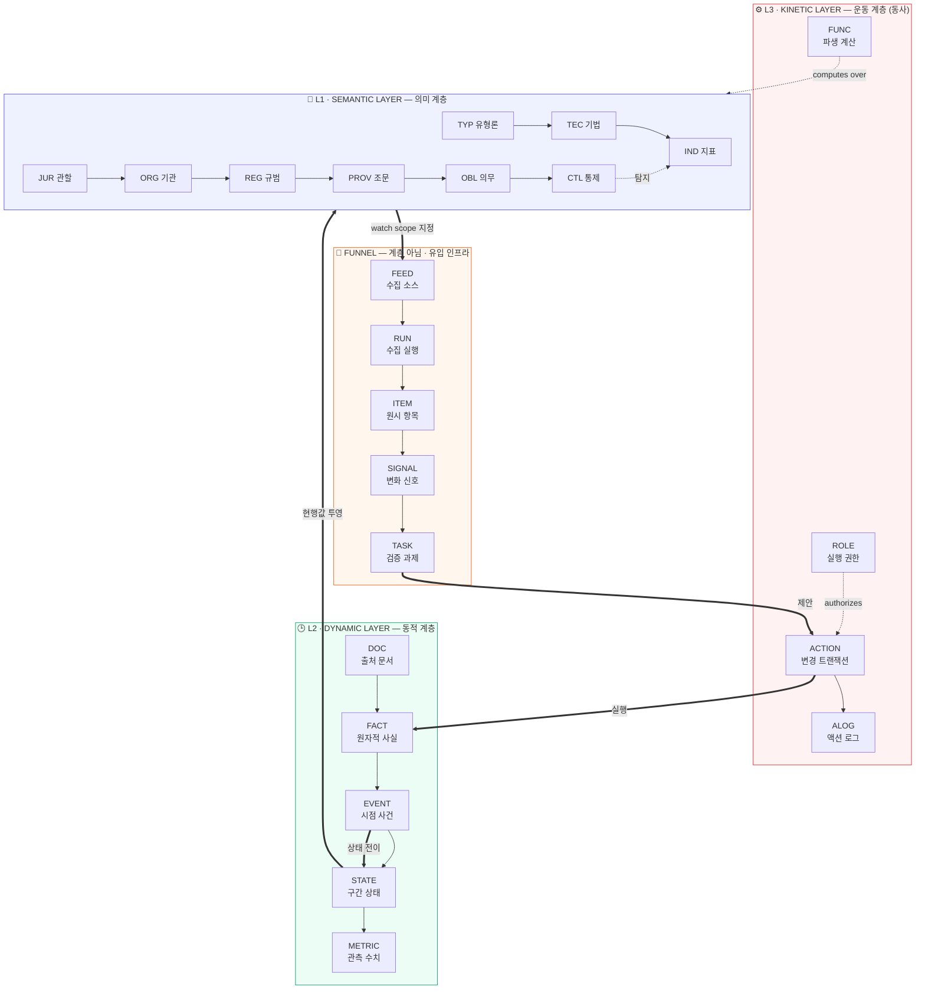
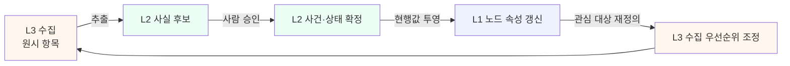
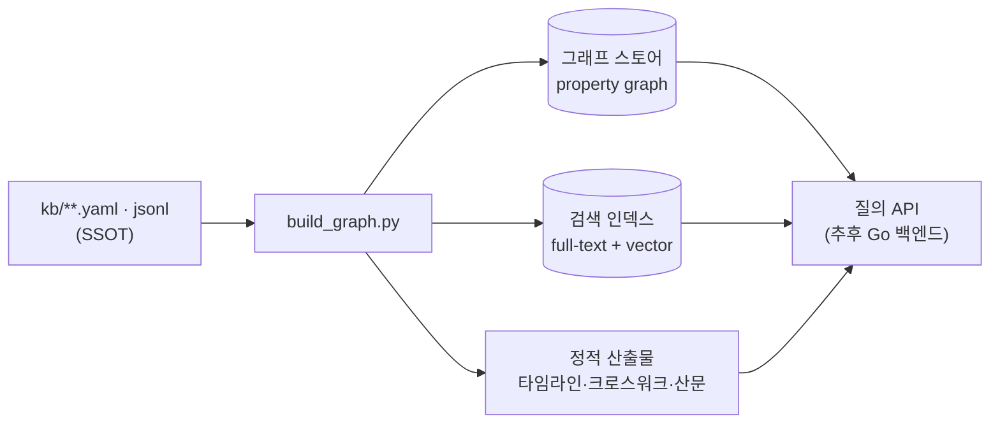

# 아키텍처 총론 — 3계층 지식 그래프

> **상태**: 설계 확정 (v0.1) · **작성일**: 2026-07-30 · **선행 문서**: 없음
> **관련**: [`../ontology/04-node-edge-spec.md`](../ontology/04-node-edge-spec.md) · [`../governance/01-data-quality.md`](../governance/01-data-quality.md)

---

## 1. 문제 정의

기존 저장소는 **사람이 읽는 산문(prose)** 이었다. 22,000줄의 마크다운은 학습에는 유효하지만 지식베이스로는 세 가지가 결정적으로 부족하다.

| 결핍 | 증상 | 결과 |
|---|---|---|
| **질의 불가** | "2024-12-30 시점 EU CASP 의무는?" 에 답하려면 사람이 파일을 뒤져야 함 | 지식이 재사용되지 않음 |
| **시점 부재** | "현재", "최근" 같은 상대 표현이 본문에 박힘 | 6개월 뒤 자동으로 틀린 문서가 됨 |
| **증거 미결속** | 주장과 출처가 문단 단위로 느슨하게 연결 | 오류 발생 시 영향 범위 추적 불가 |

지식베이스는 **산문을 버리는 것이 아니라, 산문 밑에 질의 가능한 그래프를 까는 것**으로 해결한다. 산문은 그래프의 한 가지 투영(projection)이 된다.

## 2. 설계 원칙

1. **그래프 우선(graph-first)** — 모든 지식은 노드와 엣지로 먼저 표현하고, 문서는 그로부터 생성하거나 그에 결속한다.
2. **시점 없는 주장 금지(no claim without time)** — 모든 사실은 유효기간을 갖는다. 규제는 반드시 변한다는 것을 스키마 수준에서 전제한다.
3. **증거 없는 노드 금지(no node without evidence)** — 모든 노드·엣지는 최소 1개 출처 문서에 결속된다.
4. **불변 원본(immutable raw)** — 수집한 원시 데이터는 절대 수정하지 않는다. 정정은 항상 새 레코드로.
5. **자동은 제안까지, 확정은 사람이(human-in-the-loop)** — 파이프라인은 변경을 *제안*하고, 승인 게이트를 통과해야 지식이 된다.
6. **텍스트 저장·그래프 질의(text at rest, graph at query)** — 저장은 Git 친화적 YAML/JSONL, 질의는 그래프 엔진에 적재해서. 벤더 종속 없음.

## 3. 3계층 모델



> **Funnel 은 계층이 아니다.** 수집·인덱싱은 온톨로지를 채우는 인프라이며,
> **사실 후보까지만** 만든다. 후보가 지식이 되는 것은 `ACTION` 을 통해서다.
> 이 경계가 흐려지면 "수집한 것이 곧 지식"이 되어 검증 게이트가 무력화된다.
> 정정 이력 → [ADR-0004](../adr/0004-kinetic-layer-correction.md)

### 3.1 L1 · SEMANTIC — "무엇이 존재하고 서로 어떤 관계인가"

시간에 대해 준(準)불변인 개념·존재·관계. 온톨로지의 골격.

| 항목 | 내용 |
|---|---|
| 담는 것 | 클래스·속성·제약(T-Box) + 안정 인스턴스(관할·기관·규범 골격·유형론 분류·개념 어휘) |
| 변경 빈도 | 월 ~ 분기 |
| 변경 주체 | 사람 큐레이터 (PR 리뷰 필수, 자동 변경 금지) |
| 저장 | `kb/schema/`, `kb/entities/` |
| 대표 질의 | "트래블룰 의무를 부과하는 조문 전체와 그 관할" |

**핵심**: 여기서 "규범이 시행 중인가"는 다루지 **않는다**. 규범이 *존재한다*는 사실과 그 구조만 다룬다. 상태는 L2 의 몫이다. 이 분리가 온톨로지가 시간에 오염되지 않게 하는 장치다.

### 3.2 L2 · DYNAMIC — "언제 무엇이 참이었는가"

시간축이 결합된 상태·사건·수치. **이중시간(bitemporal)** 을 채택한다.

| 항목 | 내용 |
|---|---|
| 담는 것 | 규범 상태 이력, 인가/제재 지정 상태, 집행조치, 사고, 지표 시계열, 원자적 사실 |
| 변경 빈도 | 일 ~ 주 |
| 변경 주체 | 검증 통과 자동 갱신 + 사람 승인 |
| 저장 | `kb/facts/`, `kb/entities/**/states/`, `kb/derived/timeline/` |
| 대표 질의 | "2024-12-30 기준 MiCA 상 CASP 인가 요건 상태", "2019년 이후 트래블룰 임계값 변천" |

**이중시간이 필요한 이유**: 규제 지식에서는 "언제부터 효력이 있었는가(valid time)"와 "우리가 언제 그것을 알게 되었는가(transaction time)"가 다르다. 소급 시행, 뒤늦게 발견한 오류 정정, "그때 우리는 무엇을 근거로 판단했는가"의 감사 대응 — 셋 다 두 시간축 없이는 답할 수 없다.

### 3.3 L3 · KINETIC — "무엇을 바꿀 수 있고, 누가 바꿨는가"

**동사의 세계.** 지식과 현실을 바꾸는 행위의 명세.

| 항목 | 내용 |
|---|---|
| 담는 것 | `ACTION`(변경 트랜잭션) · `FUNC`(파생 계산) · `ROLE`(실행 권한) · `ALOG`(액션 로그) |
| 변경 빈도 | 명세는 분기, 실행 기록은 상시 |
| 변경 주체 | 명세는 사람, 실행은 권한 통제 |
| 저장 | `kb/entities/{actions,functions,roles}/`, `kb/alog/` |
| 대표 질의 | "이 사실을 누가 언제 무슨 근거로 승격했나", "이 의무를 실행하는 액션은" |

변경 경로를 **모델 안에 닫아 넣는** 것이 목적이다. 모델 밖 스크립트가 임의 필드를 임의로
바꾸면 스키마는 사실상 존재하지 않는다.

**AML 에서는 액션 로그가 법적 요건이다.** 기록보존 의무는 "무엇을 했는가"뿐 아니라
"왜 그렇게 판단했는가"를 요구한다. L2 이중시간(당시 알던 것)과 L3 액션 로그(당시 한 것)를
결합해야 감독 검사의 *"이 판단의 근거는?"* 에 답할 수 있다.

→ [`../ontology/03-kinetic-layer.md`](../ontology/03-kinetic-layer.md)

### 3.3.1 FUNNEL — 계층이 아닌 것

수집·정규화·변화탐지는 온톨로지 계층이 아니라 **이를 채우는 인프라**다.

| 항목 | 내용 |
|---|---|
| 담는 것 | `FEED` · `RUN` · `ITEM` · `SIG` · `TASK` |
| 변경 빈도 | 일 (또는 그 이하) |
| 변경 주체 | 자동 |
| 저장 | `data/raw|staging|curated/`, `ingest/` |
| 산출 한계 | **사실 후보까지만.** 지식 확정은 `ACTION` 이 한다 |

→ [`../ingestion/02-daily-pipeline.md`](../ingestion/02-daily-pipeline.md)

### 3.4 계층 간 순환

계층은 위→아래 단방향이 아니라 **순환**한다. 이것이 지식베이스가 스스로 갱신되는 메커니즘이다.



예시로 한 바퀴를 돌면:

1. **L3** — FinCEN RSS 에서 신규 규칙제정 항목 수집 → `ITEM`
2. **L3** — 기존 `REG:us-fincen-cvc-mixing` 노드와 유사도 매칭 → `SIGNAL` (상태 변경 후보)
3. **L3→L2** — 검증 과제 생성, 큐레이터가 연방관보 원문 확인 → `FACT` 확정
4. **L2** — `EVENT:2026-xx-xx-final-rule-published` 생성, `STATE` 를 `proposed → in-force` 로 전이
5. **L2→L1** — `REG` 노드의 `current_status` 투영값 갱신, 연결된 `OBL` 노드들 활성화
6. **L1→L3** — 새 의무가 생겼으므로 관련 감독기관 피드의 우선순위 상향

## 4. 저장소 위상

```
aml/
├── kb/                    # 지식 그래프 (L1 + L2) — 커밋 대상, 리뷰 필수
│   ├── schema/            #   L1 T-Box: 온톨로지·JSON Schema
│   ├── entities/          #   L1 A-Box: 노드 인스턴스 (YAML)
│   ├── facts/             #   L2: 원자적 사실 (JSONL)
│   ├── sources/           #   출처·문서 레지스트리
│   └── derived/           #   생성물: 인덱스·크로스워크·타임라인
├── ingest/                # L3 파이프라인 코드
│   ├── config/            #   소스 레지스트리 (YAML)
│   └── collectors/        #   수집기 구현
├── data/                  # L3 데이터 레이크
│   ├── raw/               #   🚫 gitignore — 불변 랜딩 존
│   ├── staging/           #   🚫 gitignore — 정규화 중간물
│   └── curated/           #   ✅ 커밋 — 일일 델타·스냅샷
├── quality/               # 검증 규칙·리포트
├── intel/                 # 분석 산출물 (브리프·평가서·워치리스트)
├── notes/ curriculum/ ... # 산문 계층 — 그래프에 재결속
├── docs/                  # 설계 문서 (본 문서 포함)
├── _research/             # 🚫 gitignore — 검증 전 리서치 원시 산출물
└── _private/              # 🚫 gitignore — 비공개 분석 레이어
```

### 4.1 메달리온 규율

| 존 | 규칙 |
|---|---|
| **raw** | 수집 응답 원문 그대로. 절대 수정·삭제 금지. 파일명에 수집 시각과 소스 해시. |
| **staging** | 정규화·중복제거. 재생성 가능하므로 유실 허용. |
| **curated** | 검증 통과분만. Git 커밋 대상. 여기 들어온 것은 지식으로 간주. |

### 4.2 포맷 선택 근거

| 대상 | 포맷 | 이유 |
|---|---|---|
| L1 노드 | YAML (1 노드 = 1 파일) | diff 가독성, PR 리뷰 가능, 사람이 직접 편집 |
| L2 사실 | JSONL (append-only) | 대량 추가에 유리, 라인 단위 추적 |
| L2 상태 | YAML (엔티티별 `states/`) | 구간 데이터는 소량이고 검토 대상 |
| L3 원시 | 원본 포맷 그대로 + `.meta.json` | 원본 보존 원칙 |
| 파생 인덱스 | JSON + Parquet | 질의 성능 |

## 5. 질의 경로

저장은 파일이지만 질의는 그래프로 한다. **적재는 항상 재생성 가능**해야 하며, 파일이 단일 진실 원천(SSOT)이다.



그래프 엔진은 **결정을 미룬다**(ADR-0003 참조). 초기에는 in-memory + SQLite 로 충분하며, 규모가 커지면 교체한다. SSOT 가 파일인 한 교체 비용은 낮다.

## 6. 산문 계층의 재정의

기존 `notes/`, `curriculum/` 은 폐기하지 않는다. 대신 **그래프에 결속된 서술(bound narrative)** 로 승격한다.

- 각 산문 문서 상단에 frontmatter 로 `covers:` 필드를 두고 관련 노드 ID 를 나열한다.
- 산문 안의 사실 주장은 `[F-xxxx]` 형태로 사실 ID 를 인라인 참조한다.
- 참조된 사실이 갱신되면 해당 산문 문서가 자동으로 "재검토 필요" 로 표시된다.

이렇게 하면 규제 변경 시 **어느 문서를 고쳐야 하는지 기계가 알려준다**. 지금까지 이것이 없어서 문서가 조용히 낡았다.

## 7. 다음 문서

| 문서 | 내용 |
|---|---|
| [`../ontology/01-semantic-layer.md`](../ontology/01-semantic-layer.md) | L1 클래스 체계 |
| [`../ontology/02-dynamic-layer.md`](../ontology/02-dynamic-layer.md) | 이중시간 모델·상태 전이 |
| [`../ontology/03-kinetic-layer.md`](../ontology/03-kinetic-layer.md) | 수집·신호·검증 흐름 |
| [`../ontology/04-node-edge-spec.md`](../ontology/04-node-edge-spec.md) | 전체 노드/엣지 카탈로그 |
| [`../ontology/06-timeline-model.md`](../ontology/06-timeline-model.md) | 역사 타임라인 데이터 모델 |
| [`02-storage-topology.md`](02-storage-topology.md) | 저장소 상세·파일 규약 |
| [`03-site-blueprint.md`](03-site-blueprint.md) | 공개 사이트 (Go + React) — **최종 단계 결정 보류** |
