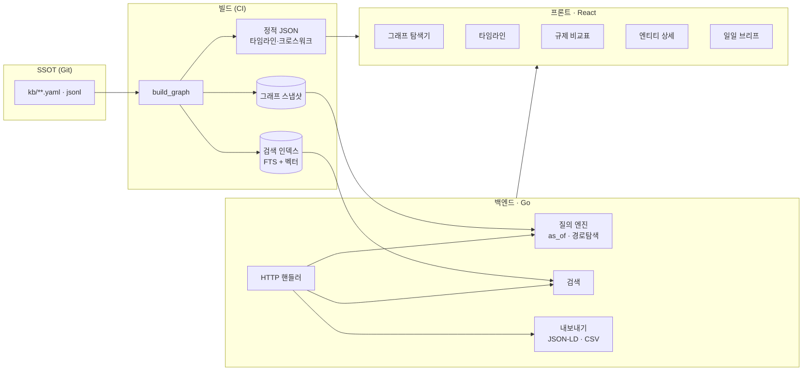

# 공개 사이트 설계 초안 — Go 백엔드 + React 프론트

> ⚠️ **상태: 결정 보류 (Deferred)** — 이 문서는 **최종 단계 결정사항**이다.
> 착수 조건: Phase 1~4 완료 (온톨로지 확정 · 리서치 검증 · KB 1차 구축 · 일일 파이프라인 안정화).
> 지금은 **데이터 리서치와 온톨로지 설계가 우선**이며, 여기 적힌 것은 데이터 설계가 사이트를 제약하지 않도록 미리 확인해 두는 스케치다.

---

## 1. 왜 지금 스케치만 하는가

사이트를 먼저 만들면 **화면이 데이터 모델을 지배한다**. 화면에 맞춰 데이터를 구부리면 온톨로지가 망가지고, 그 순간 지식베이스는 CMS 로 전락한다.

반대로 데이터 모델이 확정되면 화면은 그 투영일 뿐이므로 언제든 다시 만들 수 있다. 그래서 순서는 **데이터 → API → 화면**이며, 지금 확인할 것은 단 하나다 — *현재 데이터 설계가 나중에 사이트를 불가능하게 만들지 않는가?*

결론: 만들지 않는다. `kb/` 가 파일 기반 SSOT 이고 빌드로 그래프·인덱스를 재생성하므로, 어떤 백엔드든 붙일 수 있다.

---

## 2. 구성 스케치

### 2.1 백엔드 (Go) — 예상 책임

| 책임 | 비고 |
|---|---|
| 시점 질의 (`as_of`, `known_as_of`) | L2 이중시간 모델을 그대로 노출 |
| 그래프 경로 탐색 | "이 의무의 국제적 뿌리" 류 질의 |
| 전문·의미 검색 | 한국어 형태소 처리 필요 |
| 크로스워크 생성 | 관할 비교표를 질의 결과로 |
| 내보내기 | JSON-LD, CSV, STIX |
| 정적 산출물 서빙 | 브리프·타임라인 |

Go 를 쓰는 실익: 단일 바이너리 배포, 그래프 순회 성능, 동시성. **DB 는 초기에 두지 않는다** — 빌드 산출물을 메모리에 적재하는 방식으로 시작하고, 데이터가 그 방식을 넘어설 때 도입한다.

### 2.2 프론트 (React) — 예상 화면

| 화면 | 핵심 |
|---|---|
| **그래프 탐색기** | 노드 클릭 → 이웃 확장. 계층별 색 구분(L1/L2/L3) |
| **타임라인** | 3트랙 병렬 + 인과 화살표 + 국면 배경 ([`../ontology/06-timeline-model.md`](../ontology/06-timeline-model.md)) |
| **규제 비교표** | 추상 의무 축 × 관할 축, 시점 슬라이더 |
| **엔티티 상세** | 속성 + 상태 이력 + 증거 + 관련 노드 |
| **일일 브리프** | 최신 변화 + 검증 대기 |
| **출처 열람** | 인용 → 원문 스냅샷 대조 |

**시점 슬라이더가 이 사이트의 차별점이다.** 다른 어떤 AML 자료도 "2023년 6월 시점의 규제 지형"을 보여주지 못한다. L2 이중시간 모델이 있어야만 가능한 화면이고, 그래서 데이터 설계를 먼저 하는 것이다.

---

## 3. 지금 데이터 설계에서 미리 보장해 둔 것

사이트를 나중에 만들더라도 막히지 않도록, 다음은 이미 스키마에 반영되어 있다.

| 화면 요구 | 대응하는 데이터 설계 |
|---|---|
| 시점 슬라이더 | `STATE` 이중시간 (`valid_*` + `recorded_at`) |
| 그래프 탐색 | 모든 관계가 명시적 엣지, 고립 노드 금지(I-10) |
| 타임라인 인과 화살표 | `CAUSED` 엣지 + `basis`·`lag_days` |
| 날짜 불확실 표기 | `date_precision` |
| 관할 비교표 | 추상 `OBL` + 관할별 `IMPOSES` 한정자 |
| 출처 대조 | `DOC.snapshot_path` + `quote` + `locator` |
| 다국어 | `label.{ko,en,orig}`, `text_orig`/`text_ko` |
| 신뢰도 표시 | `confidence` A~D 전 노드 부착 |
| 검색 | `summary`·`aliases` 전 노드 필수 |

---

## 4. 착수 시 결정해야 할 것 (지금 결정하지 않음)

| 항목 | 선택지 | 결정 시점 |
|---|---|---|
| 그래프 저장 | 메모리 / SQLite / 그래프DB | KB 노드 5,000 초과 시 |
| 검색 | SQLite FTS / 검색엔진 / 벡터DB | 한국어 검색 품질 실측 후 |
| 렌더링 | SSR / SPA / 정적생성 | SEO 필요 여부 결정 후 |
| 그래프 시각화 | 라이브러리 선택 | 노드 규모 확정 후 |
| 배포 | 정적호스팅 / 컨테이너 | 백엔드 필요성 확정 후 |
| 인증 | 불필요 / 필요 | 공개 범위 결정 후 |

**공개 범위는 특히 미결이다.** 공개 저장소의 지식베이스는 중립적 산업 지식만 담으며, 그 원칙이 사이트에도 그대로 적용된다.

---

## 5. 착수 전제조건 체크리스트

- [ ] 온톨로지 v1.0 확정 (클래스·술어 변경이 3개월간 없음)
- [ ] KB 노드 1,000개 이상, 품질 종합점수 85 이상
- [ ] 일일 파이프라인 30일 무중단 운영
- [ ] 타임라인 3트랙 데이터 완비
- [ ] 미검증 부채 5% 미만
- [ ] `build_graph` 가 SSOT 에서 전 산출물을 재생성 가능

여섯 개가 모두 충족되기 전에 사이트를 시작하면, 데이터가 아니라 화면을 유지보수하게 된다.
