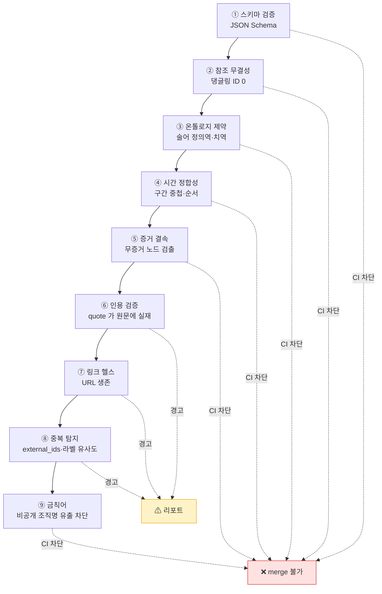

# 데이터 품질·무결성 프레임워크

> **집행**: `quality/validate_kb.py` (CI 차단) · **리포트**: `quality/dq_report.md` (매일 생성)

---

## 1. 품질 차원 (Quality Dimensions)

지식베이스에 맞게 6개 차원을 정의하고, 각각을 **측정 가능한 지표**로 환산한다. 측정할 수 없는 품질 목표는 목표가 아니다.

| 차원 | 정의 | 지표 | 목표 |
|---|---|---|---|
| **정확성** (Accuracy) | 주장이 원문과 일치 | 인용 검증 통과율 | ≥ 99% |
| **완전성** (Completeness) | 필수 필드·증거 결손 없음 | 필수필드 충족률, 무증거 노드 수 | 100% / 0 |
| **적시성** (Timeliness) | SLA 내 재검토 | SLA 위반 노드 수 | 0 |
| **일관성** (Consistency) | 내부 모순 없음 | 미해결 `CONTRADICTS` 수, 불변식 위반 | 0 위반 |
| **추적성** (Traceability) | 모든 주장이 출처까지 연결 | 증거 체인 완전율 | 100% |
| **유일성** (Uniqueness) | 중복 엔티티 없음 | 중복 후보 수 | 0 미해결 |

---

## 2. 검증 계층



### 2.1 차단(blocking) vs 경고(warning)

| 구분 | 기준 |
|---|---|
| **차단** | 기계적으로 판정 가능하고 오탐이 없는 것 — 스키마·참조·시간·금칙어 |
| **경고** | 판정에 사람 판단이 필요한 것 — 인용 유사도, 링크 사망, 중복 후보 |

경고를 차단으로 만들면 CI 가 상시 빨간불이 되어 아무도 보지 않게 된다. **차단은 반드시 즉시 고칠 수 있는 것만**.

---

## 3. 인용 검증 (Citation Verification)

지식베이스 신뢰의 마지막 보루. **인용문이 실제 원문에 존재하는지** 를 기계가 확인한다.

```mermaid
flowchart LR
    Q["evidence.quote"] --> N{"DOC.snapshot_path<br/>존재?"}
    N -->|예| M["스냅샷 본문에서<br/>정규화 후 부분문자열 탐색"]
    N -->|아니오| F["원문 fetch → 스냅샷 저장"]
    F --> M
    M --> R{"일치?"}
    R -->|정확 일치| OK["✅ verified"]
    R -->|유사 (공백·개행 차이)| OK
    R -->|불일치| WARN["⚠ 인용 불일치 — 검토 과제 생성"]
    R -->|원문 접근 불가| STALE["⚠ 검증 불가 — 스냅샷 필요"]
    style OK fill:#ecfdf5
    style WARN fill:#fee2e2
```

**스냅샷 보관이 필수인 이유**: 규제기관 사이트는 개편 시 URL 이 통째로 바뀐다. 원문 스냅샷 없이는 6개월 뒤 인용을 검증할 수 없고, 검증할 수 없는 인용은 없는 것과 같다.

정규화 규칙: 연속 공백 축약, 개행 제거, 전각/반각 통일, 인용부호 통일. **의미를 바꾸는 정규화는 금지**(숫자·조사 변경 등).

---

## 4. 무결성 규칙 목록

[`../ontology/04-node-edge-spec.md §8`](../ontology/04-node-edge-spec.md) 의 I-1 ~ I-12, [`06-timeline-model.md §8`](../ontology/06-timeline-model.md) 의 T-1 ~ T-7, [`../ontology/05-identifier-scheme.md §7`](../ontology/05-identifier-scheme.md) 의 ID-1 ~ ID-8 을 통합 집행한다.

추가 규칙:

| # | 규칙 | 등급 |
|---|---|---|
| Q-1 | 모든 수치 FACT 는 `unit` 을 갖는다 | 차단 |
| Q-2 | 통화 금액은 `currency` 를 갖는다 | 차단 |
| Q-3 | 추정치 METRIC 은 `estimator` 와 `method` 를 갖는다 | 차단 |
| Q-4 | 산문 문서의 사실 주장은 `[F-xxxx]` 로 FACT 를 참조한다 | 경고 |
| Q-5 | "현재", "최근", "올해" 등 상대 시간 표현이 KB 노드·산문에 없다 | 경고 |
| Q-6 | 번역문(`text_ko`)은 원문(`text_orig`)과 함께 저장된다 | 차단 |
| Q-7 | 동일 `(subject, measure, period)` METRIC 이 복수면 `revision` 이 서로 다르다 | 차단 |
| Q-8 | `confidence: D` 노드는 산문에 인용될 때 경고 표시가 붙는다 | 경고 |

### 4.1 상대 시간 표현 금지 (Q-5)

가장 자주 위반되고 가장 조용히 문서를 썩게 만드는 규칙이다.

| ❌ | ✅ |
|---|---|
| "현재 임계값은 100만원" | "2022-03-25 시행 이래 100만원 (2026-07-30 확인)" |
| "최근 강화되었다" | "2025-06-XX 개정으로 강화" |
| "올해 발표된" | "2026년 발표된" |

검출 정규식으로 `현재|최근|올해|작년|내년|지난달|요즘|이번|얼마 전|곧` 등을 스캔하고, 인접 문장에 절대일자가 없으면 경고한다.

---

## 5. 품질 스코어카드

매일 생성해 `quality/dq_report.md` 에 기록하고, 추세를 시계열로 보관한다.

```
## 데이터 품질 스코어카드 — YYYY-MM-DD

| 차원        | 점수 | 전일 대비 | 세부 |
|------------|-----|---------|-----|
| 정확성      | -- | --      | 인용 검증 --/-- |
| 완전성      | -- | --      | 무증거 노드 -- |
| 적시성      | -- | --      | SLA 위반 -- |
| 일관성      | -- | --      | 불변식 위반 --, 미해결 상충 -- |
| 추적성      | -- | --      | 증거 체인 결손 -- |
| 유일성      | -- | --      | 중복 후보 -- |
| **종합**    | -- | --      | |

### 확신도 분포
A: --  B: --  C: --  D: --

### 미검증 부채 (confidence C/D 이면서 review_due 경과)
| 노드 | 확신도 | 경과일 |

### SLA 위반 상위
| 노드 | SLA | 경과일 |

### 신규 상충
| FACT A | FACT B | 쟁점 |
```

### 5.1 종합 점수 산식

```
score = 100
      - 5.0 × (차단 위반 수)
      - 0.5 × (경고 수)
      - 2.0 × (SLA 위반 수)
      - 1.0 × (미해결 상충 수)
      - 0.2 × (confidence D 노드 수)
      하한 0
```

가중치는 운영하며 조정한다. **중요한 것은 절대값이 아니라 추세**다. 점수가 내려가는데 이유를 모르면 그것이 문제다.

---

## 6. 미검증 부채 (Unverified Debt)

기술 부채와 같은 개념. `confidence: C`/`D` 인 지식은 **부채**로 계상하고 상환 계획을 갖는다.

| 규칙 | 내용 |
|---|---|
| 계상 | C/D 노드 1개 = 부채 1 단위 (D 는 2 단위) |
| 상한 | 전체 노드의 5% 초과 시 신규 C/D 유입 차단 (상환 우선) |
| 상환 | 원문 확보로 A/B 승격, 또는 검증 불가 판정 후 제거 |
| 가시화 | 스코어카드에 상시 노출 |

이 장치가 없으면 "일단 넣어두고 나중에 확인"이 누적되어 지식베이스 전체 신뢰도가 무너진다. 실제로 대부분의 지식베이스가 이렇게 죽는다.

---

## 7. 기존 자산 감사 (Phase 2)

현행 산문 399 파일 · 22,000줄에 대한 전수 감사를 별도 단계로 수행한다.

| 감사 항목 | 방법 |
|---|---|
| 사실 주장 추출 | 문서별로 검증 대상 주장 목록화 |
| 출처 유무 | 출처 없는 주장 식별 |
| 원문 대조 | 출처 있는 주장의 인용 정확성 확인 |
| 시점 표현 | 상대 시간 표현 검출 및 절대일자 치환 |
| 상태 오류 | 제안/시행 혼동 검출 |
| 수치 검증 | 통계·금액·임계값 재확인 |
| 링크 생존 | 외부 URL 헬스체크 |
| 중복·모순 | 문서 간 상충 주장 대조 |

**감사 결과는 그 자체로 FACT 가 된다** — 어떤 주장이 확인되었고 어떤 것이 틀렸는지가 지식베이스에 기록된다. 조용히 고치지 않는다.
